# Модуль 1. Требования и аналитика

## Маршрут урока

| Режим | Что делать |
|---|---|
| База · 20–30 мин | Уровни требований, один сценарий и критерии приёмки. Прочитайте [основу](#lesson-base) и объясните один пример своими словами. |
| Практика · 30–45 мин | Выполните [задание](#lesson-practice), затем сравните с [критериями](../practice/assessment.md). |
| Углубление · 20–40 мин | Приоритизация, управление изменениями и трассировка. Возвращайтесь после первой практики. |

**Артефакт в портфолио:** [шаг сквозного проекта](../project/01_discovery.md). Время ориентировочное; один урок можно разделить на несколько занятий.

> **Результат модуля:** от проблемы к проверяемому поведению. Начинающему: сначала [маршрут](../START_HERE.md), затем теория → упражнение → самопроверка.

Главный навык системного аналитика — превращать размытое «хотим как Uber» в конкретные, проверяемые требования.

<a id="lesson-base"></a>

## База и разборы

### 1. Уровни требований

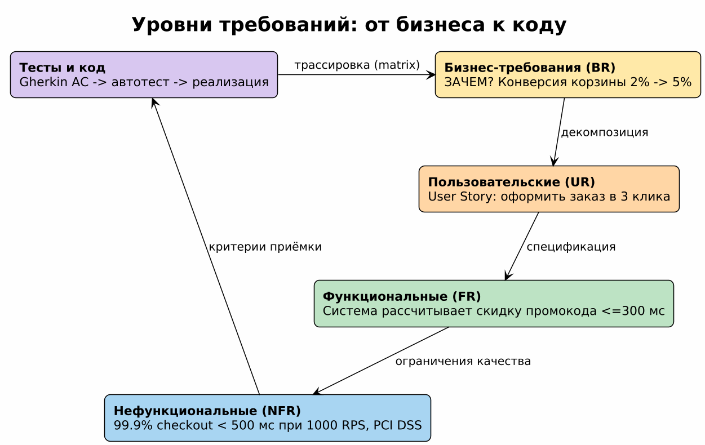
**Пример с разбором (рис. 0).** Пирамида на примере сервиса записи: BR-01 «снизить no-show с 25% до 15%» (зачем бизнесу, метрика бизнеса) порождает UR «как пациент, хочу подтвердить визит одним касанием» (намерение и ценность пользователя), который детализируется во FR «при создании записи система атомарно резервирует свободный слот; при подтверждении отмечает запись подтверждённой» (проверяемое поведение), а поверх кладётся NFR «блокировка происходит ≤ 2 с при 500 RPS» (класс качества + метрика). Типичный дефект, который ловит эта пирамида: заказчик приносит «внедрить push-уведомления» — это решение где-то между FR и реализацией; поднимаясь по пирамиде вверх находим настоящий BR, опуская вниз — проверяемые FR/NFR. Разрыв в цепочке (FR без BR) = золотой телёнок; BR без FR = лозунг.

*Рис. 0. Бизнес-цель → потребность пользователя → поведение системы; NFR задают качество выполнения функций.*

| Уровень | Вопрос | Документ |
|---|---|---|
| Бизнес-требования (BR) | ЗАЧЕМ? | Business Case, Vision Document |
| Пользовательские (UR) | ЧТО нужно пользователю? | User Stories, Use Cases |
| Системные/функциональные (FR) | ЧТО делает система? | SRS, спецификации API |
| Нефункциональные (NFR) | КАК ХОРОШО? | SLA/SLO, стандарты нагрузки |

**Пример (интернет-магазин):**
- BR: «Увеличить конверсию корзины с 2% до 5% за полгода».
- UR: «Как покупатель, я хочу оформить заказ в 3 клика, чтобы не терять время».
- FR: «Система должна рассчитать итоговую сумму со скидкой промокода за ≤300 мс».
- NFR: «99.9% запросов checkout < 500 мс при 1000 RPS; PCI DSS для карт».

Разбор: FR описывает проверяемое поведение; ограничение времени удобно вынести в связанное NFR. «Работает быстро» без метрики и условий нельзя объективно принять.

Дополнение к таблице — типичные ловушки уровня:

| Уровень | Ловушка | Как отличить |
|---|---|---|
| BR | «Внедрить микросервисы» — это решение, а не бизнес-цель | BR отвечает на «зачем бизнесу», формулируется через метрику бизнеса (выручка, конверсия, время выхода) |
| UR | Пересказ ФТ («система отправляет email») | UR описывает намерение пользователя и ценность, а не механизм |
| FR | «Система должна быть удобной» | Это NFR/UX-требование; FR всегда про поведение: вход → действие → проверяемый результат |
| NFR | Число без способа измерения | Укажите инструмент проверки: APM, синтетика в CI, аудит-лог, WCAG-чекер |

**Пример с разбором (рис. 1).** Типичная находка на интервью стейкхолдера: *«Сайт должен быть быстрым и удобным для пользователей»*. Такое требование нельзя ни проверить, ни принять — за ним нет ни события, ни метрики, ни порога. Разбор переработки по шагам:
1. **Диагноз.** «Быстрый» — субъективно; «удобный» — это UX-NFR, а не поведение системы. Оба свойства относятся к качеству; функциональное поведение ещё предстоит выяснить.
2. **FR (поведение).** После уточнения сценария поиска формулируем: *система показывает доступные слоты выбранного врача на выбранную дату; при отсутствии слотов показывает пустое состояние*. Вход → действие → ожидаемый результат.
3. **NFR (метрика + условие измерения).** Скорость оформляем как P95 ≤ 300 мс при нагрузке 500 RPS; отдельно указываем baseline (обязательно сейчас) и stretch (цель развития). Без условия нагрузки метрика бессмысленна.
4. **AC (способ проверки).** Gherkin-сценарий делает требование исполняемым: Given у врача есть свободный слот в выбранную дату → When выполняю поиск → Then вижу этот слот; для занятого слота результат его не содержит. Если AC не написан — требование ещё не готово (см. DoR, рис. 8).

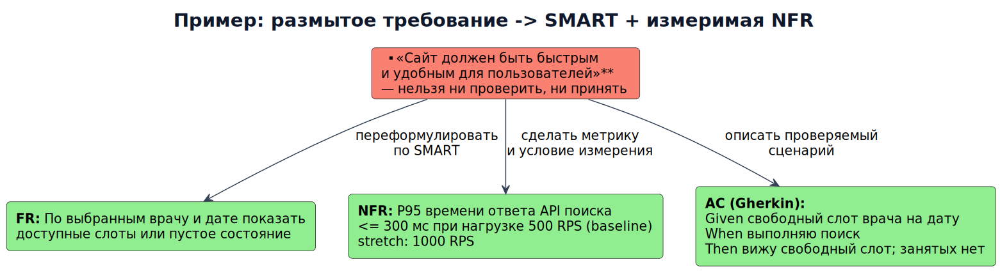
*Рис. 1. Как «сайт должен быть быстрым» превращается в FR, измеримую NFR и Gherkin-AC.*

### 2. Шаблон формулировки: EARS
Расширенная форма требований (Mott MacDonald, используется в Rolls-Royce/RAE) — 5 грамматических шаблонов, снимающих спор «как написать ФТ»:

| Тип | Шаблон | Пример |
|---|---|---|
| Ubiquitous (всегда) | The system shall <действие> | Система shall хранить историю изменения цены блюда |
| Event-driven (реакция) | When <триггер>, the system shall <действие> | Когда платёж подтверждён, система shall перевести заказ в `paid` |
| State-driven (состояние) | While <состояние>, the system shall <действие> | Пока слот бронирования активен, система shall блокировать его от других пациентов |
| Unwanted behaviour (отказ) | If <условие>, then the system shall <действие> | Если промокод просрочен, система shall вернуть ошибку `PROMO_EXPIRED` и не менять сумму |
| Optional (опционально) | Where <особенность конфигурации>, the system shall <действие> | Где включена 2FA, система shall требовать OTP при смене адреса |

Правило: если требование не ложится ни на один шаблон — скорее всего, оно размыто или это проектное решение (для него — ADR, см. модуль 5).


**Пример с разбором (рис. 2).** Возьмём одно намерение — «списывать деньги за визит» — и посмотрим, как выбор шаблона EARS меняет смысл требования и тест:

| Запись | Что проверяем в тесте |
|---|---|
| Ubiquitous: *Система shall хранить историю изменения цены блюда* | Инвариант во времени: после любого апдейта цены старая строка сохранена — сверка по audit-таблице |
| Event-driven: *Когда платёж подтверждён, система shall перевести заказ в `paid`* | Триггер + постусловие: эмулируем webhook оплаты → ожидаем статус `paid` (см. sequence-диаграмму, Модуль 2) |
| State-driven: *Пока бронь активна, система shall блокировать слот врача* | Границы состояния: проверка при входах/выходах из `active`, включая отмену |
| Optional: *Если включена push-рассылка, система shall отправлять напоминание за 24 ч* | Флаг feature toggle: два прогона — with/without фичи |
| Unwanted behaviour: *Если врач не подтвердил запись за 2 ч, система shall уведомить администратора* | Таймаут-тест: форсируем часы, ловим отсутствие уведомления как баг |

Правило выбора: есть постоянный инвариант → Ubiquitous; есть событие → When; есть состояние → While; есть условие-флаг → If; есть нежелательная ветка → If…(отказ). Неправильный шаблон = непроверяемое или переусложнённое требование.

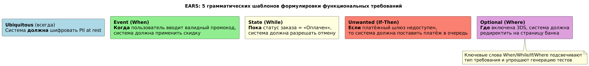
*Рис. 2. Пять грамматических шаблонов EARS — выбор типа определяет, какой тест писать.*

### 3. Классификация NFR и trade-offs
Для рабочего чеклиста используем надёжность, производительность, безопасность, совместимость, наблюдаемость, поддерживаемость, доступность интерфейса и соответствие ограничениям. Это учебная группировка, а не дословный перечень ISO/IEC 25010. У стандарта есть разные редакции; в [редакции 2023](https://www.iso.org/standard/78176.html) девять характеристик качества продукта. Наблюдаемость — дополнительный операционный аспект нашего чеклиста. Три рабочих правила:

1. **Баланс вместо максимума.** Consistency vs Availability (CAP), скорость вывода vs техдолг, шифрование vs latency — фиксируйте приоритет и допустимую цену в самой формулировке («для каталога допустим лаг чтения до 1 мин; для подтверждения оплаты читаем актуальный источник истины»; RPO отдельно задаёт допустимую потерю данных после аварии).
2. **Design constraint ≠ NFR.** «Только managed Postgres», «стек Java 21», «данные не покидают РФ (152-ФЗ)» — это ограничения проектирования; их пишут отдельным разделом SRS/Volere, иначе они маскируются под требования и душат архитектуру.
3. **Baseline vs stretch.** Базовые NFR и допустимые версии TLS согласуются с владельцем безопасности; stretch («p99 ≤ 100 мс») требуют обоснования стоимости — иначе команда платит за них скоростью всех спринтов.

**Пример с разбором (рис. 3).** Разложим NFR сервиса записи по классам ISO/IEC 25010 — каждое требование сопровождается способом проверки, иначе это пожелание:

| Класс | Требование | Как проверяем на практике |
|---|---|---|
| Performance efficiency | P95 поиска слотов ≤ 300 мс при 500 RPS | Нагрузочный тест в CI (k6/Gatling), порог как step CI |
| Reliability | SLA API 99.9% (≤ 43 мин простоя/мес); RTO 1 ч / RPO 5 мин для данных записей | Uptime-мониторинг + регулярные учения по восстановлению из бэкапа |
| Security | PII (ФИО, телефон) шифруются at rest; доступ к медданным — только роли `doctor`/`admin`, аудит каждого чтения | Пентест + тесты авторизации + проверка audit-лога |
| Usability | Запись ≤ 3 шага; WCAG AA для формы записи | Юзабилити-тест с 5 пользователями; axe-core в e2e |
| Maintainability | Покрытие критичных сценариев автотестами ≥ 80%; деплой < 15 мин | Отчёт покрытия в PR, замер времени pipeline |
| Compatibility | Интеграция с HIS через HL7 FHIR; обратная совместимость API v1 | Контрактные тесты (Pact) + семантическое версионирование URL |

Trade-off-разбор: повышение надёжности (retry ×3 на оплату) конфликтует с безопасностью (риск двойного списания → нужен Idempotency-Key, Модуль 3) и с производительностью (растёт P95). Ускорение кэширования слотов конфликтует с консистентностью (устаревший свободный слот → double booking, кейс `practice/solutions`). Поэтому NFR всегда принимаются **парой**: метрика + явно описанный компромисс в ADR.

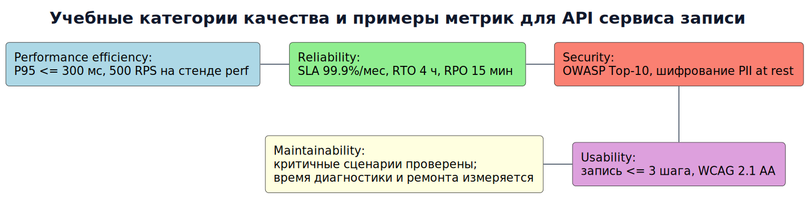
*Рис. 3. Учебный чеклист качества с примерами метрик для API сервиса записи.*

### 4. INVEST для user story
Independent, Negotiable, Valuable, Estimable, Small, Testable.
Плохо: «Я могу смотреть заказы, историю и админ-панель» (не Small, не Testable).
Хорошо: «Покупатель видит статус последнего заказа на главной» + критерии приёмки Given/When/Then.

Декомпозиция по SPIDR помогает получить небольшие вертикальные срезы: каждый срез даёт проверяемый результат пользователю, включая необходимые изменения UI, API и данных.

| Приём | Смысл | Пример для записи к врачу |
|---|---|---|
| S — Spike | Ограниченное исследование неизвестного | За 1 день проверить контракт расписания; результат — ограничения и решение, а не готовая фича |
| P — Paths | Разные полные пути пользователя | Запись на свободный слот; отдельно — запись в лист ожидания |
| I — Interfaces | Каналы и варианты интерфейса | Полная запись через веб; затем через мобильное приложение |
| D — Data | Подмножества данных | Запись на одну услугу в одной клинике; затем несколько клиник |
| R — Rules | Разные бизнес-правила | Обычная запись; затем запись по направлению |

Обязательные правила безопасности, защиты данных и целостности не откладываем ради упрощения релиза. «Выбрать врача», «написать API» и «создать таблицу» — шаг или техническая задача, а не автоматически самостоятельная пользовательская история. История «записаться на свободный слот в одной клинике» охватывает весь путь до подтверждённой записи.

Источник: [Mike Cohn — SPIDR](https://www.mountaingoatsoftware.com/blog/five-simple-but-powerful-ways-to-split-user-stories).

Проверка INVEST для истории «Как пациент, я хочу отменить запись за 24 ч»: Independent ✓ (не ждёт лист ожидания), Negotiable ✓ (способ уведомления обсуждается), Valuable ✓ (снижает no-show), Estimable ✓, Small ✓ (≤ 2 дней), Testable ✓ (Gherkin на рис. 5). Провал любой буквы = режем дальше или уточняем требование.

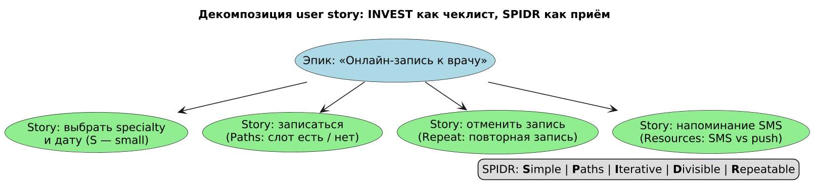
*Рис. 4. Эпик «онлайн-запись к врачу», разрезанный по SPIDR на независимые истории.*

### 5. Критерии приёмки (AC) в формате Gherkin
```gherkin
Feature: Промокод на скидку
  Background:
    Given пользователь авторизован

  Scenario Outline: Расчёт скидки промокодом
    Given промокод "<code>" активен и даёт <percent>%
    When я применяю его к корзине на <total> ₽
    Then сумма к оплате равна <pay> ₽

    Examples:
      | code    | percent | total | pay   |
      | SALE10  | 10      | 1000  | 900   |
      | SALE20  | 20      | 1000  | 800   |


  Scenario: Просроченный промокод
    Given корзина на 1000 ₽ и просроченный промокод "EXPIRED"
    When я применяю промокод
    Then ошибка "PROMO_EXPIRED"
    And сумма к оплате остаётся 1000 ₽

  Scenario: Повторное применение того же промокода
    Given промокод "SALE10" уже применён в этом заказе
    When я применяю его повторно
    Then ошибка "PROMO_ALREADY_APPLIED"
    And сумма заказа не изменилась
```

Минимальный набор сценариев на одну ФТ (иначе AC неполные): happy path · граничные значения (0, максимум, ровно порог) · отказ зависимости (таймаут платёжного шлюза) · права доступа (другой пользователь чужого заказа) · идемпотентность (двойной клик = один заказ). AC — договорённость, а не спецификация кода: детали реализации оставляйте negotiable до планирования.

**Пример с разбором (рис. 5).** Сценарий на картинке — это не «документ», а исполняемая спецификация: каждая строка `Examples` превращается pytest/Behave в отдельный автотест. Что здесь важно:
- **Background** выносит общие предусловия (пользователь авторизован, услуга выбрана) — сценарии остаются о поведении, а не о подготовке.
- **Таблица покрывает классы эквивалентности сразу**: корректный код (`SALE10`, `HALF`), истёкший (`EXPIRED`), неверный формат (`PROMO-99`), чужой/повторно использованный (`ONCE20`). Один Outline заменяет пять ручных кейсов.
- **Отдельный сценарий идемпотентности** («повторное применение того же кода → ошибка») — именно его чаще всего забывают, и он ловит баг из кейса `practice/solutions` (двойное списание промокода).
- **Then всегда проверяем и побочные эффекты**: сумма к списанию *и* запись в history применения кода; иначе тест проходит при скрытых дефектах данных.

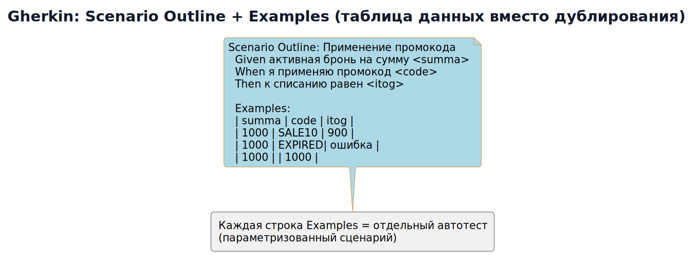
*Рис. 5. Scenario Outline: каждая строка Examples — отдельный параметризованный автотест.*

### 6. Выявление требований (elicitation) и качество требований
Интервью, воркшопы, наблюдение (job shadowing), прототипирование, анализ документов, event storming, опросы, backlog конкурентов. Выбор: незнакомая предметная область → интервью+наблюдение; известная → анализ документов и конкурентов.

Практические приёмы против «смута на входе»:
- **5 Why** к каждой хотке: «хотим дашборд» → зачем → чтобы ловить падение конверсии → почему сейчас не ловите → вручную раз в неделю. Итог: возможно, нужно алерт-правило, а не дашборд.
- **Проблема, а не решение**: заказчик приносит «нужна кнопка X»; аналитик фиксирует проблему и предлагает варианты — решение принимает команда.
- **Прототип как elicitation-инструмент**: показать кликабельную заглушку дешевле, чем собрать неверные требования; переделанный макет — дешёвая итерация, переделанная БД — дорогая.
- **Stakeholder map** (Power × Interest): высоких/властных согласуют лично, низких/интересующихся — рассылкой; забытый «низкий/властный» стейкхолдер = veto на приёмке.

Чеклист качества единичного требования (по Tracey, 1994; адаптировано из Volere):
unambiguous · complete · singular (одна мысль) · consistent с остальными · feasible · design-free (без «через Kafka») · verifiable · traceable (есть источник и ID).
Маркер незрелости области — **Dreyfus model**: эксперты действуют по наитию и плохо вербализуют правила → интервью «почему вы отклонили этот случай?» эффективнее вопроса «каковы ваши правила?».

**Пример с разбором (рис. 6).** Карта стейкхолдеров сервиса записи по осям Power × Interest:
- **Высокая власть / высокий интерес (manage closely):** главврач — согласует правила записи лично на еженедельном синке; его «нет» блокирует релиз.
- **Высокая власть / низкий интерес (keep satisfied):** юрист/ДПО — только рассылка итогов и согласование обработки PII; не трогаем деталями, но не забываем — типичный «забытый властный стейкхолдер» с veto на приёмке.
- **Низкая власть / высокий интерес (keep informed):** администраторы клиники и врачи — демо каждые две недели; их обратная связь — самый дешёвый источник скрытых требований («а если врач в отпуске?»).
- **Низко/низко (monitor):** внешние контрагенты.

План коммуникации строится из квадранта: частота × формат × канал. Ошибка — опрашивать всех одинаково: теряете время на нижнем квадранте и получаете сюрпризы от верхнего.

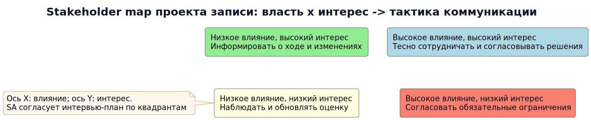
*Рис. 6. Stakeholder map Power × Interest — план интервью и коммуникаций.*

**Пример с разбором (рис. 7).** Хоткея от заказчика: *«Хотим кнопку напоминаний»*. Прогон 5 Why показывает, что решение — симптом:
1. Почему кнопка? → Пациенты забывают про визит.
2. Почему забывают? → Подтверждение приходит только письмом за неделю.
3. Почему только письмом? → Push не настроен, т.к. не решён вопрос согласия.
4. Почему не решён? → Юрист требует явного opt-in при регистрации.
5. Почему нет opt-in? → В форме регистрации его просто не добавили.

**Итог:** требование №1 — не «кнопка», а *поле согласия на push в форме регистрации + отправка напоминания за 24 ч*; юридическое ограничение уехало отдельным design constraint. Заметьте: корень оказался на два уровня выше исходной формулировки — это и есть работа elicitation: мы сэкономили спринт на функции, которая не лечила бы no-show.

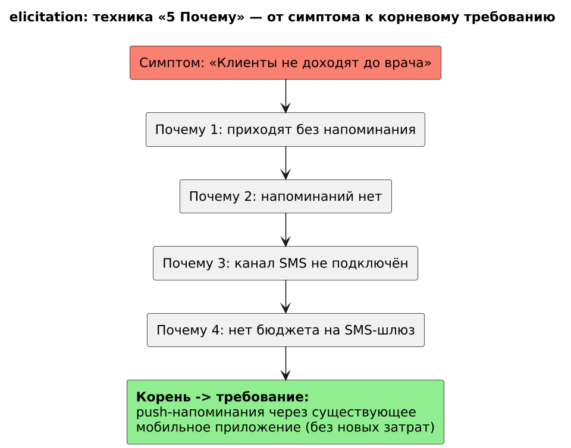
*Рис. 7. Техника «5 Почему»: от симптома «клиенты не доходят» к требованию push-напоминаний.*

<details>
<summary>Углубление: дополнительные решения и ограничения</summary>

### 7. Приоритизация и Definition of Ready/Done
- **MoSCoW**: Must (срыв = нет релиза) / Should (болезненно, но можно обойти) / Could (nice-to-have) / Won't this time (зафиксировать явно — снимает вечные «а когда?»).
- **Kano**: базовые (нет функции = продукт бракуют), линейные (больше = лучше), wow-фичи (исчезают после привыкания). Базовые нельзя резать ради wow.
- **Definition of Ready** (до взятия в спринт): есть AC, оценено, известны акторы и данные, макет/контракт согласованы, NFR-ограничения учтены.
- **Definition of Done**: AC выполнены и автоматизированы, код отревьюен, миграция накатана на staging, документация/глоссарий обновлены, метрика внедрена.
Приёмка без DoR превращает спринт в исследование; DoD спасает от «done means coded».

**Пример с разбором (рис. 8).** История «Отмена записи за 24 ч» идёт по конвейеру: Backlog → **DoR-гейт** → Sprint → **DoD-гейт** → Release. Разбор типичного провала на каждом рубеже:
- *Провал DoR:* историю взяли без AC по правам («может ли админ отменить чужую запись?») → в середине спринта разработчик идёт спрашивать → стейкхолдер меняет правило → половина кода в мусор. Цена — день команды; профилактика — 15 минут чеклиста.
- *Провал DoD:* код написан, но миграция не накатана на staging и метрика отмен не внедрена → «done» растягивается на ещё один спринт, а бизнес не видит эффекта.
- Правило: DoR проверяет **аналитик + команда** при планировании, DoD — **команда + PO** при демонстрации; оба чеклиста живут в команде, а не в вики «в общем доступе».

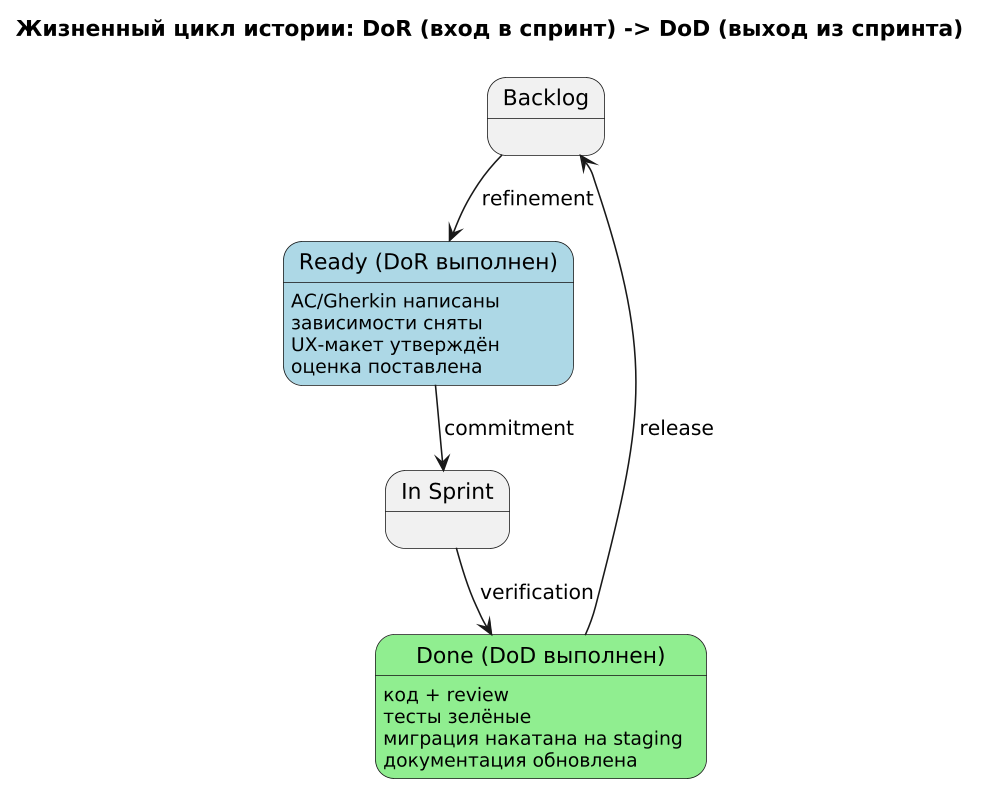
*Рис. 8. Жизненный цикл истории: чеклист DoR на входе в спринт, DoD — на выходе.*

### 8. Глоссарий и domain model
Единые термины — источник истины. Пример записи:
> **SKU** — артикул товарной позиции (не путать с SPU — карточкой товара). Владелец термина: отдел каталога.

Правила ведения: у термина есть **владелец** (кто разрешает споры), запрещённые синонимы перечисляются явно («слот» ≠ «время приёма» ≠ «приём»), изменения глоссария — через PR с ревью владельца. Domain model рисуйте до БД: сущности + связи + инварианты («один курьер не может иметь два активных заказа») — инварианты позже станут check-constraints и AC.

### 9. Изменения требований и трассировка (tracing)
BR ↔ FR ↔ тест ↔ код. Матрица трассировки показывает, что каждое бизнес-требование покрыто тестами и ничего не реализовано «просто так».

Процесс изменений (change control) — лёгкий, но обязательный:
1. Request on change фиксируется (не в чате, а в бэклоге) с мотивацией и оценкой влияния.
2. Impact analysis по матрице трассировки: какие FR/тесты/контракты/миграции задевает.
3. Решение принимает owner требования (RACI); для архитектурно значимых — ADR.
4. Baseline: зафиксированная версия документа/бэклога на момент старта спринта; правки baseline — только через п.1–3.
Инструменты: Jira + links (Story→Task→Test), Requirement Hub/Polarion — в regulated-доменах (медицина, финансы); для большинства продуктов достаточно связки «ID в commit message + тест с тегом BR-xx».

**Пример с разбором (рис. 9).** Построим трассировку для BR-01 *«Снизить долю неявок на приём (no-show) с 25% до 15% за квартал»*:

| Звено | ID | Артефакт |
|---|---|---|
| Бизнес-требование | BR-01 | Снижение no-show 25% → 15% |
| Функциональное | FR-14 | Push-напоминание за 24 ч до визита (EARS: When…shall) |
| UI/контракт | SC-07 | Макет уведомления + контракт `POST /notifications` |
| Тест | T-212 | Gherkin: «напоминание не приходит при выключенном opt-in» |
| Код | commit `AB-143` | Реализация планировщика уведомлений |

Что даёт цепочка на практике:
- **Impact analysis:** стейкхолдер просит «напоминать за 2 часа вместо 24» → по матрице видно: затронуты FR-14, макет SC-07, тест T-212 и метрика BR-01; оценка часа, а не «посмотрим».
- **Anti-gold-plating:** код без ссылки на FR — кандидат на удаление («реализовано просто так»).
- **Приёмка в regulated-домене:** аудитору достаточно показать путь BR-01 → T-212 → AB-143.

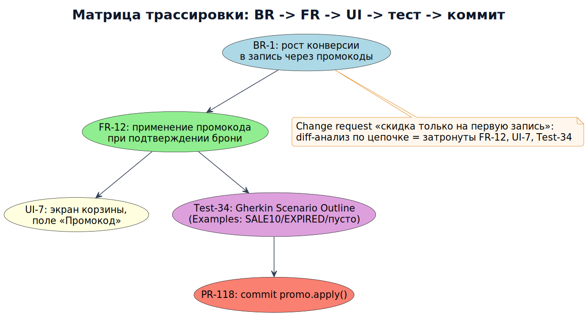
*Рис. 9. Цепочка BR → FR → UI → тест → коммит; impact analysis изменения идёт по этой цепи.*


</details>

## Полезные ссылки
- IEEE Std 830 / ISO/IEC/IEEE 29148 — шаблоны SRS: https://www.iso.org/standard/68247.html
- EARS (Easy Approach to Requirements Syntax): https://alistairmavin.com/ears/
- Volere Requirements Specification template: https://volere.org/
- Guide to Gherkin: https://cucumber.io/docs/gherkin/reference/
- Event Storming: https://eventstorming.com/
- Шаблон Definition of Ready: https://www.scrum.org/resources/blog/definition-ready
- Как писать требования, которые не придётся переписывать (P. Loukides, O'Reilly): https://www.oreilly.com/radar/how-to-write-requirements-that-dont-need-rewriting/

## Типичные ошибки (антипаттерны)
1. **Требование-решение**: «сделать выпадающий список из 5 пунктов» вместо описания поведения — сужает пространство решений команды.
2. **Непроверяемые AC**: «страница должна загрузиться быстро» — нет числа, контекста нагрузки и способа измерения.
3. **Золотой телёнок**: согласование каждой детали с заказчиком до начала работы; правильно — фиксировать DoR и оставлять детали negotiable.
4. **Требования в чате**: правки не трассируются; всё, что влияет на приёмку, — в бэклоге с ID.
5. **Один сценарий = готово**: AC без ошибок, границ и прав доступа дадут «работает только на happy path».

**Пример с разбором (рис. 10).** Четыре самых частых дефекта формулировок — в формате «было → почему плохо → стало»:
1. *«Сделать выпадающий список из пяти услуг»* — требование-решение: а если услуг станет пятьдесят? Стало: «пользователь выбирает одну услугу из справочника; способ выбора — на усмотрение команды».
2. *«Страница загружается быстро»* — непроверяемо: нет числа, контекста и инструмента. Стало: P95 LCP ≤ 2.5 с на мобильном 4G (замер Lighthouse CI).
3. *«Согласовать каждую деталь с заказчиком до начала разработки»* — золотой телёнок: паралич решений. Стало: DoR-чеклист + negotiable-детали внутри спринта.
4. *Правки требований в чате* — нет трассировки, приёмка превращается в «а мне говорили…». Стало: изменение только через request on change с ID.

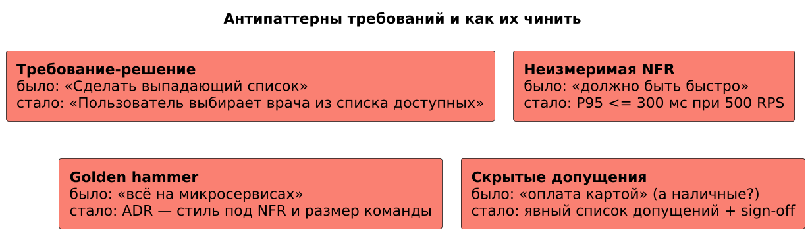
*Рис. 10. Четыре антипаттерна формулировок и корректные замены.*

<a id="lesson-practice"></a>

## Практика
- [ ] Возьмите фичу «личный кабинет банка» и распишите 1 BR → 3 UR → 5 FR → 3 NFR с метриками.
- [ ] Напишите 2 сценария Gherkin для перевода между своими счетами (успех + отказ из-за лимита).
- [ ] Переформулируйте 3 требования из прошлого проекта в шаблон EARS (определите тип: When/While/If).
- [ ] Разбейте эпик «управление подписками на рассылки» по SPIDR на 4–6 историй.
- [ ] Составьте глоссарий из 10 терминов для домена e-commerce (термин | определение | владелец | запрещённые синонимы).

Задания 1–2 практикума: [tasks](../practice/tasks.md) · [разбор NFR](../practice/solutions/sol01_nfr.md), [разбор INVEST](../practice/solutions/sol02_invest.md)
Дальше: [Модуль 2 — UML и BPMN](../02_uml_bpmn/README.md)

## Закрепление: От проблемы к проверяемому поведению

**Простыми словами.** BR отвечает, зачем бизнесу изменение; UR — что нужно человеку; FR — что делает система; NFR — насколько хорошо. Решение вроде «поставить Kafka» ещё не объясняет проблему.

**Разобранный пример.** Заказчик: «Сделайте повтор оплаты». Факт: пользователь получил timeout. Неизвестно: списаны ли деньги. Требование: система показывает неопределённый результат и уточняет статус; новая попытка разрешается только после подтверждённого отказа.

**Самостоятельно (20–30 минут).** Напишите BR, UR, два FR, один NFR и три вопроса заказчику для этого запроса.

**Критерии проверки.** Есть исходная метрика, владелец решения, границы; FR проверяются входом и результатом; NFR содержит метрику, окно, нагрузку и метод проверки.

<details>
<summary>Самопроверка: Можно ли считать «отправлять email» бизнес-целью?</summary>

Обычно это функция или вариант решения. Бизнес-цель может быть снижением обращений в поддержку; величину и срок нужно выяснить.

</details>

[Сквозной пример оплаты](../examples/payment/README.md) · [Первоисточники](../SOURCES.md)
