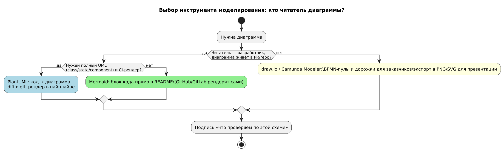
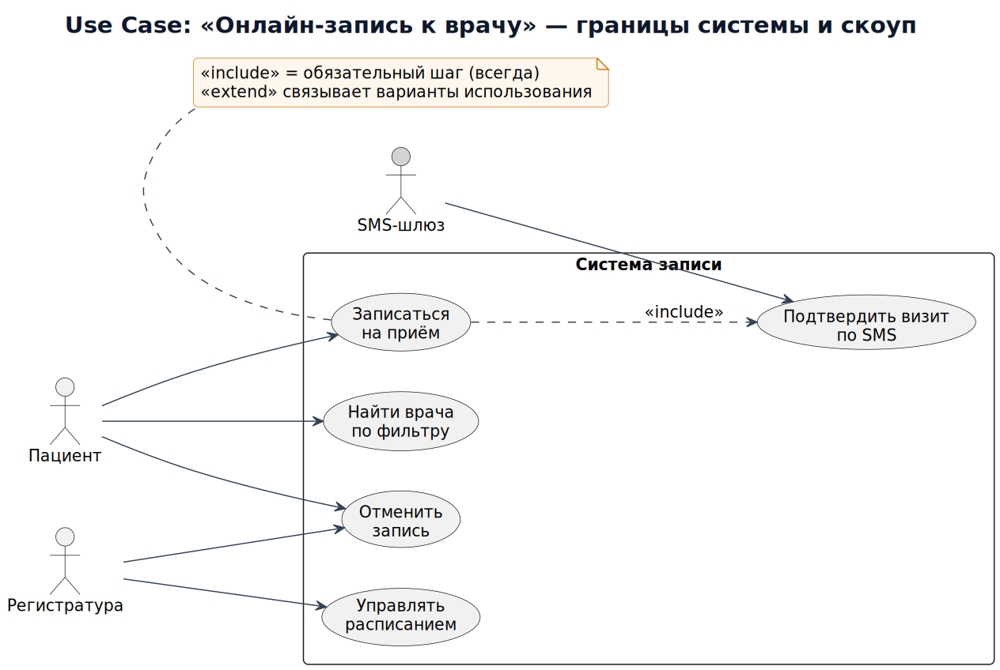
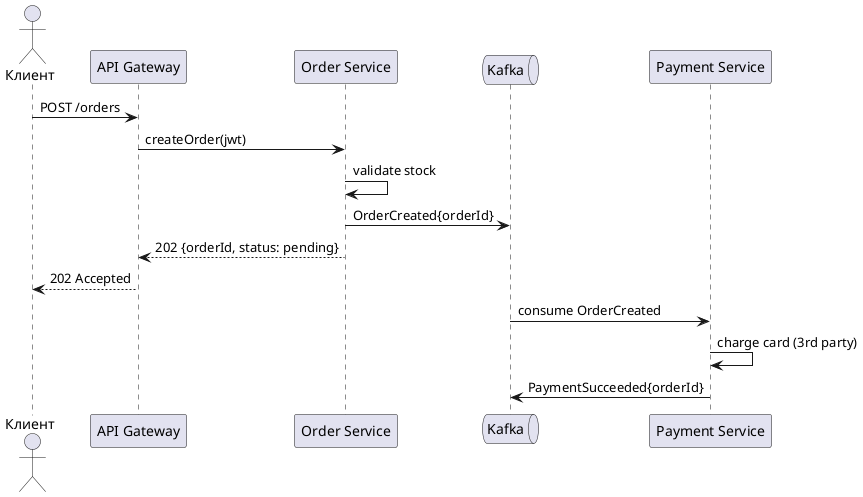
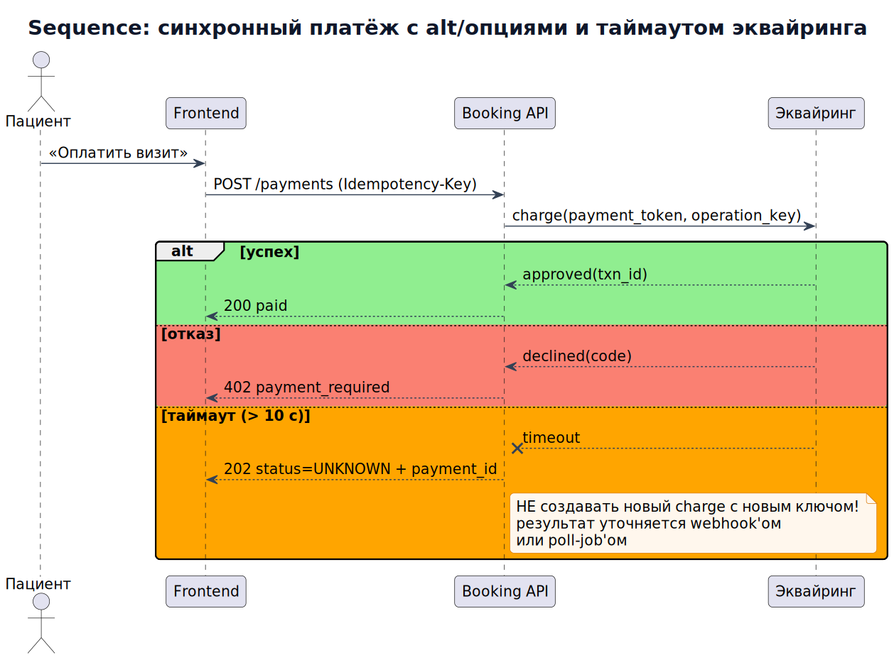
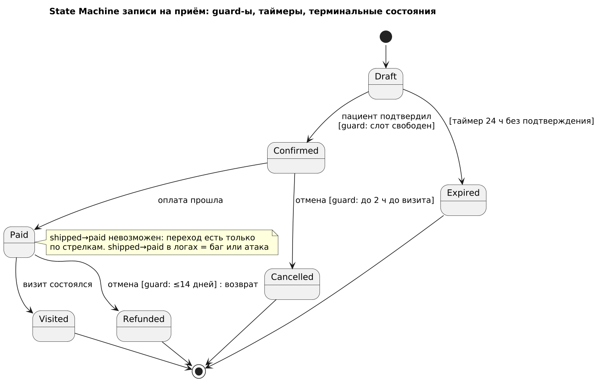
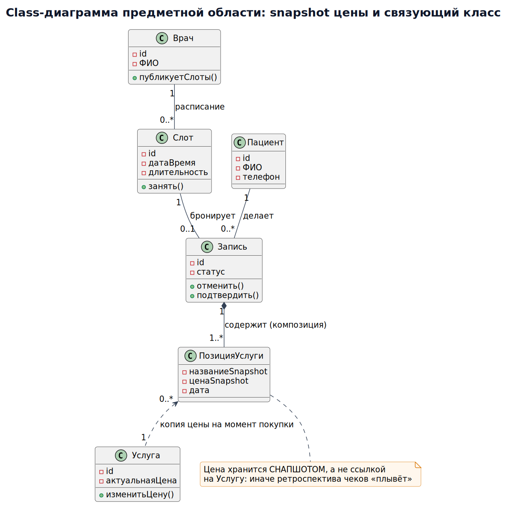
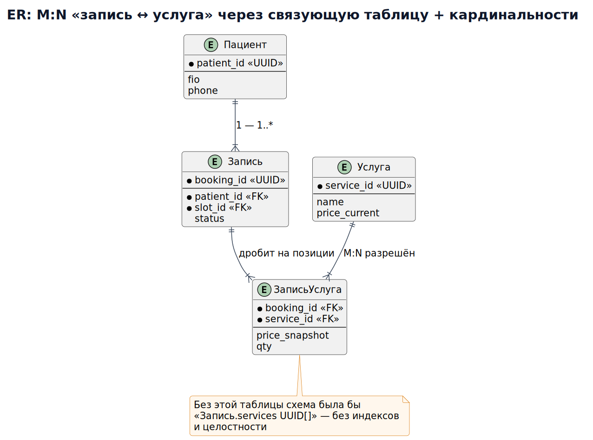
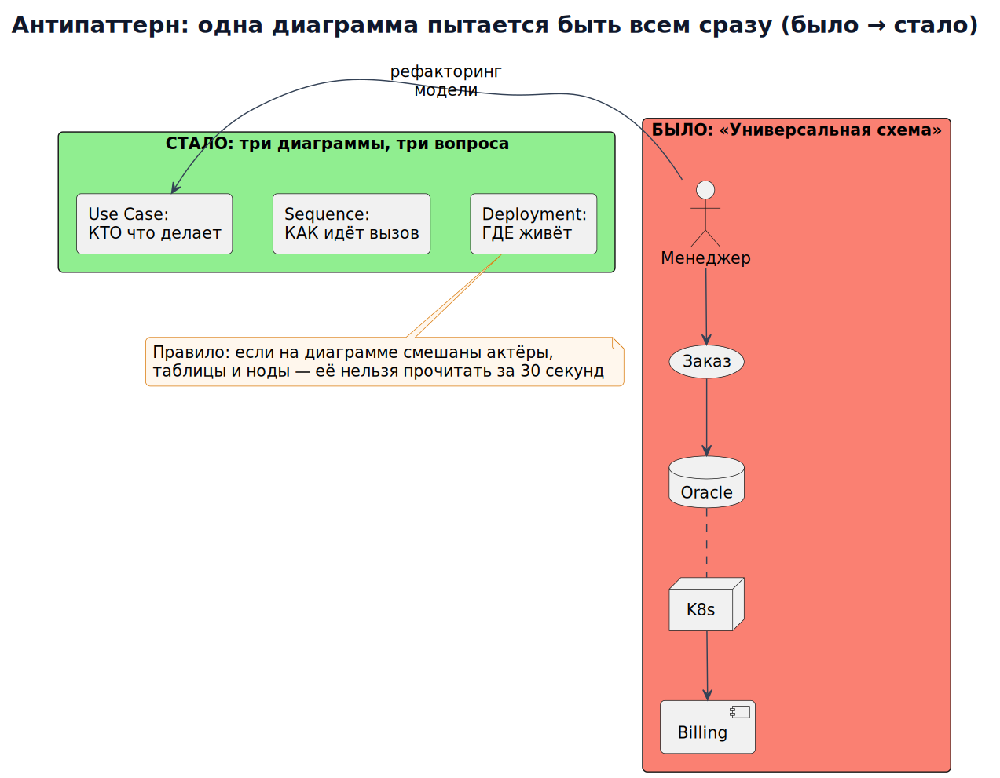
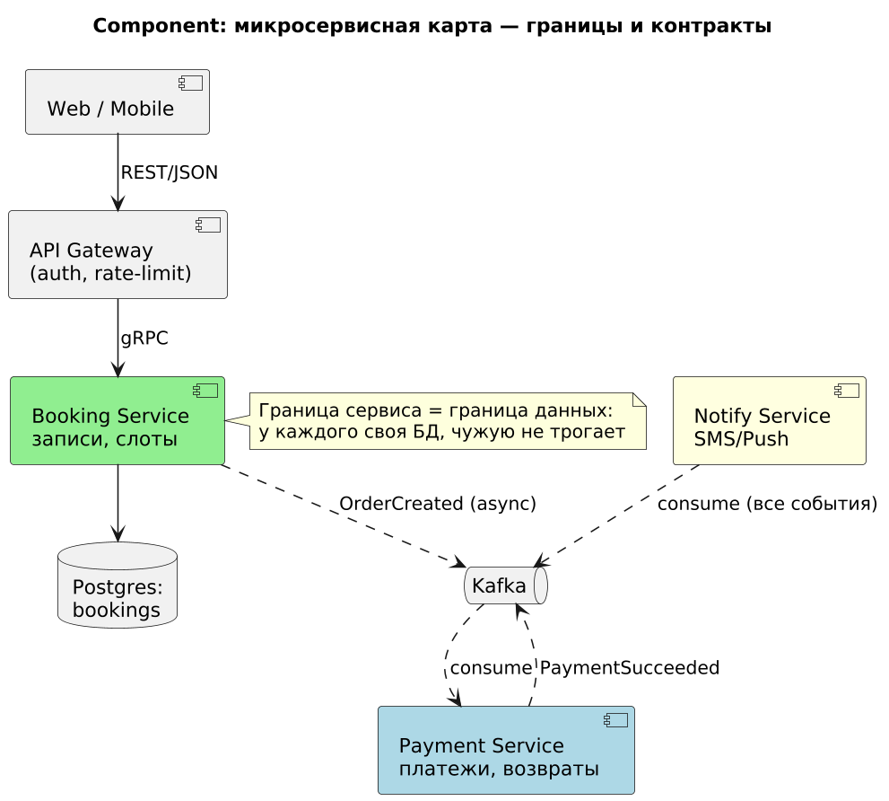
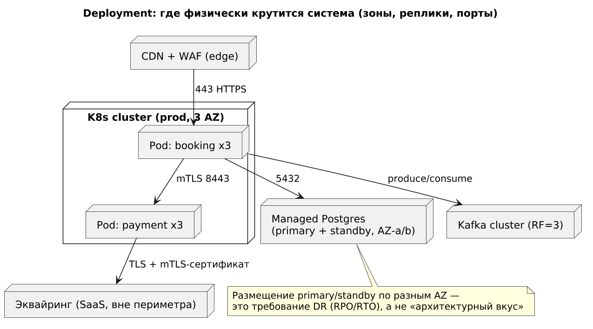

# Модуль 2. Моделирование: UML, BPMN, диаграммы

## Маршрут урока

| Режим | Что делать |
|---|---|
| База · 20–30 мин | Use Case, sequence и состояния одной функции. Прочитайте [основу](#lesson-base) и объясните один пример своими словами. |
| Практика · 30–45 мин | Выполните [задание](#lesson-practice), затем сравните с [критериями](../practice/assessment.md). |
| Углубление · 20–40 мин | BPMN, ER и архитектурные представления. Возвращайтесь после первой практики. |

**Артефакт в портфолио:** [шаг сквозного проекта](../project/05_processes.md). Время ориентировочное; один урок можно разделить на несколько занятий.

> **Результат модуля:** выбираем диаграмму под вопрос. Начинающему: сначала [маршрут](../START_HERE.md), затем теория → упражнение → самопроверка.

Аналитик думает картинками. Инструменты: PlantUML (код → диаграмма), Mermaid (в markdown/GitHub), draw.io, Camunda Modeler (BPMN).

<a id="lesson-base"></a>

## База и разборы

### 1. Какие диаграммы и когда

| Диаграмма | Отвечает на вопрос | Когда использовать |
|---|---|---|
| Use Case | Кто и что делает в системе? | Границы системы, скоуп |
| Sequence | Как общаются компоненты по времени? | Детализация одного сценария/API |
| Activity / BPMN | Каков бизнес-процесс с ветвлениями? | Процессы, workflow |
| Class / ER | Каковы данные и связи? | Модель предметной области, БД |
| State Machine | Как живёт объект (статусы)? | Заказ, платёж, заявление |
| Component/Deployment | Из чего система и где крутится? | Архитектура, инфраструктура |

**Пример с разбором (рис. 0).** Выбор инструмента под задачу: стейкхолдеры-не техники читают BPMN в draw.io; разработчики и CI — PlantUML/Mermaid как код (диффится в git, перерендеривается одной командой). Правило ветвления на диаграмме — «кто читатель?»: если схема нужна для согласования скоупа с бизнесом, берём нотацию, которую заказчик поймёт без легенды; если для имплементации и ревью PR — текстовый DSL. Разбор типичной ошибки: одна «всеобъемлющая» схема в draw.io, где одновременно UI, API и таблицы — её никто не поддерживает, и через квартал она врёт (см. рис. 9).


*Рис. 0. Decision-дерево: PlantUML vs Mermaid vs draw.io — выбор по читателю и месту жизни схемы.*

### 2. Use Case + спецификация
```
Actor: Покупатель
UseCase: Оформить заказ
Precondition: корзина не пуста, пользователь авторизован
Main flow: 1) подтверждает адрес 2) выбирает доставку 3) оплачивает
Extensions: 3a. Оплата отклонена -> вернуть на шаг 3 с ошибкой
Postcondition (успех): оплата подтверждена, заказ paid, резерв товара сохранён до отгрузки
Alternative: результат оплаты неизвестен -> заказ pending_payment, уточнить статус без нового списания
```

**Пример с разбором (рис. 1).** Use Case сервиса записи к врачу. Как читать по шагам:
1. **Граница системы (rectangle)** отделяет «что строим» от внешнего мира: всё внутри — наша ответственность и наш скоуп; всё снаружи — акторы и зависимости (SMS-шлюз на рисунке — это уже интеграция, см. Модуль 3).
2. **Два пользовательских актора** — Пациент и Регистратура: у них разные наборы use case'ов (пациент не управляет расписанием) — это прямое следствие для RBAC и навигации UI: два разных продукта на одной системе.
3. **Связь «Регистратура → Отменить запись»** — ассоциация актора с вариантом использования. `extend` связывает два use case, а не актора и use case. Дополнительное поведение описывают через точку расширения и условие; участие другой роли само по себе не является `extend`.
4. **Связь `<<include>>` «Записаться → Подтвердить визит по SMS»** — include обязателен всегда: подтверждение по SMS встроено в каждую запись; вынос в отдельный use case означает «этот шаг переиспользуется и специфицируется отдельно». Для условного дополнительного поведения можно использовать extend между вариантами использования с явной точкой расширения. Здесь SMS — условие именно этого отдельного примера; в сквозном проекте уведомление не подтверждает запись.
5. Спецификация (текст выше) важнее картинки: precondition/main flow/extensions/postcondition — это то, что превращает эллипс в проверяемые AC (Модуль 1, Gherkin). Эллипс без спецификации = декорация.


*Рис. 1. Use Case «Онлайн-запись к врачу»: акторы, ассоциации и include, граница системы.*

### 3. Sequence-диаграмма (PlantUML) — реальный вызов оплаты


*Ответ о принятии заказа предшествует асинхронной оплате. Интерфейс должен различать принятие запроса и итог операции.*

Разбор: клиент получил 202 до завершения оплаты; оплата асинхронная — это позволяет сглаживать нагрузку через очередь, но требует статуса заказа и идемпотентности.

**Пример с разбором (рис. 2).** Синхронный вариант того же платежа — с третьей веткой `alt`, которую легко пропустить: **таймаут эквайринга**. Разбор по шагам:
1. `POST /payments` несёт `Idempotency-Key` — без него любой повтор (клиент дёрнул кнопку дважды, сеть моргнула) = двойное списание. Sequence-диаграмма — лучшее место, чтобы показать заголовки контракта прямо на стрелке.
2. Ветка «успех» → 200 paid — тривиальна.
3. Ветка «отказ» → 402 с кодом причины — бизнес-ответ, фронт показывает текст карты.
4. **Ветка «таймаут > 10 c» → 202 status=processing** — ключевая: таймаут ≠ отказ! Деньги могли списаться. Правило на note: НЕ создавать новую попытку списания с новым ключом; безопасный повтор прежнего запроса возможен только по контракту идемпотентности провайдера; итог уточняется webhook'ом от эквайринга или poll-job'ом. Если на диаграмме этой ветки нет, разработчик реализует её как исключение/500 — и получаем «зависшие» платежи.
5. Проверка себя: сколько alt/опт-фрагментов в вашей sequence? Один «happy path» — признак недодуманного сценария; минимум три: успех / бизнес-отказ / сбой инфраструктуры.


*Рис. 2. Sequence синхронного платежа: alt-ветки успех/отказ/таймаут — третья ветка обязательна.*

### 4. State Machine для заказа
`draft → pending_payment → paid → assembling → shipped → delivered` + `cancelled`, `refunded`.
Правило: переход разрешён только из указанных состояний; все переходы логируются (audit). Попытка `shipped → paid` — баг или атака.

**Пример с разбором (рис. 3).** State machine записи на приём — самый недооценённый артефакт аналитика, потому что каждая стрелка это одновременно: проверка в коде, тест и AC. Разбор элементов:
1. **Guard-условия в квадратных скобках** (`[слот свободен]`, `[до 2 ч до визита]`) — без guard'а не определено бизнес-ограничение отмены; именно guard превращает картинку в спецификацию (ср. AC из Модуля 1).
2. **Таймер-переход `Draft → Expired` (24 ч без подтверждения)** — состояния часто «зависают» без внешних событий; каждый незавершённый процесс требует аварийного выхода по времени. В реализации нужен механизм обработки истечения срока; UI отображает полученное от сервера состояние.
3. **Терминальные состояния** (`Visited`, `Cancelled`, `Expired`, `Refunded` → `[*]`) — их отсутствие = запись никогда не «умирает», и аналитика no-show врёт.
4. **Отсутствие обратных стрелок**: из `Paid` нельзя вернуться в `Confirmed` — попытка такого перехода в логах = баг или атака (см. правило выше); тесты на «запрещённые переходы» важнее тестов на разрешённые.
5. Каждому переходу соответствует событие домена (`BookingConfirmed`, `BookingExpired`) — это контракт для Kafka из рис. 4 и основа audit-лога.


*Рис. 3. State Machine записи: guard-ы, таймер Draft→Expired, терминальные состояния.*

### 5. BPMN и UML Activity

BPMN описывает процесс через события, задачи и потоки управления. **Пул** обозначает участника; **дорожка** распределяет ответственность внутри пула. Sequence flow связывает элементы одного процесса, message flow — разных участников. Между пулами нельзя проводить sequence flow.

В [сквозном проекте](../project/05_processes.md) есть две настоящие BPMN 2.0-модели: запись на приём и ручная обработка исключения. Файлы `.bpmn` содержат модель и координаты BPMN DI, их можно открыть в совместимом редакторе. Там же — SVG, легенда и пошаговый разбор.


*Рис. 4. BPMN: запрос пациента запускает процесс; XOR выбирает подтверждение либо отказ. Проверка и занятие слота — одна атомарная операция.*

Предыдущий [пример возврата в UML Activity](../images_m2/m2_03_activity_bpmn.svg) иллюстрирует ветвления и ответственность. Его подписи про сроки не являются BPMN boundary events. Для точной семантики таймера используйте отдельную BPMN-модель исключения.

### 6. ER/Class диаграмма
Обозначения кардинальности: `1..*`, `0..1`. Ошибки новичков: many-to-many без связующей таблицы (`order_position`), хранение цены товара ссылкой на каталог вместо snapshot'а цены на момент заказа.

**Пример с разбором (рис. 5).** Class-диаграмма домена записи — два урока на одном рисунке:
1. **Композиция (закрашенный ромб) `Запись ◆— ПозицияУслуги`** описывает владение частью в данной модели. Это не автоматическая команда `ON DELETE CASCADE`: хранение истории, мягкое удаление и сроки хранения определяются отдельно. Платежи на этой схеме не показаны.
2. **Поле `price_snapshot` вместо ссылки на прайс** — классическая ошибка из текста выше, смоделированная корректно: цена фиксируется копией на момент создания; ссылка на каталог «плывёт» при изменении прайса и ломает ретроспективные отчёты и фискальные документы.
3. Мнемоника для проверки кардинальностей: прочитайте связь вслух с обеих сторон («одна запись содержит одну или несколько позиций услуг», «один пациент имеет ноль или много записей») — если фраза звучит абсурдно, модель неверна.


*Рис. 5. Class-диаграмма: композиция Запись—ПозицияУслуги и snapshot цены вместо ссылки на прайс.*

**Пример с разбором (рис. 6).** ER-диаграмма той же области глазами SQL: связь «многие-ко-многим» `Запись ↔ Услуга` (на приёме могут выполнить несколько услуг, услуга встречается в разных записях) физически невозможна двумя таблицами — появляется связующая таблица `ЗаписьУслуга` с составным PK `(appointment_id, service_id)` и своими атрибутами (количество, выполнено?). Проверка качества ER: каждую M:N увидели → задали вопрос «есть ли у связи собственные атрибуты?» — если да, связующая таблица полноценная сущность (её надо защищать FK- и уникальностью); если кардинальность нарисована `1..*` там, где бизнес говорит «может быть и ноль» — получите IntegrityError на проде. ER — единственный вид диаграмм, который напрямую конвертируется в DDL: проверьте, умеете ли вы читать его как `CREATE TABLE`.


*Рис. 6. ER: M:N через связующую таблицу «ЗаписьУслуга», кардинальности crow's foot.*

## Типичные ошибки (антипаттерны моделирования)

**Пример с разбором (рис. 7).** Антипаттерн «одна диаграмма обо всём» и его лечение. Слева: схема, где в одном холсте UI, REST-вызовы, таблицы и статусы — такие диаграммы умирают: любое изменение требования правит её целиком, ревью невозможно, а противоречия внутри (разные названия одного поля в UI и в БД) никто не замечает. Справа: та же область разложена на три диаграммы под три вопроса — Use Case (скоуп), Sequence (поведение), ER (данные). Цена разделения: три файла вместо одного; выигрыш — каждая диаграмма меняется независимо и отвечает на свой вопрос (ср. таблицу §1). Тест на здоровую модель: можете ли вы назвать для каждой диаграммы один вопрос, на который она отвечает? «Она показывает систему» — красный флаг.


*Рис. 7. Антипаттерн «одна диаграмма обо всём» → три диаграммы под три вопроса.*

<details>
<summary>Углубление: дополнительные решения и ограничения</summary>

### Архитектурные диаграммы: Component и Deployment

**Пример с разбором (рис. 8).** Component-диаграмма микросервисной карты. Как читать и зачем:
1. **Граница сервиса = граница данных** (note): у Booking и Payment свои БД; если на схеме два сервиса тычутся в одну таблицу — это распределённая монолит, а не микросервисы (следствие: деградация изоляции отказов, см. Модуль 5).
2. **Синхронные стрелки (REST/gRPC) vs асинхронные (Kafka)**: синхронный вызов = доступность зависимого сервиса входит в вашу доступность; заметьте, уведомление (Notify Service) подписано на события — новый потребитель добавляется без изменения отправителя (Open/Closed на уровне архитектуры).
3. **API Gateway** выделен не случайно: аутентификация и rate-limit в одном месте, а не в каждом сервисе — это NFR-решение из Модуля 1.
4. Для аналитика component-карта = карта владельцев API и источник каталога интеграций (Модуль 3): каждая стрелка порождает контракт и SLA-договорённость между командами.


*Рис. 8. Component: границы сервисов и данных, синхронные вызовы и Kafka-события.*

**Пример с разбором (рис. 9).** Deployment-диаграмма: та же логика, но «где физически крутится». Разбор решений, которые видно только здесь:
1. **Primary и standby БД в разных зонах доступности** — прямая визуализация RTO/RPO из NFR (Модуль 1): если обе в одной AZ, отказ этой зоны может сделать обе недоступными. Потеря данных зависит от репликации и резервных копий; standby не заменяет backup.
2. **Порты и протоколы на соединениях** (443 ingress, mTLS между сервисами) — вход для security-ревью (Модуль 6): диаграмма буквально показывает поверхность атаки.
3. **Load Balancer + N реплик в K8s** — масштабирование без остановки требует stateless-сервисов; если разработчик возразит «у меня сессия в памяти», нужно определить хранение сессий и поведение при переключении реплики — аналитик видит конфликт заранее.
4. Тест полезности deployment-схемы: на ней отмечены все единые точки отказа (SPOF)? Если нет — найдите их мысленным экспериментом «что упадёт вместе с X?».


*Рис. 9. Deployment: K8s/AZ, primary+standby в разных зонах (DR), mTLS, surface атаки.*


</details>

## Ссылки
- PlantUML — все типы диаграмм: https://plantuml.com/
- Mermaid (рендерится GitHub): https://mermaid.js.org/
- BPMN 2.0 спецификация: https://www.omg.org/spec/BPMN/2.0/
- Camunda Modeler: https://camunda.com/download/modeler/
- Шпаргалка «какая диаграмма когда»: https://www.uml-diagrams.org/

<a id="lesson-practice"></a>

## Практика
- [ ] Нарисуйте sequence «Оформление заказа» с синхронным платежом и разберите, что будет при таймауте эквайринга (ср. рис. 2 — три alt-ветки обязательны).
- [ ] State machine «Доставка»: 8 состояний, минимум 2 терминальных, guard-ы на каждом спорном переходе (ср. рис. 3).
- [ ] BPMN «Онбординг юрлица в банк» с дорожками Клиент/Менеджер/Комплаенс и таймером SLA (ср. рис. 4).
- [ ] По рис. 1: для своего домена нарисуйте Use Case с границей системы и хотя бы одной парой include/extend; напишите к одному use case полную спецификацию (precondition/main flow/extensions/postcondition).
- [ ] Возьмите свою ER-модель и найдите в ней все M:N: для каждой напишите DDL связующей таблицы с составным PK (ср. рис. 6).

Задания 3–4 практикума: [tasks](../practice/tasks.md) · [разбор sequence](../practice/solutions/sol03_sequence.md), [разбор state machine](../practice/solutions/sol04_statemachine.md)
Исходники всех диаграмм модуля: `puml_m2/*.puml`, пересборка — `./render_all.sh`
Дальше: [Модуль 3 — Интеграции и API](../03_integration_apis/README.md)

## Закрепление: Выбираем диаграмму под вопрос

**Простыми словами.** Sequence показывает обмен сообщениями, state — допустимые изменения объекта, activity/BPMN — ход процесса, ER — данные и связи. Каждая схема отвечает на свой вопрос.

**Разобранный пример.** Платёжный провайдер не ответил: на sequence показываем timeout и сверку, на state — PENDING → UNKNOWN → SUCCESS/FAILED. UNKNOWN не означает FAILED.

**Самостоятельно (20–30 минут).** Нарисуйте sequence оплаты и state попытки. Добавьте двойной клик, отказ и поздний webhook.

**Критерии проверки.** На схеме есть акторы, граница системы, сообщения и ветки; таймаут не превращён в отказ; статусы совпадают с текстом и API.

<details>
<summary>Самопроверка: Может ли процессная activity-схема автоматически считаться BPMN?</summary>

Нет. PlantUML activity иллюстрирует поток, но не проверяет BPMN-семантику событий, пулов и сообщений. Для BPMN используйте соответствующую нотацию и редактор.

</details>

[Сквозной пример оплаты](../examples/payment/README.md) · [Первоисточники](../SOURCES.md)

**О нотации:** activity-схемы PlantUML в этом модуле иллюстрируют процесс, но не являются BPMN 2.0 моделями. Для исполняемого BPMN используйте специализированный редактор, события, пулы и message flow по BPMN-семантике.
