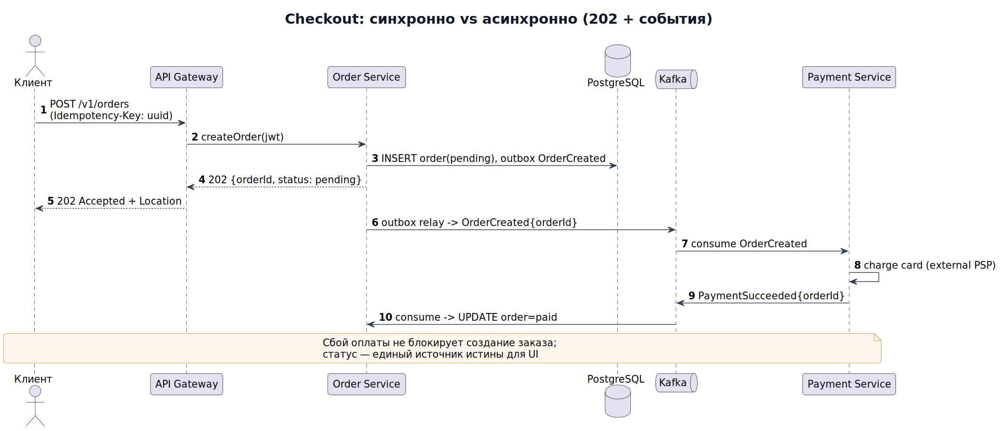
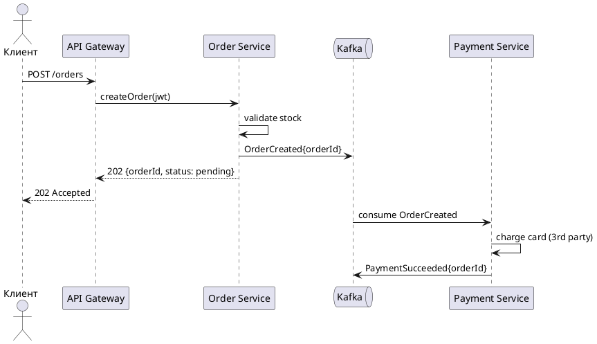

# Модуль 2. Моделирование: UML, BPMN, диаграммы

Аналитик думает картинками. Инструменты: PlantUML (код → диаграмма), Mermaid (в markdown/GitHub), draw.io, Camunda Modeler (BPMN).

## Теория

### 1. Какие диаграммы и когда

| Диаграмма | Отвечает на вопрос | Когда использовать |
|---|---|---|
| Use Case | Кто и что делает в системе? | Границы системы, скоуп |
| Sequence | Как общаются компоненты по времени? | Детализация одного сценария/API |
| Activity / BPMN | Каков бизнес-процесс с ветвлениями? | Процессы, workflow |
| Class / ER | Каковы данные и связи? | Модель предметной области, БД |
| State Machine | Как живёт объект (статусы)? | Заказ, платёж, заявление |
| Component/Deployment | Из чего система и где крутится? | Архитектура, инфраструктура |

### 2. Use Case + спецификация
```
Actor: Покупатель
UseCase: Оформить заказ
Precondition: корзина не пуста, пользователь авторизован
Main flow: 1) подтверждает адрес 2) выбирает доставку 3) оплачивает
Extensions: 3a. Оплата отклонена -> вернуть на шаг 3 с ошибкой
Postcondition: заказ в статусе pending_payment, списаны остатки
```

### 3. Sequence-диаграмма (PlantUML) — реальный вызов оплаты



Разбор: клиент получил 202 мгновенно; оплата асинхронная — это снимает пиковую нагрузку, но требует статуса заказа и идемпотентности.

### 4. State Machine для заказа
`draft → pending_payment → paid → assembling → shipped → delivered` + `cancelled`, `refunded`.
Правило: переход разрешён только из указанных состояний; все переходы логируются (audit). Попытка `shipped → paid` — баг или атака.

### 5. BPMN vs UML Activity
BPMN — язык бизнеса: пулы/дорожки (участники), шлюзы (XOR/AND/OR), события (таймер, сообщение), пул «Эскалация». Выбирайте BPMN, если процесс читают заказчики-не техники; UML Activity — для внутренней детализации.

Пример разбора: «Возврат товара»: дорожки Клиент / e-commerce / Склад / Банк; XOR-шлюз «чек найден?»; таймер-событие «7 дней на ответ склада»; error-边界 «банк отказал» → ручная обработка.

### 6. ER/Class диаграмма
Обозначения кардинальности: `1..*`, `0..1`. Ошибки новичков: many-to-many без связующей таблицы (`order_position`), хранение цены товара ссылкой на каталог вместо snapshot'а цены на момент заказа.

## Ссылки
- PlantUML — все типы диаграмм: https://plantuml.com/
- Mermaid (рендерится GitHub): https://mermaid.js.org/
- BPMN 2.0 спецификация: https://www.omg.org/spec/BPMN/2.0/
- Camunda Modeler: https://camunda.com/download/modeler/
- Шпаргалка «какая диаграмма когда»: https://www.uml-diagrams.org/

## Практика
- [ ] Нарисуйте sequence «Оформление заказа» с синхронным платежом и разберите, что будет при таймауте эквайринга.
- [ ] State machine «Доставка»: 8 состояний, минимум 2 терминальных.
- [ ] BPMN «Онбординг юрлица в банк» с дорожками Клиент/Менеджер/Комплаенс и таймером SLA.

Задания 3–4 практикума: [tasks](../practice/tasks.md) · [разбор sequence](../practice/solutions/sol03_sequence.md), [разбор state machine](../practice/solutions/sol04_statemachine.md)
Дальше: [Модуль 3 — Интеграции и API](../03_integration_apis/README.md)
