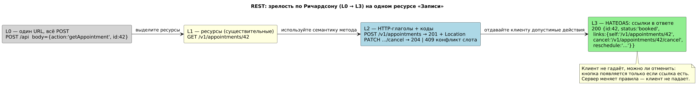
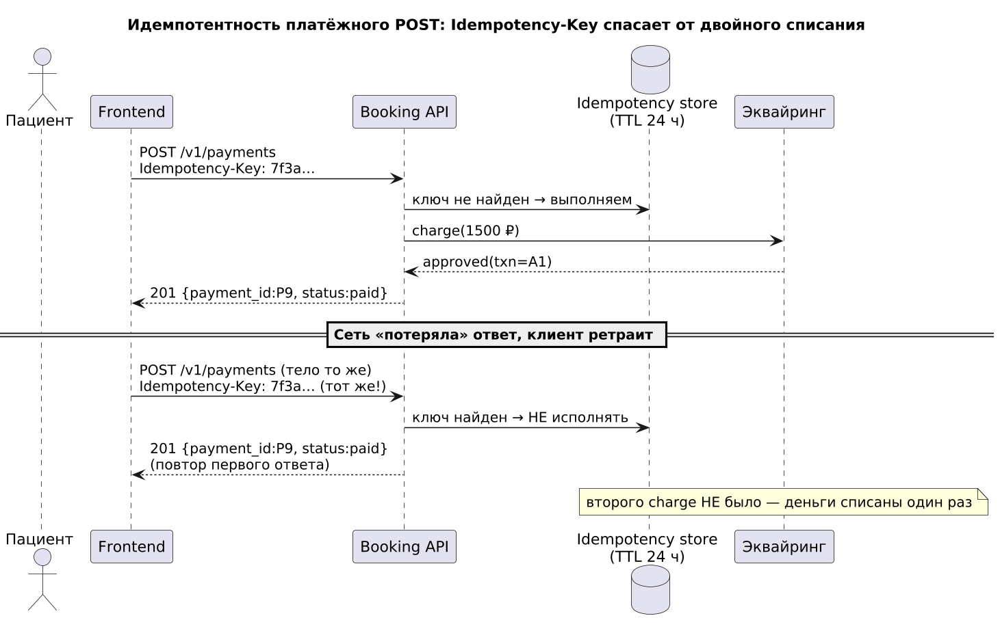
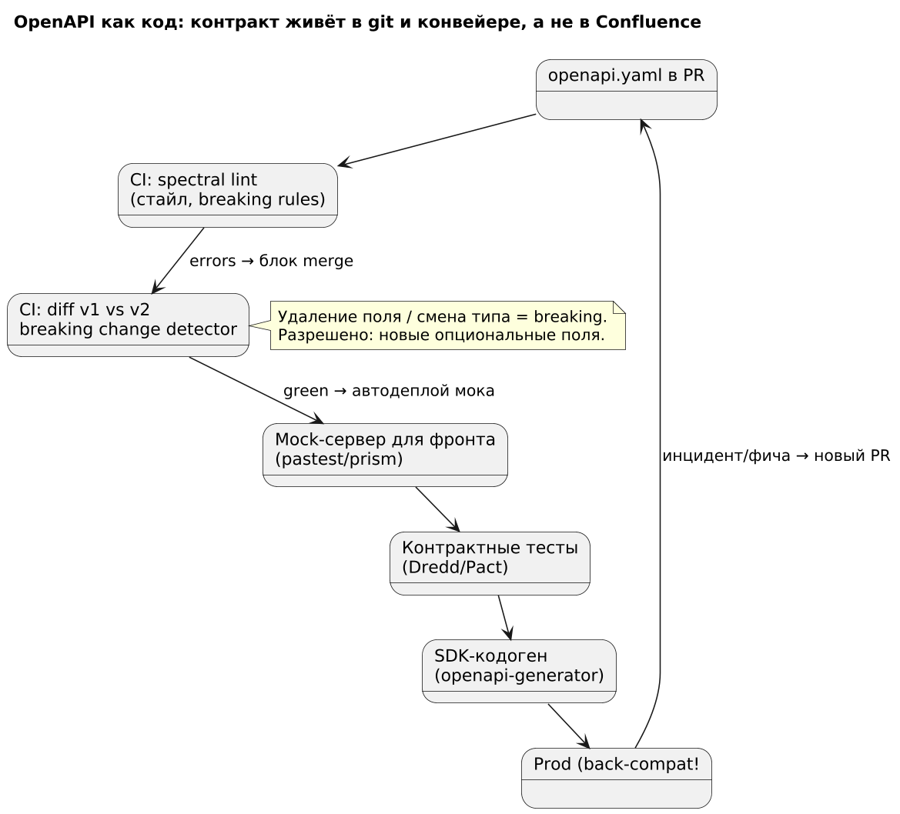
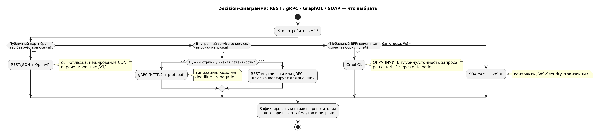
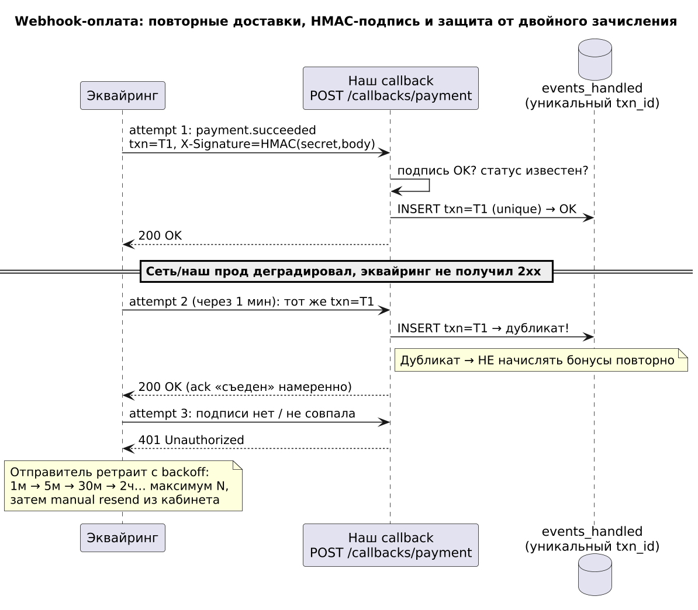
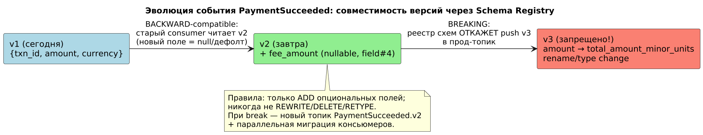
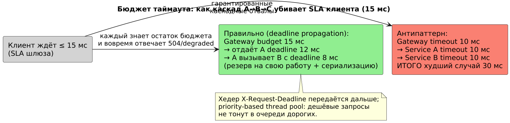
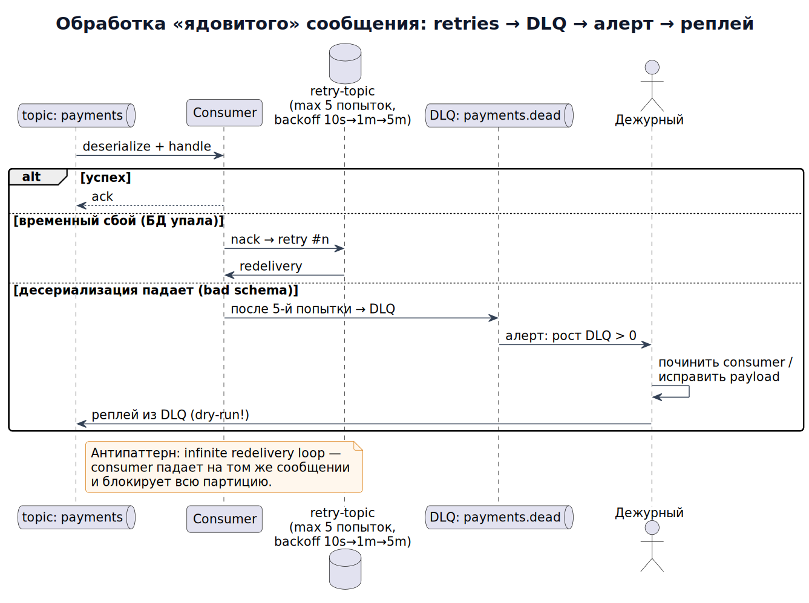
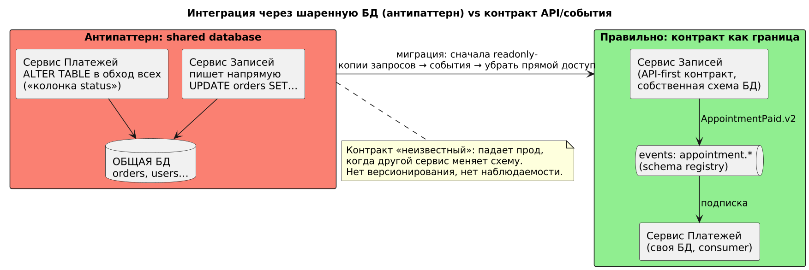
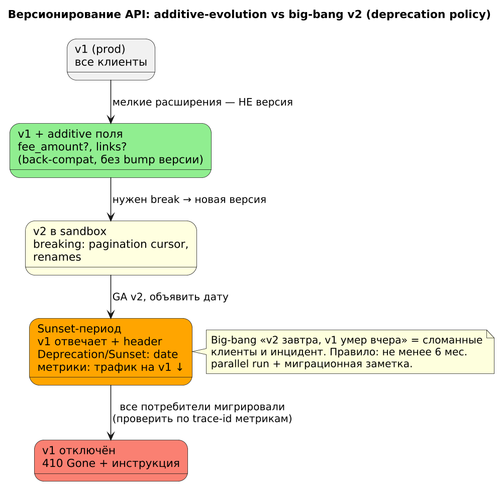

# Модуль 3. Интеграции и API

## Маршрут урока

| Режим | Что делать |
|---|---|
| База · 20–30 мин | Запрос, ответ, ошибка и безопасный повтор. Прочитайте [основу](#lesson-base) и объясните один пример своими словами. |
| Практика · 30–45 мин | Выполните [задание](#lesson-practice), затем сравните с [критериями](../practice/assessment.md). |
| Углубление · 20–40 мин | События, совместимость и бюджеты таймаутов. Возвращайтесь после первой практики. |

**Артефакт в портфолио:** [шаг сквозного проекта](../project/04_api.md). Время ориентировочное; один урок можно разделить на несколько занятий.

> **Результат модуля:** http-ответ и результат оплаты. Начинающему: сначала [маршрут](../START_HERE.md), затем теория → упражнение → самопроверка.

Язык, на котором системы говорят друг с другом. Аналитик проектирует контракты до написания кода (API-first).

<a id="lesson-base"></a>

## База и разборы

### 1. REST: зрелость по Ричардсону
- L0 — один URL, всё через POST. L1 — ресурсы (`/orders/{id}`). L2 — HTTP-глаголы + коды. L3 — HATEOAS (ссылки в ответе).
- Правила хорошего тона: существительные во множественном числе, версии `/v1/`, фильтрация `?status=paid&sort=-created_at`, пагинация `limit/offset` или cursor.

**Пример с разбором (рис. 0).** 
*Рис. 0. Эволюция одного ресурса «Записи» от L0 до L3.*
Разбор по шагам:
1. **L0→L1**: вместо `POST /api {action:'getAppointment'}` выделяем существительное — ресурс `/v1/appointments/42`. Проверка: к URL можно задать вопрос «это noun?» — если там глагол (`/getUserList`), уровень не пройден.
2. **L1→L2**: семантика метода делает контракт самодокументируемым: `POST /v1/appointments → 201 + Location`, конфликт слота — `409`, а не `200 {success:false}`. Клиент различает успех/ошибку статусом, а не парсингом тела.
3. **L2→L3**: сервер кладёт в ответ ссылки на допустимые действия (`cancel`, `reschedule`). Разбор выигрыша: кнопка «Отменить» появляется у фронта только когда ссылка есть — правила жизненного цикла живут на сервере, клиент не устаревает при смене бизнес-правил.
4. Практический вывод для аналитика: требовать L2 минимум; L3 — там, где у API много клиентов и правила меняются часто.

Идемпотентность: GET/PUT/DELETE — идемпотентны, POST — нет. Для платёжного POST используйте `Idempotency-Key: <uuid>` — повторный запрос с тем же ключом вернёт первый результат, а не спишет деньги дважды.

**Пример с разбором (рис. 1).** 
*Рис. 1. Повтор POST с тем же Idempotency-Key не приводит ко второму списанию.*
Разбор механики:
1. Первый запрос: ключ `7f3a…` не найден в idempotency-store → выполняем charge, запоминаем ответ, отдаём `201 {P9, paid}`.
2. Сеть «потеряла» ответ → фронт ретраит с **тем же ключом и тем же телом**.
3. Ключ найден → НЕ исполнять повторно, отдать закешированный первый ответ. Эквайринг видел `charge` ровно один раз.
Правила, которые надо зафиксировать в контракте (иначе реализация разъедется): ключ обязателен (задать `required: true` в OpenAPI); TTL хранения ≥ периода ретраев клиента (24 ч); повтор с тем же ключом, но **другим телом** → `422` (признак бага клиента); гонка двух одновременных запросов с одним ключом → блокировка на вставке уникального индекса, второй ждёт и получает тот же результат.

### 2. OpenAPI 3 — контракт как код
```yaml
openapi: 3.0.3
info: { title: Orders API, version: 1.2.0 }
paths:
  /v1/orders:
    post:
      parameters:
        - in: header
          name: Idempotency-Key
          required: true
          schema: { type: string, format: uuid }
      requestBody:
        content:
          application/json:
            schema:
              type: object
              required: [items, addressId]
              properties:
                items:
                  type: array
                  minItems: 1
                  items: { $ref: '#/components/schemas/OrderItem' }
      responses:
        '201': { description: created, headers: { Location: {...} } }
        '409': { description: duplicate idempotency key }
        '422': { description: validation error, content: { application/problem+json: {...} } }
```
Разбор: контракт фиксирует ошибки 409/422 — интеграция устойчива к дублям; `problem+json` (RFC 7807) — единый формат ошибок.

**Пример с разбором (рис. 2).** 
*Рис. 2. Контракт живёт в git и CI: lint → breaking-diff → mock → контрактные тесты → SDK.*
Разбор конвейера:
1. `openapi.yaml` — артефакт репозитория, меняется PR'ом; правка контракта видна в диффе, обсуждается в review (в отличие от «живого» Swagger UI, который всегда показывает имплементацию, а не договорённость).
2. **Spectral-lint** ловит стиль и нарушения правил компании (нет описания ошибки, snake_case vs camelCase — выбор должен быть единым во всех API).
3. **Breaking-change detector** сравнивает v_prev и v_new: удаление поля/смена типа = блок мержа; добавление опционального поля = зелёно. Это единственный надёжный способ не сломать чужих клиентов.
4. Из того же файла: **mock-сервер** (фронт начинает работу до бэкенда), **контрактные тесты** (Dredd/Pact проверяют, что имплементация соответствует спеке — иначе спека врёт), **кодоген SDK** (клиенты получают типы бесплатно).
5. Роль аналитика: контракт — источник истины для AC из Модуля 1; каждое поле `required` и каждый код ответа должны трассироваться в ФТ/NFR.

### 3. REST vs gRPC vs GraphQL vs SOAP


*Сравнивайте контракт, взаимодействие и ограничения потребителя. Название протокола само по себе не определяет пригодность решения.*

| Протокол | Транспорт | Плюсы | Минусы | Когда |
|---|---|---|---|---|
| REST/JSON | HTTP | просто, кешируется, отладка curl | нет схемы из коробки | публичные API |
| gRPC | HTTP/2 protobuf | типизация, скорость, стримы, кодоген | плохая поддержка браузерами | service-to-service |
| GraphQL | HTTP | клиент сам выбирает поля, нет overfetching | N+1, сложное кеширование, лимитировать глубину! | BFF для мобильных |
| SOAP/XML | HTTP | контракты, WS-Security, транзакции | громоздко | госсектор, банки (ЕБС ПГ) |

**Пример с разбором (рис. 3).** 
*Рис. 3. Decision-диаграмма выбора стиля интеграции по типу потребителя.*
Разбор веток:
1. **Вопрос ветвления один: «кто потребитель?»** — не «что моднее». Публичный партнёр → REST+OpenAPI (его можно пробить curl'ом и закешить на CDN без специальной инфраструктуры).
2. Внутренний service-to-service под нагрузкой → gRPC: protobuf быстрее JSON, схема `.proto` даёт кодоген на оба языка, deadline propagation (см. рис. 6) работает «из коробки».
3. Мобильный BFF → GraphQL, но разбор обязательных предохранителей: лимит глубины и стоимости запроса (иначе один запрос убьёт БД), dataloader против N+1, кеширование сложнее REST (POST не кешируется прокси).
4. Банк/госка с требованиями WS-Security/транзакций → SOAP, даже если он громоздкий: здесь важны стандартизированные контракты и подпись сообщения, а не красота.
5. Общий лист для всех веток: до старта разработки зафиксировать контракт, таймауты, ретраи и формат ошибок — это предмет договора между командами, а не «детали реализации».

### 4. Асинхронные интеграции
Webhooks: платёжный провайдер шлёт `POST /callbacks/payment` с подписью `X-Signature: HMAC(secret, body)`. Обязательны: проверка подписи, идемпотентность (повторяющиеся callbacks!), быстрый ответ 2xx, ретраи со стороны отправителя.
Очереди/pub-sub (Kafka, RabbitMQ): события `PaymentSucceeded.v2` — контракт в схеме (Avro/JSON Schema + реестр схем), совместимость версий back-compatible.

**Пример с разбором (рис. 4).** 
*Рис. 4. Три доставки одного webhook-события и защита от двойного зачисления.*
Разбор по доставкам:
1. **Attempt 1**: проверяем HMAC по сырому телу (не после парсинга — канонизация JSON ломает подпись), затем надёжно сохраняем событие в inbox с UNIQUE(provider,event_id). Только успешный COMMIT позволяет ответить 2xx. Worker применяет эффект и отметку обработки в одной транзакции. txn_id идентифицирует платёж, а event_id — конкретное событие; это разные ключи.
2. **Attempt 2** (провайдер не получил 2xx из-за нашего деплоя): INSERT падает на дубликате → событие уже обработано → отвечаем `200`, но ничего не начисляем. Разбор тонкости: отвечать нужно именно 2xx, иначе провайдер будет ретраить бесконечно.
3. **Attempt 3** с неверной подписью → `401`: callback-эндпоинт — публичный URL, без проверки подписи любой, кто узнал адрес, «начислит» себе оплату. Дополнительно: сверять сумму/валюту/статус с внутренним платежом (idempotency-key ≠ гарантия корректности данных), whitelist IP провайдера — defense-in-depth, но не замена подписи.
4. Порядок событий гарантировать нельзя (attempt 2 может прийти раньше attempt 1) — поэтому handler идемпотентен **по состоянию** (переход payment.status по state-machine из Модуля 2), а не «по порядку прилёта».

**Пример с разбором (рис. 5).** 
*Рис. 5. v1→v2 обратно-совместимо; переименование поля — breaking, реестр схем не пустит.*
Разбор правил эволюции схемы:
1. **v2 добавляет `fee_amount` nullable** — старый consumer прочитает новый payload (поле просто игнорируется), новый consumer читает старые сообщения (null/дефолт). Это BACKWARD compatibility — дефолтный режим Schema Registry.
2. **v3 переименовывает `amount`** — для старого консьюмера поле «исчезло», десериализация падает. Реестр схем откажет push такой версии в прод-топик — единственная защита, которая реально работает, потому что она в CI, а не в вики.
3. Если break необходим: публикуем **новый топик** `PaymentSucceeded.v2`, producer пишет в оба, consumers мигрируют, старый топик гасится после полного перевода (стратегия параллельного запуска — та же логика, что у strangler fig в курсовом модуле микросервисов).
4. Соглашение об именовании событий: прошедшее время, факт (`PaymentSucceeded`, а не `MakePayment`) — событие это запись истории, приказ живёт в команде-API.

### 5. Типовые боли и разборы
- **Overfitting таймаутов:** вызов A→B→C с таймаутами 10+10+10 мс при SLA клиента 15 мс — гарантированные каскады. Правило: бюджет таймаута делится по пути вызова.

**Пример с разбором (рис. 6).** 
*Рис. 6. Антипаттерн «таймауты не суммируются в SLA» vs deadline propagation.*
Разбор числами:
1. Слева: таймауты вложенных вызовов по 10 мс не означают автоматическую сумму 30 мс. Проблема — несогласованные дедлайны и работа downstream после прекращения ожидания upstream. Хуже того: gateway уже отдал 504 клиенту, а A и B могут продолжать обработку после завершения ожидания клиента — держат потоки/соединения, и под нагрузкой каскад валит весь кластер (retry storm усиливает).
2. Справа: бюджет 15 мс передается по цепочке как **оставшийся дедлайн** (header `X-Request-Deadline` или gRPC deadline): gateway резервирует 3 мс на себя, отдаёт A 12 мс, A — B 8 мс. Каждый участник знает, сколько осталось, и вовремя отвечает 504/degraded-ответ вместо зависания.
3. Парные настройки, которые тоже фиксирует аналитик в контракте интеграции: retries только для идемпотентных методов, max 1–2 повтора с jitter backoff (иначе синхронные ретраи всех клиентов создают волну), circuit breaker на внешнюю систему с fallback'ом («цена по умолчанию + досчитать позже»).
4. NFR-формулировка из Модуля 1, которую требует эта схема: «P95 сквозного вызова ≤ X мс; при деградации зависимостей — degraded-ответ не позднее Y мс».

- **Потеря данных при рестарте потребителя:** без manual ack + DLQ сообщения «сгорают». Разбор: consumer упал на десериализации → message requeued → infinite redelivery loop. Лечение: max attempts → DLQ + алерт.

**Пример с разбором (рис. 7).** 
*Рис. 7. Ядовитое сообщение: retry-topic → DLQ → алерт → контролируемый реплей.*
Разбор трёх исходов обработки:
1. **Успех** → manual ack **после** успешной записи в свою БД (ack до обработки = потеря при падении; обработка до ack = дубль при redelivery — поэтому обработка обязана быть идемпотентной, см. рис. 1).
2. **Временный сбой** (БД недоступна) → nack в retry-topic с нарастающей задержкой (10s→1m→5m), максимум 5 попыток. Основная партиция не блокируется.
3. **Перманентный сбой** (битая схема — «ядовитое» сообщение) → после 5-й попытки в DLQ `payments.dead` + алерт на рост счётчика. Разбор эксплуатации: DLQ без алерта = тихая потеря денег; реплей из DLQ только после починки консьюмера и **dry-run** на одном сообщении, иначе реплеем затопит всю партицию заново.
4. Что аналитик документирует в контракте: политику ack, число попыток, имя DLQ, SLA разбора DLQ (например, «необработанные > 24 ч → инцидент P2»).

- **Интеграция по шаренной БД:** два сервиса пишут в одну таблицу → контракт «неизвестный», колонки ломают прод. Антипаттерн.

**Пример с разбором (рис. 8).** 
*Рис. 8. Слева — интеграция через общую БД (хаос), справа — через контракт API/события.*
Разбор:
1. Почему это происходит: «быстро прочитать чужие таблицы» дешевле на день, чем договориться о контракте. Расплата — ALTER TABLE одним сервисом роняет другой в проде, причём никто не узнал об изменении через review: схема БД стала теневым API без версионирования.
2. Диагностика в code-review: SQL вида `SELECT ... FROM чужой_сервис.orders` или запись в чужие таблицы — красный флаг архитектурного долга; единственная легальная работа с чужими данными — через их API/события.
3. Миграция (справа): readonly-копии запросов → вынос в событие `AppointmentPaid.v2` с реестром схем → прямой доступ к чужой таблице удалён, у каждого сервиса своя схема. Каждый шаг обратим и не требует big-bang.
4. Честный trade-off: события дают eventual consistency — фантомные чтения возможны; для критичных операций (списание денег) оставляем синхронный вызов с идемпотентностью. Выбор «событие vs sync» — часть контракта, его обосновывает аналитик.

<details>
<summary>Углубление: дополнительные решения и ограничения</summary>

### 6. Версионирование и deprecation API
Мелкие additive-расширения не требуют bump версии; breaking-изменения — новая версия с политикой sunset.

**Пример с разбором (рис. 9).** 
*Рис. 9. Путь v1 → v2: аддитивная эволюция, sandbox, sunset-период, отключение.*
Разбор стадий:
1. **Additive-эволюция**: новое опциональное поле — это не «v2»; версий должно быть мало, потому что каждая версия — это поддерживаемый контракт навсегда.
2. **Breaking** (cursor-пагинация, rename) — только в новой версии, сначала sandbox: ранние партнёры тестируют до GA.
3. **Sunset-период**: v1 работает, но отвечает заголовками `Deprecation`/`Sunset: <дата>`; по trace-id метрикам видно, кто ещё сидит на v1 — отключение «вслепую» запрещено. Правило курса: не менее 6 месяцев parallel run + миграционная заметка для владельцев клиентов.
4. **Отключение**: `410 Gone` с ссылкой на инструкцию (не `404` — чтобы клиент понял причину). Разбор ошибки big-bang («v2 завтра, v1 вчера умер»): чужие батчи падают в ночь, инцидент P1, доверие к вашему API теряется — следующие контракты партнёры будут согласовать «на всякий случай» через свои прослойки.
5. Артефакт аналитика: таблица deprecated-элементов (поле/эндпоинт, причина, версия удаления, владелец клиента) — ревизится на каждом планировании.


</details>

## Типичные ошибки (антипаттерны)
1. **«Swagger из кода» как источник истины**: спека генерится с контроллеров постфактум → контракт никто не ревьюил, breaking-изменения выходят незаметно (противоядие — API-first, рис. 2).
2. POST-платежи без `Idempotency-Key` «потому что фронт один раз не нажмёт дважды» (рис. 1).
3. Webhook без проверки HMAC и без защиты от дублей (рис. 4) — двойные начисления и поддельные «оплаты».
4. Таймауты проставлены «на глаз» независимо на каждом звене (рис. 6) — каскадные отказы под нагрузкой.
5. Сообщения без DLQ и алертов (рис. 7) — тихая потеря данных.
6. Общая БД как «интеграция» (рис. 8) и отключение версий big-bang (рис. 9).

## Ссылки
- OpenAPI Specification: https://spec.openapis.org/oas/latest.html
- RFC 7807 problem+json: https://datatracker.ietf.org/doc/html/rfc7807
- RFC 9745 Deprecation & Sunset headers: https://datatracker.ietf.org/doc/html/rfc9745
- gRPC docs: https://grpc.io/docs/
- Webhooks best practices (Stripe): https://docs.stripe.com/webhooks
- Confluent Schema Registry: https://docs.confluent.io/platform/current/schema-registry/index.html
- Google AIP (API дизайн-практики): https://google.aip.dev/
- Spectral (lint OpenAPI): https://stoplight.io/open-source/spectral

<a id="lesson-practice"></a>

## Практика
- [ ] Спроектируйте OpenAPI для «карты лояльности»: выписка бонусов, списание с идемпотентностью (сверьте с рис. 1–2: `required: true` на ключе, 409/422 в контракте).
- [ ] Нарисуйте sequence webhook-оплаты с повторной доставкой и покажите защиту от двойного зачисления (чек-лист: подпись, UNIQUE txn_id, быстрый 2xx, state-machine статусов — рис. 4).
- [ ] Выберите протокол для 5 кейсов (мобильное приложение, межсервис, госсистема, аналитика событий, платежи) и обоснуйте по decision-диаграмме рис. 3.
- [ ] Проведите аудит существующей интеграции по рис. 6–7: посчитайте бюджет таймаута вдоль цепочки вызовов; проверьте, что «ядовитое» сообщение попадёт в DLQ, а DLQ — под алерт.
- [ ] Составьте deprecation-план для вашего публичного API по стадиям рис. 9 (additive → sandbox → sunset → 410).

Задание 5 практикума: [tasks](../practice/tasks.md) · [разбор webhook-контракта](../practice/solutions/sol05_webhook.md) · заполните [шаблон контракта интеграции](../templates/integration-contract.md) на свою реальную интеграцию
Исходники диаграмм этого раздела: `puml_m3/*.puml`, пересборка — `./render_all.sh`
Дальше: [Модуль 4 — Базы данных и SQL](../04_databases_sql_nosql/README.md)

## Закрепление: HTTP-ответ и результат оплаты

**Простыми словами.** HTTP-код относится к запросу; статус платежа — к бизнес-операции. 202 значит принято в обработку, а не оплачено. Потеря ответа не доказывает отсутствие списания.

**Разобранный пример.** POST /payments создаёт попытку P9 и отвечает 202 + Location. GET /payments/P9 возвращает 200 с status=UNKNOWN. Это успешное чтение пока неизвестного результата.

**Самостоятельно (20–30 минут).** Опишите POST/GET, обязательные заголовки, повтор с тем же ключом, другое тело и конфликт двух запросов.

**Критерии проверки.** Повтор сохраняет payment_id; новый ключ не создаёт повторную оплату активного заказа; ответы и действия UI однозначны.

<details>
<summary>Самопроверка: Что делать после 504 от шлюза?</summary>

Сохранить идентификатор операции/ключ, уточнить статус; повторять только по согласованному контракту идемпотентности. Не считать платёж неуспешным.

</details>

[Сквозной пример оплаты](../examples/payment/README.md) · [Первоисточники](../SOURCES.md)
