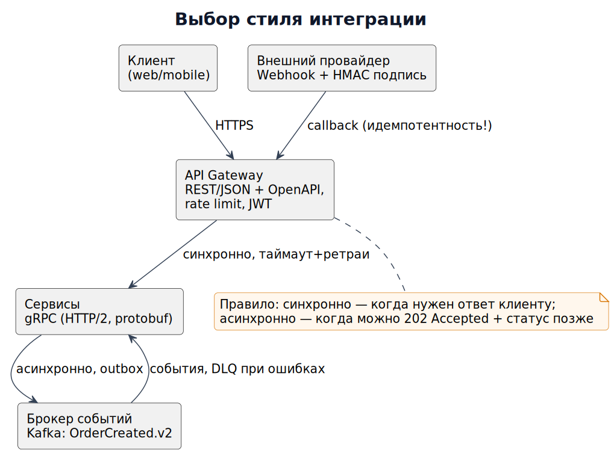

# Модуль 3. Интеграции и API

Язык, на котором системы говорят друг с другом. Аналитик проектирует контракты до написания кода (API-first).

## Теория

### 1. REST: зрелость по Ричардсону
- L0 — один URL, всё через POST. L1 — ресурсы (`/orders/{id}`). L2 — HTTP-глаголы + коды. L3 — HATEOAS (ссылки в ответе).
- Правила хорошего тона: существительные во множественном числе, версии `/v1/`, фильтрация `?status=paid&sort=-created_at`, пагинация `limit/offset` или cursor.

Идемпотентность: GET/PUT/DELETE — идемпотентны, POST — нет. Для платёжного POST используйте `Idempotency-Key: <uuid>` — повторный запрос с тем же ключем вернёт первый результат, а не спишет деньги дважды.

### 2. OpenAPI 3 — контракт как код
```yaml
openapi: 3.0.3
info: { title: Orders API, version: 1.2.0 }
paths:
  /v1/orders:
    post:
      parameters:
        - in: header
          name: Idempotency-Key
          required: true
          schema: { type: string, format: uuid }
      requestBody:
        content:
          application/json:
            schema:
              type: object
              required: [items, addressId]
              properties:
                items:
                  type: array
                  minItems: 1
                  items: { $ref: '#/components/schemas/OrderItem' }
      responses:
        '201': { description: created, headers: { Location: {...} } }
        '409': { description: duplicate idempotency key }
        '422': { description: validation error, content: { application/problem+json: {...} } }
```
Разбор: контракт фиксирует ошибки 409/422 — интеграция устойчива к дублям; `problem+json` (RFC 7807) — единый формат ошибок.

### 3. REST vs gRPC vs GraphQL vs SOAP


| Протокол | Транспорт | Плюсы | Минусы | Когда |
|---|---|---|---|---|
| REST/JSON | HTTP | просто, кешируется, отладка curl | нет схемы из коробки | публичные API |
| gRPC | HTTP/2 protobuf | типизация, скорость, стримы, кодоген | плохая поддержка браузерами | service-to-service |
| GraphQL | HTTP | клиент сам выбирает поля, нет overfetching | N+1, сложное кеширование, лимитировать глубину! | BFF для мобильных |
| SOAP/XML | HTTP | контракты, WS-Security, транзакции | громоздко | госсектор, банки (ЕБС ПГ) |

### 4. Асинхронные интеграции
Webhooks: платёжный провайдер шлёт `POST /callbacks/payment` с подписью `X-Signature: HMAC(secret, body)`. Обязательны: проверка подписи, идемпотентность (повторяющиеся callbacks!), быстрый ответ 2xx, ретраи со стороны отправителя.
Очереди/pub-sub (Kafka, RabbitMQ): события `PaymentSucceeded.v2` — контракт в схеме (Avro/JSON Schema + реестр схем), совместимость версий back-compatible.

### 5. Типовые боли и разборы
- **Overfitting таймаутов:** вызов A→B→C с таймаутами 10+10+10 мс при SLA клиента 15 мс — гарантированные каскады. Правило: бюджет таймаута делится по пути вызова.
- **Потеря данных при рестарте потребителя:** без manual ack + DLQ сообщения «сгорают». Разбор: consumer упал на десериализации → message requeued → infinite redelivery loop. Лечение: max attempts → DLQ + алерт.
- **Интеграция по шаренной БД:** два сервиса пишут в одну таблицу → контракт «неизвестный», колонки ломают прод. Антипаттерн.

## Ссылки
- OpenAPI Specification: https://spec.openapis.org/oas/latest.html
- RFC 7807 problem+json: https://datatracker.ietf.org/doc/html/rfc7807
- gRPC docs: https://grpc.io/docs/
- Webhooks best practices (Stripe): https://docs.stripe.com/webhooks
- Confluent Schema Registry: https://docs.confluent.io/platform/current/schema-registry/index.html

## Практика
- [ ] Спроектируйте OpenAPI для «карты лояльности»: выписка бонусов, списание с идемпотентностью.
- [ ] Нарисуйте sequence webhook-оплаты с повторной доставкой и покажите защиту от двойного зачисления.
- [ ] Выберите протокол для 5 кейсов (мобильное приложение, межсервис, госсистема, аналитика событий, платежи) и обоснуйте.

Задание 5 практикума: [tasks](../practice/tasks.md) · [разбор webhook-контракта](../practice/solutions/sol05_webhook.md) · заполните [шаблон контракта интеграции](../templates/integration-contract.md) на свою реальную интеграцию
Дальше: [Модуль 4 — Базы данных и SQL](../04_databases_sql_nosql/README.md)
