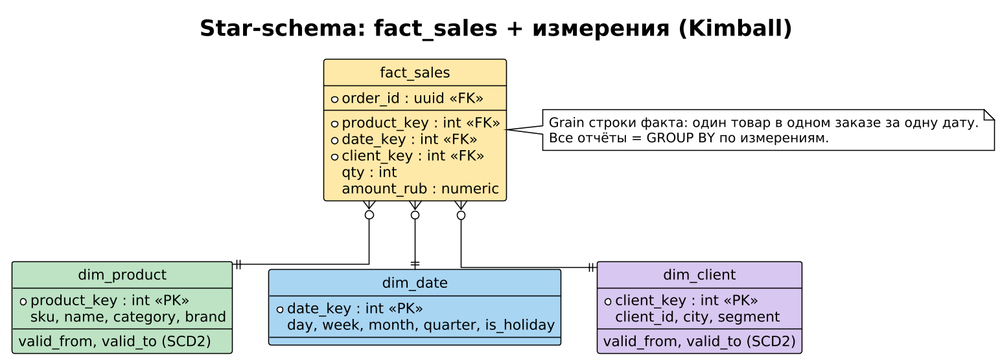

# Модуль 4. Базы данных и SQL

Аналитик, понимающий SQL и модели данных, решает 80% вопросов сам, без разработчика.

## Теория

### 1. Реляционная модель и нормализация
- 1НФ — атомарные значения (никаких «списков через запятую» в колонке).
- 2НФ — нет частичной зависимости от составного ключа.
- 3НФ — неключевые атрибуты зависят только от PK.
Пример разбора: таблица `orders(id, client_name, client_city, product_ids)`. Нарушены 1НФ (product_ids), 2/3НФ (city от client, не от order). Денормализация оправдана для аналитики/отчётов и кешированных выборок — но тогда нужен механизм актуальности.

### 2. SQL: рабочий минимум
```sql
-- Топ-10 клиентов по обороту за квартал с пагинацией
SELECT c.id, c.name, SUM(o.total) AS revenue
FROM clients c
JOIN orders o ON o.client_id = c.id
WHERE o.created_at >= '2026-07-01' AND o.status = 'paid'
GROUP BY c.id, c.name
HAVING SUM(o.total) > 100000
ORDER BY revenue DESC
LIMIT 10 OFFSET 0;

-- Окно: нумерация заказов клиента + доля от общего оборота
SELECT id, client_id, total,
       ROW_NUMBER() OVER (PARTITION BY client_id ORDER BY created_at) AS pos,
       ROUND(100.0 * total / SUM(total) OVER (), 2) AS pct_of_total
FROM orders;
```

### 3. Индексы: как думать
B-tree — равенство и диапазоны; составной индекс работает по левому префиксу (`(status, created_at)` ускорит `WHERE status=? AND created_at>?`, но не `WHERE created_at>?` одного). EXPLAIN — обязательный инструмент разбора медленных запросов: `Seq Scan` на миллионной таблице = отсутствие индекса.

### 4. Транзакции и ACID, уровни изоляции
Read Uncommitted → Read Committed (дефолт Postgres) → Repeatable Read → Serializable. Аномалии: dirty read, non-repeatable read, phantom. Разбор: два кассира списывают со счёта 100 ₽ одновременно при RC без блокировки → баланс -100. Лечение: `SELECT ... FOR UPDATE` или оптимистичная блокировка версией.

### 5. NoSQL-выбор по модели доступа


| Тип | Примеры | Модель доступа | Кейс |
|---|---|---|---|
| Document | MongoDB | гибкая схема, богатые объекты | карточки товаров, профили |
| Key-Value | Redis | O(1) get/set | кеш, сессии, счётчики |
| Column-family | Cassandra | запись потока, линейное масштабирование | телеметрия, события |
| Graph | Neo4j | обходы связей | рекомендации, антифрод |
| Search | Elasticsearch | полнотекст, агрегации | поиск, логи |
| Timeseries | ClickHouse/TimescaleDB | временные окна | метрики, OLAP |

Правило: начинайте с PostgreSQL (JSONB покрывает 70% «документных» кейсов), специализированную СУБД добавляйте под конкретную нагрузку.

### 6. Миграции схемы
Expand-Contract: добавить nullable-колонку → dual-write → бэкфилл → переключить чтение → удалить старую. Никогда `ALTER TABLE ... DROP COLUMN` в один деплой с кодом. Инструменты: Flyway/Liquibase.

## Ссылки
- Postgres документация (EXPLAIN, изоляция): https://www.postgresql.org/docs/current/ddl-index-types.html
- Use The Index, Luke: https://use-the-index-luke.com/
- Martin Fowler, NoSQL overview: https://martinfowler.com/articles/nosql-overview.html
- ClickHouse best practices: https://clickhouse.com/docs/en/best-practices

## Практика
- [ ] По схеме `clients-orders-order_positions-products` напишите запрос: средний чек по категориям за месяц.
- [ ] Дано: SELECT тормозит 4 с на 10M строк, фильтр `WHERE email = ?`. Составьте план действий с EXPLAIN и индексом.
- [ ] Спроектируйте хранение «истории статусов заказа»: отдельная таблица vs JSONB vs Event Sourcing — сравните.

Дальше: [Модуль 5 — Архитектура](../05_architecture/README.md)
