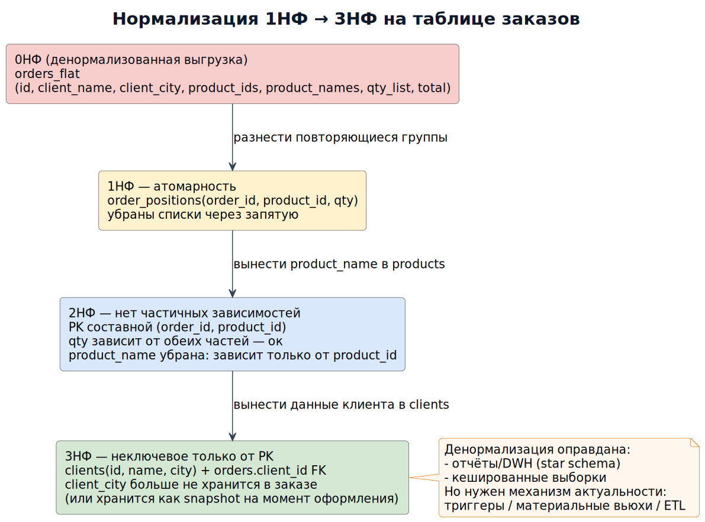
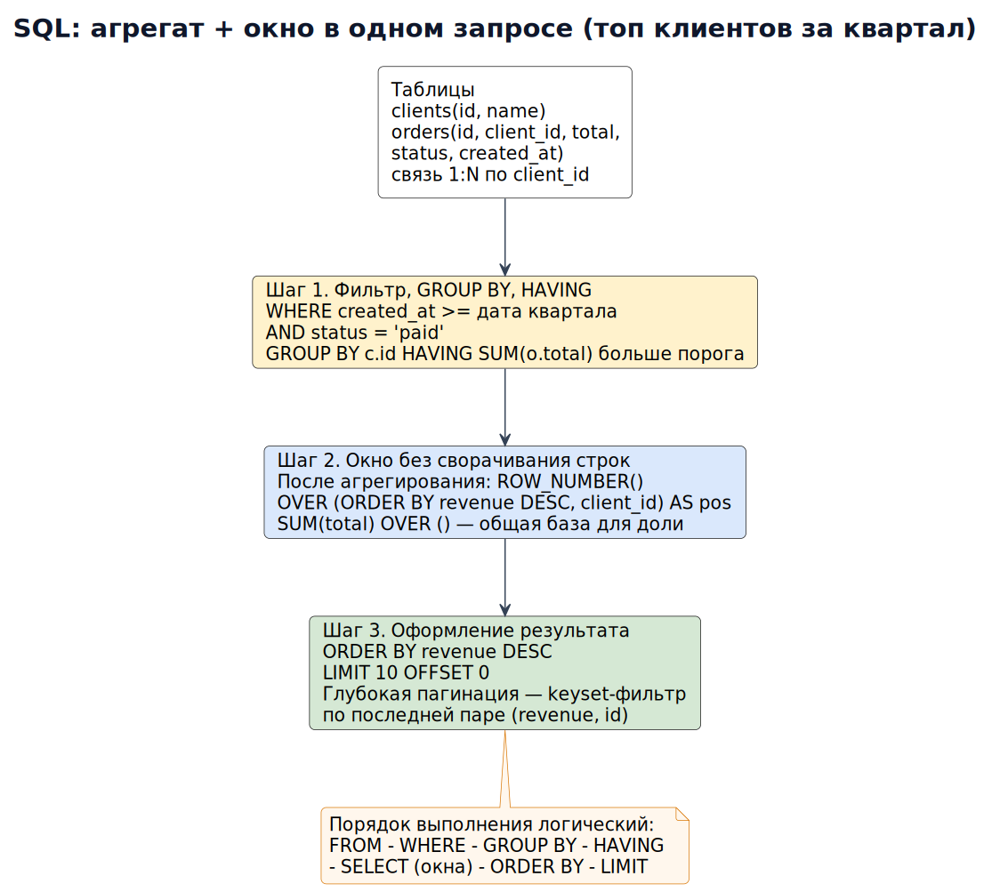
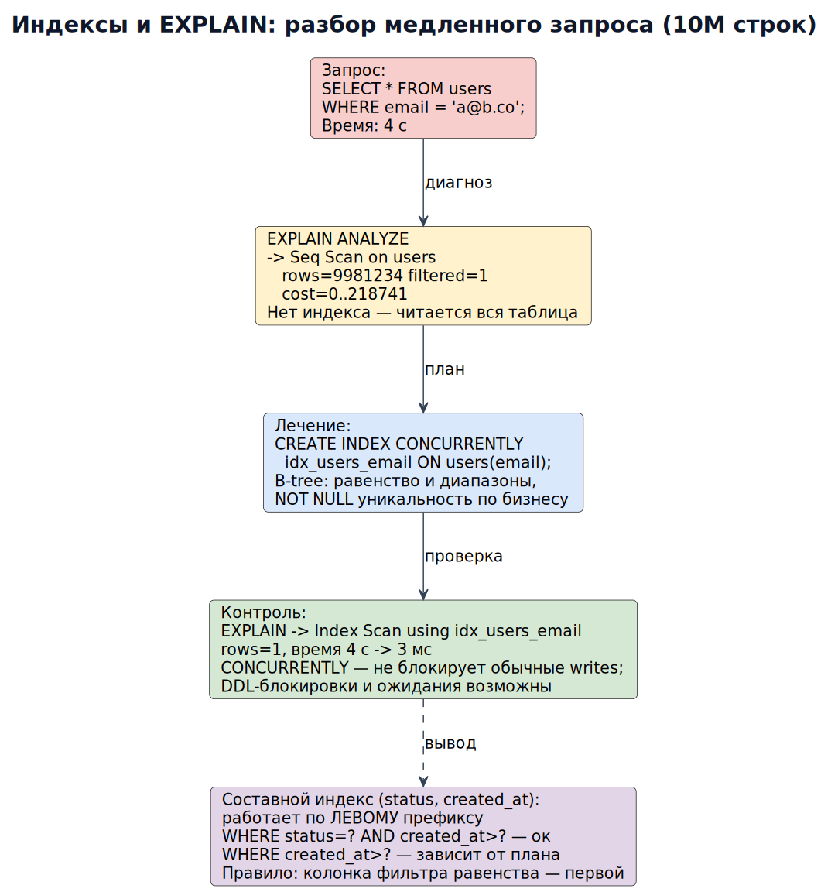
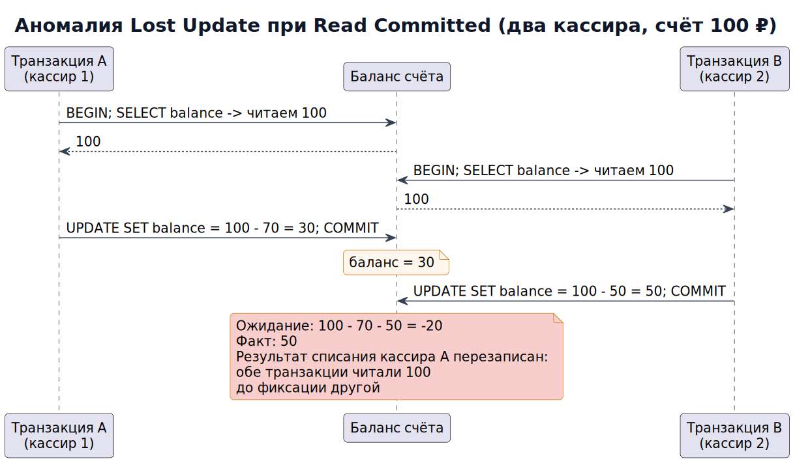
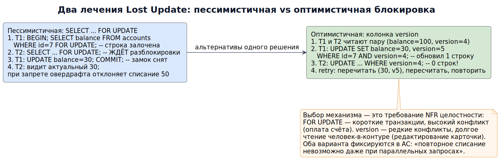
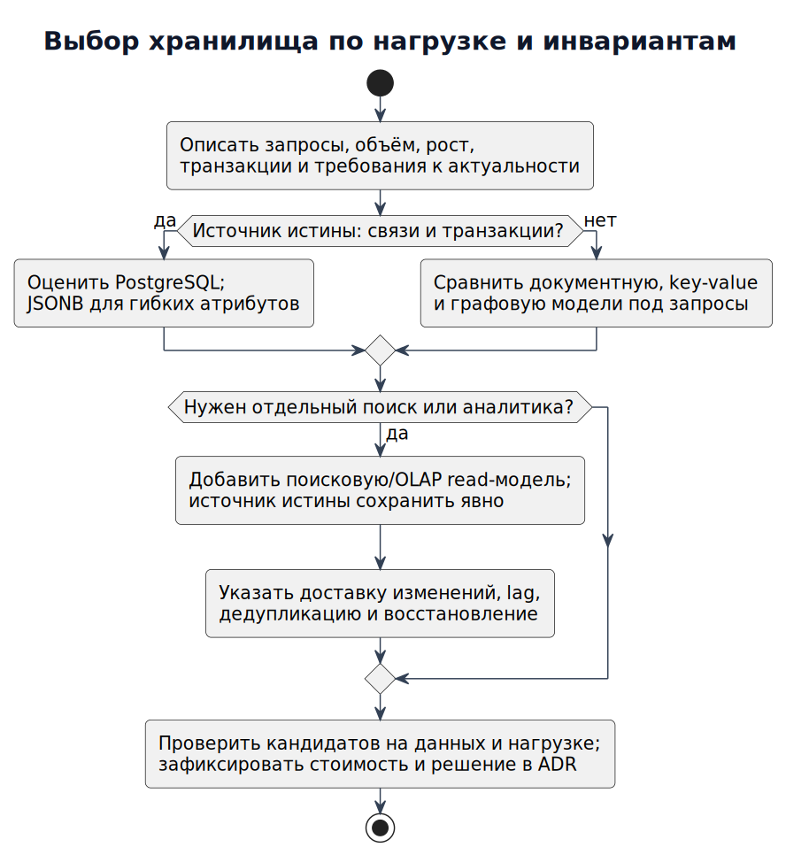
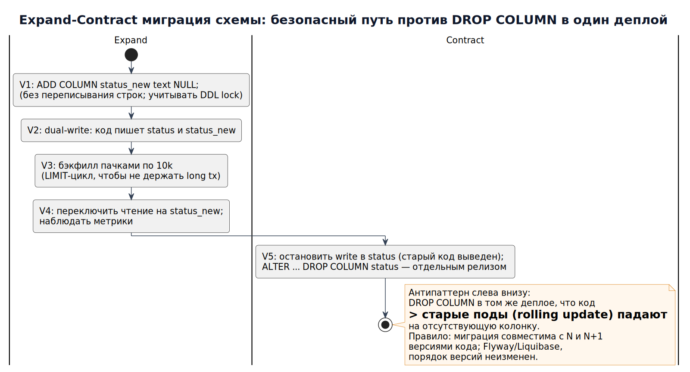
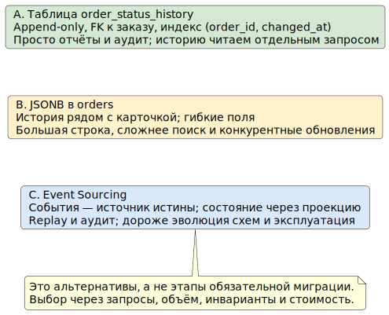
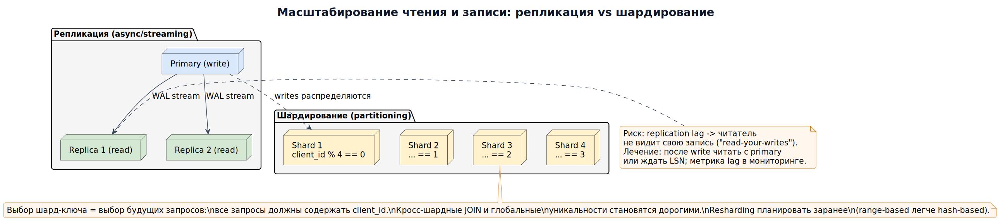
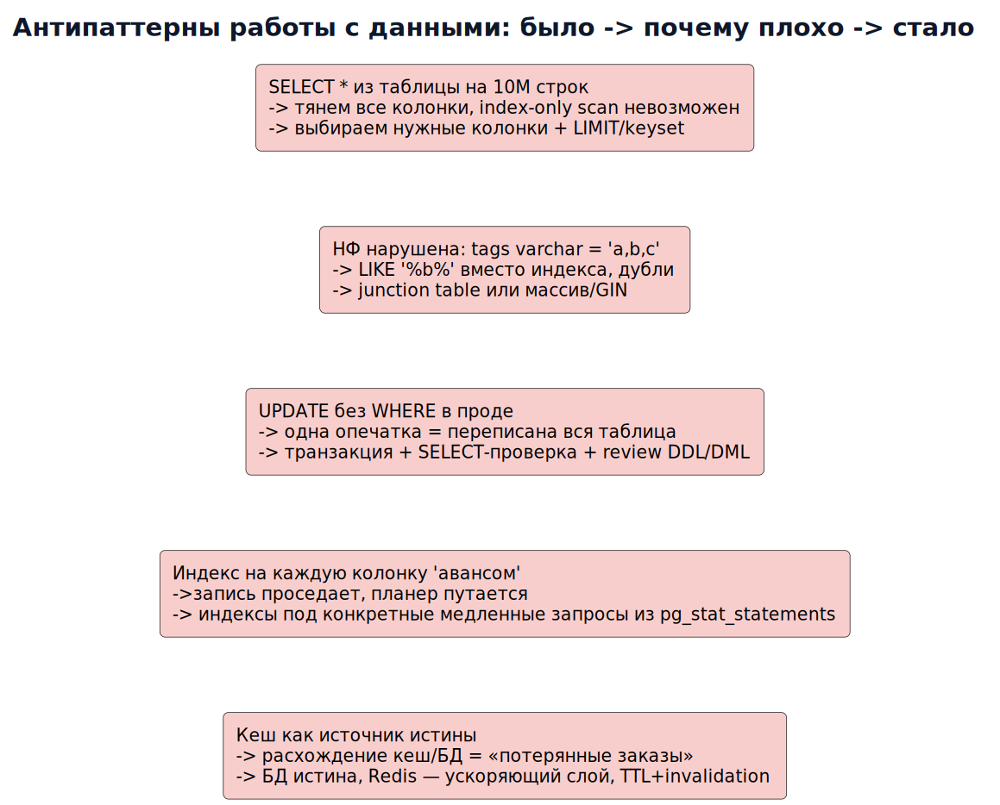

# Модуль 4. Базы данных и SQL

> **Результат модуля:** строки и группы в sql. Начинающему: сначала [маршрут](../START_HERE.md), затем теория → упражнение → самопроверка.

Аналитик, понимающий SQL и модели данных, решает 80% вопросов сам, без разработчика.

## Теория

### 1. Реляционная модель и нормализация
- 1НФ — атомарные значения (никаких «списков через запятую» в колонке).
- 2НФ — нет частичной зависимости от составного ключа.
- 3НФ — неключевые атрибуты зависят только от PK.
Пример разбора: таблица `orders(id, client_name, client_city, product_ids)`. Нарушены 1НФ (product_ids), 2/3НФ (city от client, не от order). Денормализация оправдана для аналитики/отчётов и кешированных выборок — но тогда нужен механизм актуальности.

**Пример с разбором (рис. 0).** Путь нормализации на реальной таблице выгрузки CRM:



*Рис. 0. Нормализация 0НФ→3НФ: какие нарушения исправляет каждая форма*

Разбор по шагам:
1. **Диагноз 1НФ**: в `orders_flat` колонки `product_ids`, `qty_list` хранят списки через запятую — одну строку нельзя посчитать/отсортировать по позиции, `LIKE '%id%'` ловит ложные совпадения. Лечение: отдельная таблица `order_positions(order_id, product_id, qty)` — значение атомарно.
2. **Диагноз 2НФ**: после ввода составного PK `(order_id, product_id)` колонка `product_name` зависит только от `product_id` — частичная зависимость. Лечение: имя товара живёт в `products`, в позициях только FK.
3. **Диагноз 3НФ**: `client_city` в заказе зависит от клиента, а не от заказа → транзитивная зависимость. Лечение: таблица `clients` + FK. Важно: если бизнес требует «город на момент доставки» — это осознанный **snapshot**, его надо формулировать как ФТ (см. Модуль 1), иначе аналитика по истории продаж врёт при переезде клиента.
4. **Когда денормализовать обратно**: отчёты/DWH (star schema — рис. ниже в §5), кешированные выборки витрин. Обязательное условие — механизм актуальности: материальная вьюха с refresh, ETL или триггер; без него дубли расходятся, и «правды» в системе становится две.

### 2. SQL: рабочий минимум
```sql
-- Топ-10 клиентов по обороту за квартал с пагинацией
SELECT c.id, c.name, SUM(o.total) AS revenue
FROM clients c
JOIN orders o ON o.client_id = c.id
WHERE o.created_at >= '2026-07-01' AND o.status = 'paid'
GROUP BY c.id, c.name
HAVING SUM(o.total) > 100000
ORDER BY revenue DESC
LIMIT 10 OFFSET 0;

-- Окно: нумерация заказов клиента + доля от общего оборота
SELECT id, client_id, total,
       ROW_NUMBER() OVER (PARTITION BY client_id ORDER BY created_at) AS pos,
       ROUND(100.0 * total / SUM(total) OVER (), 2) AS pct_of_total
FROM orders;
```

**Пример с разбором (рис. 1).** Как читать такой запрос как конвейер, а не как текст:



*Рис. 1. Три стадии запроса и логический порядок выполнения*

Разбор:
1. **Сначала FROM/WHERE, потом GROUP BY/HAVING**: фильтр `status='paid'` отсекает строки ДО группировки — «неоплаченные» вообще не влияют на оборот. Если нужно «клиенты, у которых есть хотя бы один неоплаченный заказ» — это уже HAVING/подзапрос, а не WHERE.
2. **Окна не сворачивают строки**: `ROW_NUMBER() OVER (PARTITION BY client_id ...)` нумерует заказы внутри клиента, сохраняя все строки — то, чего нельзя достичь обычным GROUP BY. Типичный аналитический кейс: «первый заказ клиента = acquisition, третий = retention».
3. **`SUM(total) OVER ()`** — окно по всей таблице: знаменатель для доли процента одним запросом вместо двух round-trip.
4. **Пагинация**: `LIMIT/OFFSET` на 10-й странице из 1M строк читает и выбрасывает 100k строк. Для UI/API требуйте keyset-пагинацию (`WHERE (revenue,id) < (?,?) ORDER BY ... LIMIT n`) — фиксируйте это как NFR производительности списка (P95 не деградирует с глубиной страницы).

### 3. Индексы: как думать
B-tree часто подходит для равенства и диапазонов. `(status, created_at)` обычно эффективен при равенстве по status и диапазоне created_at. Без первого условия использование зависит от плана, версии и статистики; возможны сканирование индекса и skip scan. Seq Scan не доказывает отсутствие индекса: при большой доле подходящих строк он может быть дешевле. Смотрим EXPLAIN (ANALYZE, BUFFERS) на безопасном стенде: ANALYZE действительно выполняет запрос.

**Пример с разбором (рис. 2).** Полный цикл «жалоба → диагноз → лечение → проверка»:



*Рис. 2. Разбор медленного запроса через EXPLAIN: Seq Scan → Index Scan*

Разбор:
1. **Жалоба приходит к аналитику, а не к DBA**: «страница клиента открывается 4 секунды». Первая задача — получить текст запроса и план (`EXPLAIN ANALYZE`), а не сразу «добавьте индекс».
2. **Диагноз**: `Seq Scan on users rows=9981234 filtered=1` — сканируем весь million, чтобы найти одну строку. Это не «тормоза сервера», это отсутствие индекса под конкретный предикат.
3. **Лечение**: `CREATE INDEX CONCURRENTLY idx_users_email ON users(email);` — CONCURRENTLY важно для прода: обычный CREATE INDEX на большой таблице блокирует запись и валит сервис на время сборки.
4. **Проверка**: тот же EXPLAIN показал `Index Scan ... rows=1`, время 4 с → 3 мс. Без шага проверки «индекс добавили, стало быстрее» остаётся верой.
5. **Правило порядка колонок**: в составном индексе первым ставим колонку равенства (`status`), затем диапазон (`created_at`) — это полезный исходный вариант, но использование индекса определяет планировщик; проверяем план и статистику. Аналитик фиксирует это в design constraint, если SLA списка висит на одном запросе.

### 4. Транзакции и ACID, уровни изоляции
Read Uncommitted → Read Committed (дефолт Postgres) → Repeatable Read → Serializable. Аномалии: dirty read, non-repeatable read, phantom. Разбор: два кассира списывают со счёта 100 ₽ одновременно при RC без блокировки → возможен lost update при записи вычисленного в приложении абсолютного значения; арифметический UPDATE и проверка остатка ведут себя иначе. Лечение: `SELECT ... FOR UPDATE` или оптимистичная блокировка версией.

**Пример с разбором (рис. 3).** Sequence-диаграмма гонки — то, что невозможно показать таблицей требований:



*Рис. 3. Lost Update: обе транзакции читают 100 до фиксации другой*

Разбор:
1. При Read Committed каждый `SELECT` видит последний закоммиченный снимок **на момент своего запуска**. T1 и T2 успели прочитать 100 друг до друга — ни одна аномалия «формально» не нарушена, но бизнес-инвариант «баланс = сумма операций» сломан.
2. Итог: результат списания кассира A (70 ₽) перезаписан вторым UPDATE; баланс стал 50 ₽ вместо арифметических −20 ₽ — потерянные деньги заметит только сверка (reconciliation), то есть постфактум и у бизнеса.
3. Вывод для аналитика: формулируйте инвариант явно («сумма списаний не может превзойти доступный остаток; параллельные списания не теряются») как NFR целостности — тогда у команды есть критерий приёмки, а не «как-нибудь реализуйте».

**Пример с разбором (рис. 4).** Два механизма лечения и критерий выбора:



*Рис. 4. Пессимистичная блокировка против оптимистичной (version)*

Разбор:
1. **Пессимистичная** (`SELECT ... FOR UPDATE`): второй участник ждёт замок. Подходит для коротких транзакций с высоким конфликтом — оплата счёта, списание стока. Риск: держать транзакцию открытой на время внешнего HTTP-вызова = очередь блокировок и таймауты каскадом (см. Модуль 3, бюджет таймаута).
2. **Оптимистичная** (колонка `version`): никто не ждёт; конфликт виден как «UPDATE затронул 0 строк», лечится retry. Подходит для долгого редактирования человеком (карточка, прайс). Риск: бесконечные retries при горячем споре — ограничьте число попыток и покажите пользователю «данные изменились, обновите».
3. **Что писать в спецификацию**: какой инвариант, какой уровень изоляции допускает система, поведение при конфликте (wait / retry / отказать). Это контракт поведения, а не деталь реализации — ровно граница ответственности аналитика.

### 5. NoSQL-выбор по модели доступа


*Рис. 5. Звезда схемы DWH: факт «Записи» вокруг измерений — типовой результат «денормализации ради аналитики»*

| Тип | Примеры | Модель доступа | Кейс |
|---|---|---|---|
| Document | MongoDB | гибкая схема, богатые объекты | карточки товаров, профили |
| Key-Value | Redis | O(1) get/set | кеш, сессии, счётчики |
| Column-family | Cassandra | запись потока, линейное масштабирование | телеметрия, события |
| Graph | Neo4j | обходы связей | рекомендации, антифрод |
| Search | Elasticsearch | полнотекст, агрегации | поиск, логи |
| Timeseries | ClickHouse/TimescaleDB | временные окна | метрики, OLAP |

Правило: начинайте с PostgreSQL (JSONB подходит для многих задач с гибкими атрибутами; универсального процента нет), специализированную СУБД добавляйте под конкретную нагрузку.

**Пример с разбором (рис. 6).** Decision-процедура выбора хранилища на реальных вопросах:



*Рис. 6. Какая СУБД под какую модель доступа — ветвление по вопросам, а не по моде*

Разбор:
1. Первый вопрос всегда **«опишите 2–3 главных запроса»**, а не «какая база модная». Модель доступа (что ищем, как часто, объём) определяет всё остальное; этот абзац идёт в ADR (шаблон `templates/adr.md`).
2. **PostgreSQL по умолчанию**: JOIN + транзакции + отчёты нужны почти всегда; JSONB закрывает «гибкие атрибуты» без второй СУБД.
3. **Elasticsearch — дополнение, не замена**: полнотекст и агрегации по логам; консистентность с основной БД обеспечивается контролируемым пайплайном (CDC или Outbox; неатомарная двойная запись может потерять обновление) — это отдельное требование надёжности.
4. **ClickHouse/Timescale** — когда запросы «окно времени + группировка» на миллиардах строк; ClickHouse ориентирован на OLAP; TimescaleDB расширяет PostgreSQL, поэтому сохраняет транзакционные возможности. Выбор проверяем на целевой нагрузке.
5. **Neo4j** оцениваем по стоимости и сложности обходов на реальных данных; глубина ≥2 не является универсальным порогом (антифрод «друзья друзей»); один JOIN «друзья» — это обычный SQL.

### 6. Миграции схемы
Expand-Contract: добавить nullable-колонку → dual-write → бэкфилл → переключить чтение → удалить старую. Никогда `ALTER TABLE ... DROP COLUMN` в один деплой с кодом. Инструменты: Flyway/Liquibase.

**Пример с разбором (рис. 7).** Конвейер миграции `status → status_new` с ценами каждого шага:



*Рис. 7. Expand-Contract: пять версий миграции, совместимых с N и N+1 кодом*

Разбор:
1. **Expand V1 — ADD COLUMN NULL**: Postgres добавляет nullable-колонку без переписывания строк (метаданные), даже на 100M строк — секунды. Проверка NOT NULL может потребовать сканирования, но это не обязательно rewrite. DDL требует блокировок; время зависит от версии, размера и активных транзакций, задаём lock_timeout и план проверки.
2. **V2 dual-write**: новый код пишет в обе колонки; старый код ещё живёт во время rolling update — поэтому удаление старой колонки никогда не совпадает с деплоем кода.
3. **V3 бэкфилл пачками**: `WITH batch AS (SELECT id FROM orders WHERE status_new IS NULL ORDER BY id LIMIT 10000) UPDATE orders o SET status_new=o.status FROM batch b WHERE o.id=b.id` (в PostgreSQL нет UPDATE ... LIMIT) циклами по ~10k строк; один огромный UPDATE = долгая транзакция, раздувание WAL, блокировки и риск вакации.
4. **V4 переключение чтения + наблюдение**: сравнение значений старой/новой колонки на части трафика (shadow read) даёт уверенность до cut-over.
5. **Contract V5**: DROP COLUMN — отдельным релизом, после того как выведен из эксплуатации последний код, который её читает. Правило для чеклиста приёмки: «миграция обратима или имеет rollback-скрипт; каждая версия схемы совместима с N и N+1 кода».

### 7. Хранение историчности и событий (добавлено для уровня middle+)

**Пример с разбором (рис. 8).** Классическое задание «история статусов заказа» — три архитектуры с честными плюсами/минусами:



*Рис. 8. Отдельная таблица vs JSONB-колонка vs Event Sourcing*

Разбор:
1. **Вариант A (junction-таблица append-only)** — дефолт: отчёты «сколько заказов висело в Pending > суток» пишутся простым SQL, индекс `(order_id, changed_at)`, аудит построчный. Цена: JOIN при чтении карточки.
2. **Вариант B (JSONB-лог в заказе)** — выигрывает, когда история читается ВСЕГДА вместе с заказом (UI карточки). Минусы честные: конкурентное обновление всей колонки требует `jsonb_set` внутри одного UPDATE (иначе гонка), фильтрация по «был ли в refund» — GIN-индекс или полный scan JSON.
3. **Вариант C (Event Sourcing)** — покупается только под явное бизнес-требование replay/«как выглядело 3 дня назад»; цена — schema evolution событий, снапшоты проекций, обучение команды.
4. Решение фиксируется как **design decision с обоснованием** (ADR), а не как «сделайте таблицу» — иначе через год новый стейкхолдер потребует «а дайте-ка историю в отчётах», и вариант B придётся переделывать.

### 8. Масштабирование: репликация и шардирование (добавлено)

**Пример с разбором (рис. 9).** Что происходит, когда «база тормозит» на растущей нагрузке:



*Рис. 9. Read-scale через реплики; write-scale через шарды; риски обоих*

Разбор:
1. **Репликация лечит чтение, не запись**: все writes идут на primary; лаг реплики создаёт аномалию «пользователь создал заказ и не видит его в списке» (read-your-writes). Требование к аналитику: перечислить экраны, где это неприемлемо, и заложить чтение с primary после записи.
2. **Шардирование лечит запись, но диктует модель запросов**: выбор ключа шарда = обещание, что каждый запрос содержит `client_id`. Кросс-шардные JOIN, глобальные UNIQUE и «выбрать все заказы за день» становятся дорогими или невозможными.
3. **Resharding планируйте заранее** (range-based переносить легче, чем hash-based); миграция шардов — это expand-contract из рис. 7 в масштабе инстансов.
4. Честный ответ middle+: сначала профиль нагрузки (pg_stat_statements, QPS read/write), потом решение; «разшардируем» до измерения — самый дорогой способ узнать, что нужен был один индекс (рис. 2).

### 9. Антипаттерны работы с данными

**Пример с разбором (рис. 10).** Пять дефектов, которые аналитик обязан видеть в макетах запросов и ТЗ:



*Рис. 10. Было → почему плохо → стало*

Типичные ошибки раздела:
- `SELECT *` в продакшн-запросах — ломает index-only scan и тянет лишние байты; список колонок = часть контракта.
- Списки через запятую в колонке — нарушение 1НФ, см. рис. 0.
- `UPDATE`/`DELETE` без `WHERE` в проде — только через транзакцию с проверкой количества и review.
- Индексы «авансом на каждую колонку» —write-амплификация и шум планера; индекс под замеренный медленный запрос.
- Кеш как источник истины — БД первична, Redis ускоряющий слой с TTL и инвалидацией (см. также `practice/solutions/sol06_sql.md`).

## Ссылки
- Postgres документация (EXPLAIN, изоляция): https://www.postgresql.org/docs/current/indexes-types.html
- Use The Index, Luke: https://use-the-index-luke.com/
- Martin Fowler, NoSQL overview: https://martinfowler.com/articles/nosql-overview.html
- ClickHouse best practices: https://clickhouse.com/docs/en/best-practices
- Postgres: locking reads: https://www.postgresql.org/docs/current/explicit-locking.html
- Confluent, Schema Evolution (для §7 вариант C): https://docs.confluent.io/platform/current/schema-registry/index.html

## Практика
- [ ] По схеме `clients-orders-order_positions-products` напишите запрос: средний чек по категориям за месяц.
- [ ] Дано: SELECT тормозит 4 с на 10M строк, фильтр `WHERE email = ?`. Составьте план действий с EXPLAIN и индексом (сверьтесь с рис. 2).
- [ ] Спроектируйте хранение «истории статусов заказа»: отдельная таблица vs JSONB vs Event Sourcing — сравните (рис. 8) и защитите выбор в формате ADR.
- [ ] Нарисуйте sequence-гонку Lost Update для вашего домена и выберите механизм лечения по критериям рис. 4.
- [ ] Для трёх главных запросов системы решите по рис. 6, достаточно ли PostgreSQL; обоснуйте выбор в ADR.

Задания 6–7 практикума: [tasks](../practice/tasks.md) · [разбор SQL](../practice/solutions/sol06_sql.md), [разбор ER](../practice/solutions/sol07_er.md)
Исходники диаграмм этого модуля: `puml_m4/*.puml`, пересборка — [render_all.sh](../render_all.sh)
Дальше: [Модуль 5 — Архитектура](../05_architecture/README.md)

## Закрепление: Строки и группы в SQL

**Простыми словами.** WHERE убирает исходные строки, GROUP BY создаёт группы, HAVING отбирает группы. Ограничение целостности защищает данные даже при ошибке приложения.

**Разобранный пример.** Из оплаченных заказов сначала выбираем status=PAID, затем считаем сумму по городу, затем оставляем города с суммой больше 10000. Отменённые заказы в сумму не входят.

**Самостоятельно (20–30 минут).** Запустите examples/sql/having.sql; до чтения ответа выпишите ожидаемые города и суммы. Затем увеличьте порог до 15000.

**Критерии проверки.** На тестовых данных получены точные суммы; статус фильтруется WHERE, сумма — HAVING; ORDER BY стабилен при равенстве.

<details>
<summary>Самопроверка: HAVING SUM(amount)>10000 можно заменить WHERE SUM(amount)>10000?</summary>

Нет: WHERE применяется до группировки и не фильтрует итог SUM. Для этого нужен HAVING или внешний запрос над агрегатом.

</details>

[Сквозной пример оплаты](../examples/payment/README.md) · [Первоисточники](../SOURCES.md)
