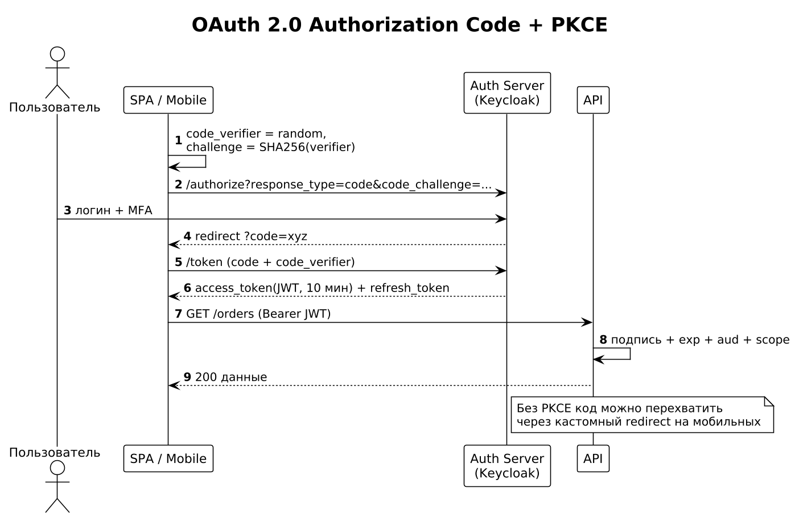

# Модуль 6. Безопасность и аутентификация

Аналитик закладывает требования безопасности на старте — дешевле, чем латать потом.

## Теория

### 1. Аутентификация vs авторизация
- **AuthN** — кто ты (логин/пароль, токен, biometrics).
- **AuthZ** — что тебе можно (RBAC, ABAC, ReBAC).

### 2. OAuth 2.0 / OIDC — main flow Authorization Code + PKCE


```
1. Клиент → /authorize?response_type=code&client_id=...&redirect_uri=...&code_challenge=...&method=S256
2. Пользователь логинится у Auth Server
3. Redirect с ?code=xyz
4. Клиент → /token (code + code_verifier) → access_token(JWT), refresh_token
5. Запросы к API: Authorization: Bearer <access_token>
```
Разбор: PKCE защищает мобильные/SPA-клиенты от перехвата кода; refresh token хранится в secure httpOnly-cookie или keychain, access JWT короткоживущий (5–15 мин).

### 3. JWT анатомия и ловушки
`header.payload.signature`. Типовые дыры: `alg: none`, подмена RS→HS, отсутствие проверки `aud/iss/exp`, секрет в клиенте. Правила: подписывать asymmetric (RS256/EdDSA), короткий TTL + jti-реvoke list, claims минимальны (не хранить PII).

### 4. RBAC модель для админки
```
roles: admin | manager | support
support: orders:read, orders:comment          ← запрет refund
manager: +orders:refund(limit 50k), users:read
admin:   *
Проверка на gateway И внутри сервиса (defense in depth).
```
Разбор инцидента: фронт скрывал кнопку «рефанд», но эндпоинт не проверял роль → любой support мог вернуть деньги через curl. Урок: проверка прав только на сервере.

### 5. OWASP Top-10 (то, что требует аналитик в ТЗ)
Injection (параметризованные запросы), Broken Access Control, Failures of Authentication, Sensitive Data Exposure (TLS, шифрование at-rest, маскирование логов), XXE, Security Misconfiguration (дефолтные пароли, открытые minio/actuator), XSS (экранирование, CSP), Insecure Design (угрозы бизнес-логики: перебор SMS-лимитов, накопление бонусов).

### 6. Хранение секретов и паролей
Пароли: bcrypt/scrypt/argon2 + salt. Секреты: Vault/SOPS/K8s Secrets, ротация, никаких ключей в git. Логи: фильтр PII (маска PAN карт по Luhn — только последние 4 цифры).

### 7. Threat modeling (STRIDE) на практике
Для «перевод между клиентами»: Spoofing (поддельная сессия) → MFA; Tampering (подмена суммы в теле) → подпись + серверный расчёт; Repudiation → аудит действий; Information Disclosure → шифрование; DoS → rate limit 10 rps/user; Elevation → RBAC-проверки. Результат — список требований, которые аналитик вносит в бэклог.

## Ссылки
- OAuth 2.0 RFC 6749 / OAuth for AI agents best practices: https://datatracker.ietf.org/doc/html/rfc6749
- JWT.io разбор токена: https://jwt.io/
- OWASP Top 10 (2021): https://owasp.org/www-project-top-ten/
- OWASP ASVS — чеклист требований безопасности: https://owasp.org/www-project-application-security-verification-standard/
- Cheatsheets: https://cheatsheetseries.owasp.org/

## Практика
- [ ] Нарисуйте sequence Authorization Code + PKCE и покажите точку перехвата без PKCE.
- [ ] Проведите STRIDE для «загрузки документов пользователем» — минимум 6 угроз с мерами.
- [ ] Составьте матрицу RBAC для CRM (роли: agent, teamlead, compliance) × 10 операций.

Дальше: [Модуль 7 — Тестирование и качество](../07_testing_quality/README.md)
