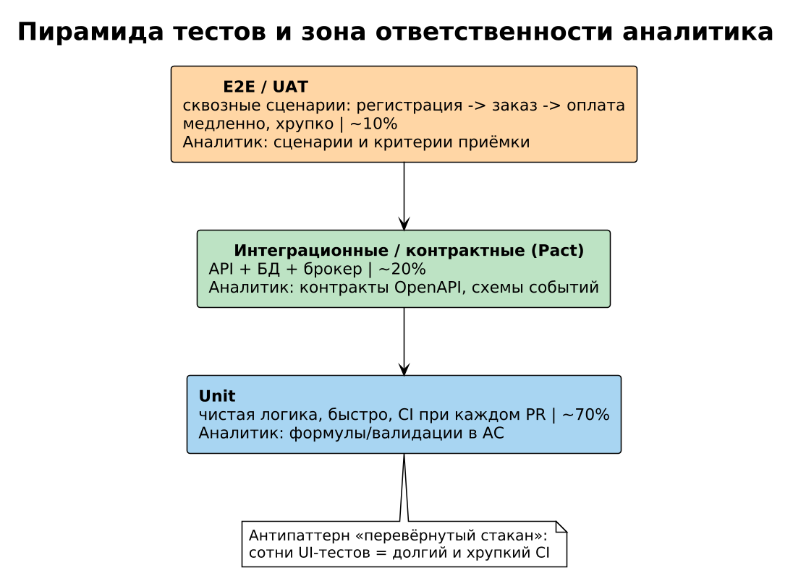

# Модуль 7. Тестирование и качество

Аналитик пишет критерии приёмки — значит, он и определяет, что «готово». Без понимания тестирования AC превращаются в пожелания.

## Теория

### 1. Пирамида тестов (Mike Cohn)


```
        / E2E (мало, медленно, хрупко) \
       /   Интеграционные / контракты    \
      /        Unit (много, быстро)        \
```
Соотношение ~70/20/10. Разбор: команда покрыла UI-тестами весь бэклок → каждый рефакторинг ломает 200 тестов, запуск 40 минут. Лечение: логику перенести в unit, E2E оставить для сквозных сценариев (регистрация→заказ→оплата).

### 2. Виды тестов, которые аналитик заказывает
- **Функциональные**: smoke, регресс, граничные значения (boundary value), эквивалентные классы.
- **Нефункциональные**: нагрузочные (load/stress/spike), объёмные, отказоустойчивость (chaos), security (DAST/SAST/pentest), совместимость.
- **Приёмочные**: UAT на реальных данных заказчика.

Пример анализа границ: поле «возраст 18–65» → тест-кейсы 17/18/19/64/65/66 + нечисло + пусто. Ловит off-by-one ошибки валидации.

### 3. TDD и BDD
BDD связывает Gherkin-AC с автотестами (Cucumber/SpecFlow): критерий приёмки = исполняемый тест. Разбор спора «тест прошёл, а фича не работает»: тесты проверяли HTTP 200, но не содержимое; после перехода на BDD AC описывают бизнес-результат («бонусы списались», «заказ в статусе paid»).

### 4. Контрактное тестирование (Pact)
Потребитель публикует ожидания от API (`GET /orders/{id}` вернёт `items[]` c полями sku, qty), поставщик проверяет их в своём CI. Ловит поломку интеграции до релиза без дорогих E2E-стендов. Актуально для микросервисов.

### 5. Метрики качества
Coverage ≠ качество (100% coverage при assert'ах «не упало»). Лучше: mutation score, defect escape rate (баги, найденные на проде ÷ все баги), MTTR, flakiness rate. SLO/error budget — см. модуль наблюдаемости курса микросервисов.

### 6. Стенды и тестовые данные
Схема dev → stage → prod; прод-данные нельзя копировать (GDPR/152-ФЗ) → синтетика или анонимизация (маска, shuffle, детерминированный hash). Разбор инцидента: тест оплаты проходил на stage, потому что там отключена проверка 3-D Secure → на проде фича «работала иначе». Правило: stage конфигурационно идентичен проду.

## Ссылки
- Pact docs: https://docs.pact.io/
- Cucumber BDD: https://cucumber.io/docs/
- ISTQB Foundation syllabus: https://www.istqb.org/certifications/certified-tester-foundation-level
- Test Pyramid объяснение Fowler: https://martinfowler.com/articles/practical-test-pyramid.html

## Практика
- [ ] Для AC «промокод даёт скидку не более 30%» составьте 8 тест-кейсов (границы + комбо двух промокодов).
- [ ] Опишите контрактный тест для метода `POST /v1/refunds` (потребитель — админка).
- [ ] Придумайте сценарий spike-теста перед распродажей: профиль нагрузки, метрики, критерии провала.

Задание 10 практикума: [tasks](../practice/tasks.md) · [разбор плана тестирования](../practice/solutions/sol10_testplan.md)
Дальше: [Модуль 8 — DevOps и CI/CD](../08_devops_ci_cd/README.md)
