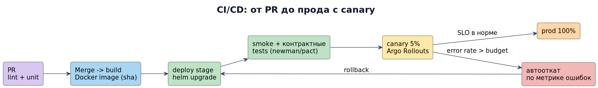

# Модуль 8. DevOps, CI/CD и облака

## Маршрут урока

| Режим | Что делать |
|---|---|
| База · 20–30 мин | Путь изменения от коммита до работающей версии. Прочитайте [основу](#lesson-base) и объясните один пример своими словами. |
| Практика · 30–45 мин | Выполните [задание](#lesson-practice), затем сравните с [критериями](../practice/assessment.md). |
| Углубление · 20–40 мин | Стратегии выпуска, восстановление и инфраструктура. Возвращайтесь после первой практики. |

**Артефакт в портфолио:** [шаг сквозного проекта](../project/08_delivery.md). Время ориентировочное; один урок можно разделить на несколько занятий.

> **Результат модуля:** готовность релиза измеряется. Начинающему: сначала [маршрут](../START_HERE.md), затем теория → упражнение → самопроверка.

Аналитик живёт в цикле «требование → код → прод → фидбек». Понимание конвейера позволяет требовать правильное и оценивать сроки.

<a id="lesson-base"></a>

## База и разборы

### 1. CI/CD конвейер (GitLab CI пример)
```yaml
stages: [lint, test, build, deploy-stage, smoke, deploy-prod]
unit-test: { stage: test, script: mvn test }
build-image: { stage: build, script: docker build -t $CI_REGISTRY_IMAGE:$CI_COMMIT_SHA . }
deploy-stage: { stage: deploy-stage, script: helm upgrade --install app ./chart --namespace stage }
smoke: { stage: smoke, script: newman run postman/smoke.json -e env/stage.json }
deploy-prod: { stage: deploy-prod, script: helm upgrade ... --wait, when: manual }
```
Разбор: без шага `--wait` + smoke деплой «успешен», а поды CrashLoopBackOff — релиз считается удачным по ошибке.

### 2. Стратегии релизов



*Изменение проходит сборку и проверки, затем ограниченный выпуск. Решение о продолжении зависит от наблюдаемых метрик и критериев отката.*
- **Recreate** — простой даунтайм.
- **Rolling** — K8s по очереди; дефолт.
- **Blue/Green** — два окружения, переключение балансировщика; мгновенный rollback.
- **Canary** — 5% трафика → метрики → автопромоут/автооткат (Argo Rollouts, Flagger).
- **Feature flags** — код в проде выключен; включаете по сегменту/проценту (LaunchDarkly, Unleash). Разбор: флаг с логикой «для beta-группы» оставили в коде на год → технический долг; правило: у флага есть дата удаления в тикете.

### 3. IaC и Kubernetes минимум
Terraform описывает инфраструктуру кодом (ревьюable, drift detection). K8s объекты: Deployment (реплики), Service (балансировка), Ingress (L7), ConfigMap/Secret (конфиг), HPA (автоскейл по CPU/RPS), PVC (диски). Аналитику достаточно уметь читать topology diagram сервиса и понимать, что «под не готов» = readiness probe падает.

### 4. Мониторинг и алерты (кратко, подробнее в курсе микросервисов)
Золотые сигналы Google: latency, traffic, errors, saturation. Алерт должен быть actionable: «p99 checkout > 800 мс 5 мин → страница on-call, runbook ссылка». Разбор: 300 алертов в неделю, все игнорируются → alert fatigue; аудит: убрали 80%, добавили SLO-бюджетные алерты.

### 5. Облачные модели
IaaS (VM, сети) / PaaS (Managed Postgres, App Runner) / FaaS (Lambda). Экономика: steady load → reserved instances; спорадическая → serverless. Lock-in оценка: Terraform снижает, но managed-Kafka ↔ Kafka API совместим частично.

### 6. Gitflow vs Trunk-based
Trunk-based + feature flags — стандарт для CD (короткие ветки, частые merge). Gitflow — для релизных продуктов с версиями (on-prem поставки). Выбор влияет на требования к тестам и частоте UAT.

## Ссылки
- GitLab CI docs: https://docs.gitlab.com/ee/ci/
- Argo Rollouts canary: https://argo-rollouts.readthedocs.io/
- Terraform best practices: https://www.terraform.io/cloud-docs/architectural-best-practices
- Google SRE Book (monitoring): https://sre.google/sre-book/monitoring-distributed-systems/
- Feature Toggles catalog: https://featureflags.io/

<a id="lesson-practice"></a>

## Практика
- [ ] Опишите pipeline для мобильного BFF: от PR до прода с canary и автоматическим откатом по метрике ошибок.
- [ ] Составьте чеклист готовности сервиса к прод-эксплуатации (SLO, runbook, алерты, backup, rollback plan).
- [ ] Для онбординга-фичи спроектируйте rollout: feature flag по компаниям → canary 10% → GA.

Задание 11 практикума (инцидент): [tasks](../practice/tasks.md) · [разбор](../practice/solutions/sol11_incident.md)
Дальше: [Модуль 9 — Frontend для fullstack-аналитика](../09_frontend_web/README.md)

## Закрепление: Готовность релиза измеряется

**Простыми словами.** CI проверяет изменения, deployment переносит версию, release делает функцию доступной. Эти события можно разделить feature flag.

**Разобранный пример.** Canary получает 5% трафика. В тестовом плане задано: после минимум 1000 запросов 5xx превышает согласованный порог — остановить rollout; неизвестные платежи продолжить сверять.

**Самостоятельно (20–30 минут).** Опишите canary, наблюдение, переключение трафика, совместимость схемы и план восстановления.

**Критерии проверки.** Есть окно и минимальная выборка, владелец решения, критерий остановки, совместимость N/N+1 и действия с уже начатыми операциями.

<details>
<summary>Самопроверка: Откат образа контейнера отменит выполненный платёж?</summary>

Нет. Код можно откатить; бизнес-эффект требует отдельной проверки и согласованной компенсации.

</details>

[Сквозной пример оплаты](../examples/payment/README.md) · [Первоисточники](../SOURCES.md)
