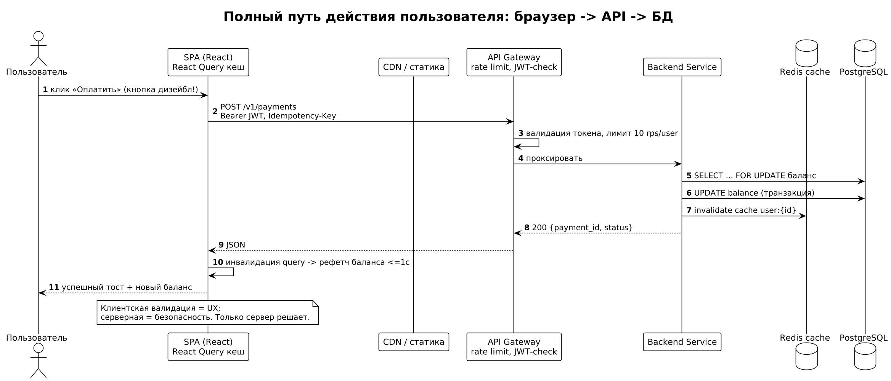

# Модуль 9. Frontend и веб для fullstack-аналитика

Аналитик понимает, что происходит в браузере: от рендера до CORS — чтобы корректно специфицировать требования к клиенту и API.

## Теория

### 1. Как живёт SPA
`index.html → JS бандл → React/Vue монтируется → роутинг на клиенте → fetch/axios к API`. SSR (Next.js/Nuxt) добавляет серверный рендер первого экрана ради SEO и LCP. Разбор: интернет-магазин на чистом SPA без SSR — поисковики не индексируют карточки товаров; требование «SEO-оптимизация» оказалось архитектурным решением, а не «текстами».

### 2. HTTP глазами фронтенда

- Кэши: `Cache-Control`, ETag, Service Worker (PWA offline).
- CORS: браузер блокирует cross-origin запрос без заголовков `Access-Control-Allow-Origin`; preflight OPTIONS требует настройки на gateway. Типовая постановка «почему не работает из админки на другом домене» — ответ здесь.
- Cookie: `SameSite=Lax/Strict`, `Secure`, `HttpOnly` — защита от CSRF/XSS-кражи сессии.

### 3. Состояние и данные
Клиентский стейт (Redux/Zustand/Pinia), серверное состояние (React Query/SWR): кеширование GET, инвалидация по мутации, оптимистичные обновления. Требование аналитика: «после создания заказа список обновится ≤1 сек» = инвалидация query + polling/WebSocket.

### 4. Формы и валидация
Правило: клиентская валидация — UX, серверная — безопасность. Спецификация поля включает: тип, лимиты, формат ошибки, поведение при submit (disable кнопки, повторная отправка). Разбор двойного списания: пользователь дважды кликнул «Оплатить», кнопка не дизейблилась, бэкенд без идемпотентности — два платежа.

### 5. Производительность (Core Web Vitals)
LCP < 2.5с, INP < 200мс, CLS < 0.1. Методы: lazy loading изображений, code splitting роутов, CDN статики, skeleton вместо спиннера. Аналитик переводит бизнес-метрику («конверсия мобильной корзины») в эти числа.

### 6. Доступность (a11y) и i18n
WCAG AA: контраст ≥4.5:1, alt у изображений, навигация с клавиатуры, aria-labels. Для госсектора и банков часто обязательна по закону. i18n: ICU MessageFormat, RTL, локализованные форматы дат/валют.

## Ссылки
- MDN HTTP caching: https://developer.mozilla.org/en-US/docs/Web/HTTP/Caching
- CORS explained: https://developer.mozilla.org/en-US/docs/Web/HTTP/CORS
- Core Web Vitals: https://web.dev/articles/vitals
- WCAG quickref: https://www.w3.org/WAI/WCAG22/quickref/
- React Query docs: https://tanstack.com/query/latest

## Практика
- [ ] Опишите user story «загрузка аватара» с клиентской валидацией (тип/размер), прогрессом, retry при обрыве — 8 AC.
- [ ] Разберите баг: «в Safari форма логина отправляет пустой пароль» — какие механизмы браузера проверить?
- [ ] Составьте требования к производительности личного кабинета: метрики, бюджет бандла, деградация на 3G.

Дальше: [Модуль 10 — Backend-практики](../10_backend_practices/README.md)
