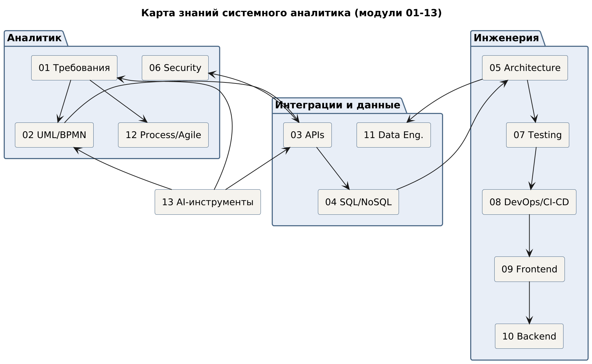
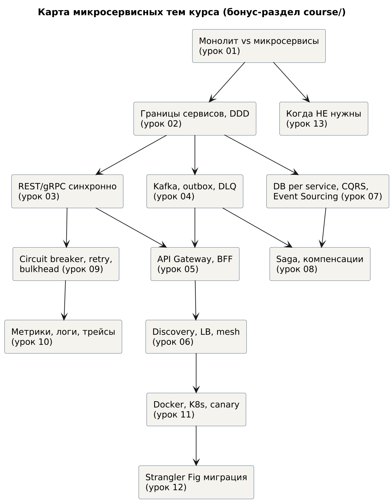

# Полный курс: Системный аналитик (Fullstack)

Учебный курс для системных аналитиков уровня middle+: от сбора требований до архитектуры, интеграций, данных, безопасности и процессов. Каждый модуль — теория с примерами и разборами, ссылки на первоисточники, задания практики и схемы (PlantUML → PNG).



## Программа

| # | Модуль | О чём |
|---|---|---|
| 1 | [Требования и аналитика](01_requirements/README.md) | BR/UR/FR/NFR, INVEST, Gherkin AC, техники выявления, трассировка |
| 2 | [Моделирование: UML и BPMN](02_uml_bpmn/README.md) | Use Case, Sequence, State Machine, ER, BPMN; диаграммы как код |
| 3 | [Интеграции и API](03_integration_apis/README.md) | REST/gRPC/GraphQL/SOAP, OpenAPI, идемпотентность, webhooks, Kafka-события |
| 4 | [Базы данных и SQL](04_databases_sql_nosql/README.md) | Нормализация, SQL-минимум, индексы, транзакции, NoSQL-выбор, миграции |
| 5 | [Архитектура](05_architecture/README.md) | Стили, NFR/SLA-математика, CAP/BASE, паттерны (Saga, CQRS, Outbox), ADR |
| 6 | [Безопасность и аутентификация](06_security_auth/README.md) | OAuth2/OIDC + PKCE, JWT, RBAC, OWASP Top-10, STRIDE threat modeling |
| 7 | [Тестирование и качество](07_testing_quality/README.md) | Пирамида тестов, BDD/Gherkin, контрактные тесты, метрики качества, стенды |
| 8 | [DevOps, CI/CD и облака](08_devops_ci_cd/README.md) | Pipeline, canary/blue-green/feature flags, K8s/IaC минимум, мониторинг |
| 9 | [Frontend и веб](09_frontend_web/README.md) | SPA/SSR, HTTP-кеши/CORS/cookies, состояние данных, Core Web Vitals, a11y |
| 10 | [Backend-практики](10_backend_practices/README.md) | Слои сервиса, retry/backoff/jitter, конкурентность, кеширование, correlation-id |
| 11 | [Данные и аналитика](11_data_engineering/README.md) | DWH/Kimball star-schema, ETL/ELT, CDC/streaming, data quality, спецификации отчётов |
| 12 | [Процессы, Agile и инструменты](12_process_agile_tools/README.md) | Роли, DoR/Definition of Done, тулинг, жизненный цикл артефактов, soft skills |
| 13 | [AI-assisted analysis](modules_extra/13_ai_assisted_analysis/README.md) | Промпт-плейбук SA, ревью спеков через LLM, privacy-границы применения |

## Навигация по курсу

| Ресурс | Для чего |
|---|---|
| [progress.md](progress.md) | трекер прогресса: чеклист модулей, маршруты A/B/C, зачётный проект |
| [templates/](templates/) | 6 рабочих шаблонов: спецификация ФТ, ADR, контракт интеграции, NFR-чеклист, threat model, декомпозиция и оценка |
| [cases/](cases/README.md) | 7 мини-кейсов с разборами: конкурентность, webhook-дубли, миграции, privacy |
| [practice/](practice/README.md) | практикум: 12 заданий + полные решения в `solutions/` |
| [modules_extra/13_ai_assisted_analysis/](modules_extra/13_ai_assisted_analysis/README.md) | AI-модуль: промпты для аналитика, границы применения LLM |
| [snippets/](snippets/README.md) | копипаст в спецификации: NFR-формулировки, Gherkin-шаблоны, OpenAPI-фрагменты, SQL для отчётов, чеклисты контрактов |
| [GLOSSARY.md](GLOSSARY.md) | глоссарий EN → RU: ~90 терминов с комментариями «как правильно по-русски» |
| [interview.md](interview.md) | 36 вопросов собеседований с эталонными ответами и ловушками + мини-тест самопроверки |

## Бонус: микросервисы

Отдельный углублённый курс из 13 уроков лежит в [course/](course/README.md): границы сервисов, коммуникация, Saga, отказоустойчивость, наблюдаемость, миграция от монолита. Используется в модуле 5 как справочник по распределённым системам.



## Итоговый проект (зачёт)

Начинайте с [progress.md](progress.md) — там же маршруты быстрого онбординга и полного прохождения.

Возьмите домен «сервис записи к врачу» и подготовьте полный пакет аналитики (каждый пункт оформляется по соответствующему шаблону из `templates/`):
1. BR → UR → FR/NFR с метриками (модуль 1).
2. Use Case + 2 sequence + state machine записи + BPMN «приём пациента» (модуль 2).
3. OpenAPI-контракт записи с идемпотентностью + схема событий напоминаний (модуль 3).
4. Модель данных PostgreSQL + обоснование индексов (модуль 4).
5. ADR: выбор стиля архитектуры и брокера + расчёт SLA цепочки (модули 5, 10).
6. Threat model записи (запись на чужого пациента, DDoS слота) + RBAC ролей (модуль 6).
7. План тестирования: пирамида + контрактные тесты + нагрузочный сценарий пика понедельника (модуль 7).
8. Pipeline релиза с feature flag для нового расписания (модуль 8).
9. Спецификация виджета записи: состояния загрузки/ошибок, WCAG AA (модуль 9).
10. Витрина «загрузка врачей» star-schema + SLA актуальности (модуль 11).
11. Definition of Ready/Done команды и декомпозиция работ (модуль 12).

## Как устроены изображения

Исходники схем — PlantUML в `puml_fullstack/` и `course/puml/`, рендер в `images_fullstack/` и `course/images/`. Пересборка:

```bash
java -jar plantuml.jar -tpng -Sdpi=150 -o images_fullstack puml_fullstack/*.puml
```

## Лицензия
MIT — используйте свободно.
