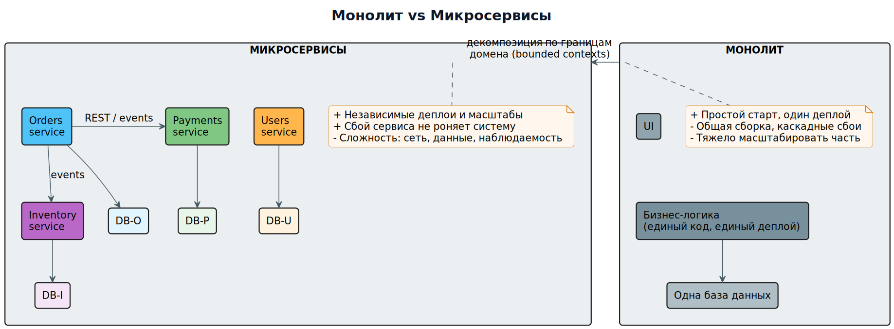

# Модуль 1. Введение: монолит vs микросервисы

[Программа](../README.md) · [Следующий →](02_service_boundaries_ddd.md)

> Порядок работы: разберите основную идею, объясните схему словами, выполните задание и самопроверку. Если термины мешают, вернитесь к [основному маршруту](../../START_HERE.md).

## 1.1. Что такое монолит

**Монолит** — приложение, где вся бизнес-логика, доступ к данным и интерфейс собираются в один деплоируемый артефакт (один JAR, один образ, один проект).

Плюсы монолита:
- Простота старта: один репозиторий, один билд, один сервер.
- Транзакции — обычные ACID-транзакции одной БД.
- Отладка тривиальна: стектрейс полный, логи в одном файле.
- Нет сетевых задержек между модулями — вызовы идут внутри процесса.

Минусы, из-за которых от него уходят:
- **Связанность деплоя**: любое изменение — это релиз всего приложения.
- **Единая точка отказа**: утечка памяти в одном модуле роняет всё.
- **Масштабирование по максимуму**: чтобы разгрузить тяжёлую страницу, приходится масштабировать всё приложение.
- **Технологический диктат**: один язык/фреймворк на всё.
- **Организационные трения**: 50 разработчиков в одной кодовой базе мешают друг другу.

## 1.2. Что такое микросервис

**Микросервис** — независимо развёртываемая служба, которая:
1. Инкапсулирует **ограниченную область бизнес-возможности** (business capability).
2. Имеет **собственную модель данных** (обычно свою БД).
3. Общается с другими сервисами через **сетевые API** (HTTP/gRPC) или **обмен сообщениями**.



*Сравниваются границы развёртывания и данных. Выбор определяется связностью, независимостью выпуска и стоимостью эксплуатации.*

### Ключевые характеристики
| Свойство | Монолит | Микросервисы |
|---|---|---|
| Деплой | Один артефакт | Каждый сервис отдельно |
| БД | Общая | Своя у каждого сервиса |
| Отказ | Падает всё | Падает один сервис |
| Масштабирование | Всё приложение | Горячий сервис точечно |
| Технологии | Одна | Polyglot (Java + Go + Python…) |
| Сложность | Низкая на старте | Высокая операционная |

## 1.3. Разбор примера: интернет-магазин

**Монолит `shop.jar`:**
```
shop/
├── controllers/   # HTTP
├── services/      # заказы, оплата, склад, пользователи
├── repositories/  # все таблицы одной PostgreSQL
└── templates/     # HTML
```
Отдел оплаты меняет формулу комиссии → релизится весь магазин → риск регрессии в заказах, складе, пользователях.

**Микросервисы:**
```
order-service    (Java)  → БД orders
payment-service  (Go)    → БД payments
inventory-service(Python)→ БД inventory
user-service     (Node)  → БД users
catalog-service  (Java)  → БД catalog + Redis
```
Тот же change: деплой только `payment-service`. Остальные не трогаем. Если payment упадёт — каталог и оформление просмотра работают; создание заказа деградирует, а не падает целиком (см. модуль 9).

## 1.4. Цена перехода

Микросервисы переносят сложность **из кода в инфраструктуру**:
- Нужны: service discovery, шлюзы, мониторинг, трейсинг, CI/CD на каждый сервис, обработка сетевых отказов.
- Команда Amazon: «Two-pizza team» — сервис владеет команда из ≤10 человек.
- Правило Конвея: архитектура системы повторяет коммуникации организации. Дробите систему — дробите команды, и наоборот.

## 1.5. Проверьте себя

1. Почему «один сервис = одна БД» критично, а не опционально?
2. Какой класс задач остаётся проще в монолите при команде из 3 человек?
3. Что такое «каскадный отказ» и почему его почти нет в монолите с локальными вызовами?

**Дальше → [Модуль 2. Границы сервисов и DDD](02_service_boundaries_ddd.md)**

## Проверка понимания

<details>
<summary>Почему монолит нельзя автоматически считать плохой архитектурой?</summary>

Он может дать простые транзакции и эксплуатацию; цена зависит от границ модулей, нагрузки и команды.

</details>

**Практика:** примените тему к [сквозному платежу](../../examples/payment/README.md). Опишите решение, один сбой, способ обнаружения и действие восстановления. Явно отделите допущения от требований.
