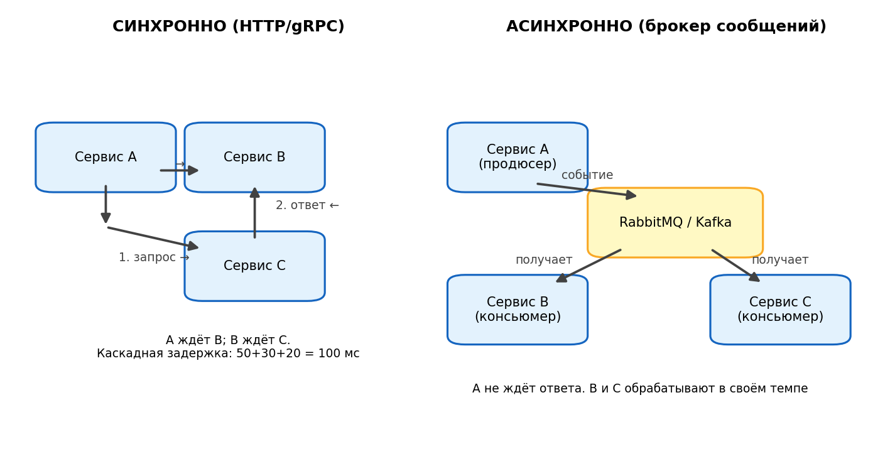

# Модуль 3. Синхронная коммуникация: REST и gRPC



## 3.1. Когда синхронный вызов уместен

- Клиенту **нужен результат сейчас** (оформление заказа проверяет остаток на складе).
- Запрос короткий и дешёвый.
- Требуется строгая семантика «сделалось / не сделалось».

Все остальные случаи лучше переводить в асинхронщину (модуль 4): синхронные цепочки A→B→C складывают задержки и превращают отказ C в отказ A.

## 3.2. REST

Контракт — URL + метод + JSON. Пример сервиса заказов:

```
GET    /orders/{id}            → 200 {"id":"o-1","status":"PAID"}
POST   /orders                 → 201 + Location
PATCH  /orders/{id}/cancel     → 204
```

Достоинства: универсальность, кэшируемость GET, отладка curl'ом, экосистема.
Проблемы: нет типизации контракта «из коробки» (лечится OpenAPI + codegen), loose contract = тихие breaking changes.

**Версионирование API.** Правила:
- Добавлять поля — безопасно; удалять/переименовывать — breaking change.
- Версия в URL (`/v2/orders`) или заголовке; старая версия живёт ≥ одного цикла миграции клиентов.
- Consumer-driven contracts (Pact) — потребители публикуют ожидаемые схемы, провайдер проверяет их в CI.

## 3.3. gRPC

Бинарный RPC поверх HTTP/2, контракт — `.proto`:

```proto
syntax = "proto3";
service InventoryService {
  rpc Reserve(ReserveRequest) returns (ReserveResponse);
}
message ReserveRequest {
  string sku = 1;
  int32 quantity = 2;
}
```

Достоинства:
- Сильная типизация, codegen на все языки.
- HTTP/2: мультиплексирование, серверный/streaming (`stream` в обе стороны).
- Быстрее REST на 3–10× за счёт бинарного Protobuf.

Недостатки: браузеры «из коробки» не говорят (нужен grpc-web/прокси), отладка сложнее, нет нативного кэша как у GET.

## 3.4. Выбор между REST и gRPC

| Критерий | REST | gRPC |
|---|---|---|
| Внешний API для браузера/партнёров | ✅ | ❌/сложно |
| Внутренние сервис-сервис вызовы | ок | ✅ |
| Streaming (события, чаты) | SSE/WebSocket | ✅ нативно |
| Строгий типизированный контракт | OpenAPI+codegen | ✅ нативно |
| Latency-critical пути | ❌ | ✅ |

## 3.5. Таймауты и дедлайны — обязательная гигиена

Никогда не вызывайте без таймаута. Сквозной deadline propagates:

```python
resp = requests.post("http://inventory/reserve", json=payload, timeout=(0.3, 1.0))
#                 соединение 0.3с, чтение 1.0с
```

В gRPC — `context.WithTimeout(ctx, time.Second)`; в Java — `Deadline.after()` из gateway. Если клиент дал 2 с на весь запрос, gateway выделяет каждому downstream меньше (например, по 800 мс), иначе сеть забьется «висящими» запросами (см. модуль 9 о retry storms).

## 3.6. Разбор примера: каскад задержек

Запрос `POST /checkout` идёт: gateway → orders → inventory → pricing.
Latency: 20 + 50 + 30 + 20 = 120 мс p50, но при деградации pricing до 5 с весь checkout лежит 5 с, пулы соединений переполняются, падает всё.

Лечение:
1. Таймаут на каждый hop (pricing: 200 мс + fallback «цена из кэша»).
2. Circuit breaker вокруг pricing.
3. Вынести pricing в асинхронную предвычисленную читательскую модель (CQRS, модуль 7).

**Дальше → [Модуль 4. Асинхронная коммуникация](04_async_messaging.md)**
