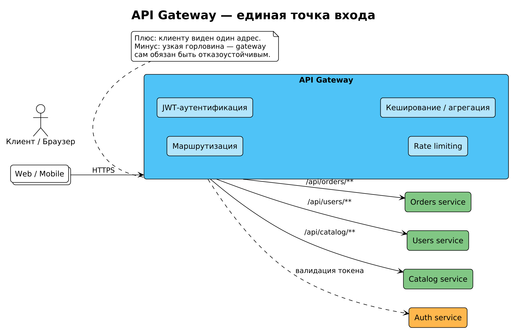

# Модуль 5. API Gateway

[← Предыдущий](04_async_messaging.md) · [Программа](../README.md) · [Следующий →](06_service_discovery.md)

> Порядок работы: разберите основную идею, объясните схему словами, выполните задание и самопроверку. Если термины мешают, вернитесь к [основному маршруту](../../START_HERE.md).



## 5.1. Зачем нужен шлюз

Клиенту (мобильное приложение, браузер) нельзя показывать топологию из 40 сервисов:
- один вход → единая точка аутентификации, rate limiting, CORS, WAF;
- маршрутизация `/api/orders/**` → order-service;
- **агрегация**: мобильный экран «профиль» требует данных из 5 сервисов — шлюз делает fan-out/fan-in и отдаёт один ответ (паттерн Backend-for-Frontend);
- трансформация протоколов: внешний REST ↔ внутренний gRPC;
- кэширование горячих GET.

Без шлюза каждая из этих забот копируется в каждый сервис или в каждый клиент.

## 5.2. Чем не является gateway

- Не бизнес-логикой (полоса «fat gateway» — антипаттерн: правила скидок внутри nginx = зло).
- Не service mesh (mesh решает сетевые заботы *между* сервисами, gateway — на границе система/внешний мир).

## 5.3. Популярные реализации

| Продукт | Особенности |
|---|---|
| Kong | Lua-плагины, кластеризация, большой маркетплейс плагинов |
| Envoy | C++, xDS-API, лежит в основе многих mesh (Istio) |
| Traefik | автоконфигурация из Docker/K8s |
| AWS API Gateway / ALB | managed, интеграции с Lambda/IAM |
| Spring Cloud Gateway | Java-экосистема |

## 5.4. Конфигурация на примере Kong

```yaml
# маршрут /orders → upstream order-service
routes:
  - name: orders
    paths: ["/api/orders"]
    service: order-service
plugins:
  - name: key-auth        # аутентификация
  - name: rate-limiting   # 100 req/min per IP
    config: { minute: 100, policy: "local" }
```

## 5.5. Аутентификация и авторизация на шлюзе

Типовая схема с JWT/OAuth2:
1. Клиент логинится в auth-сервис → получает access token (JWT).
2. Gateway проверяет подпись, срок, выдаёт внутренним сервисам `X-User-Id` + scopes (или пропускает токен дальше).
3. Сервисы принимают доверенные заголовки только от gateway (сеть изолирована / mTLS).

Проблема распространения отзыва токенов: короткое время жизни access token (5–15 мин) + refresh token.

## 5.6. Паттерн BFF (Backend-for-Frontend)

Отдельный «тонкий» gateway под каждого клиента: web-BFF, mobile-BFF, partner-BFF. Разные формы агрегации и версий API без раздувания общего шлюза.

**Дальше → [Модуль 6. Service Discovery](06_service_discovery.md)**

## Проверка понимания

<details>
<summary>Заменяет ли gateway проверки прав в сервисе?</summary>

Нет. Сервис проверяет действия и объекты; шлюз не знает всех бизнес-ограничений.

</details>

**Практика:** примените тему к [сквозному платежу](../../examples/payment/README.md). Опишите решение, один сбой, способ обнаружения и действие восстановления. Явно отделите допущения от требований.
