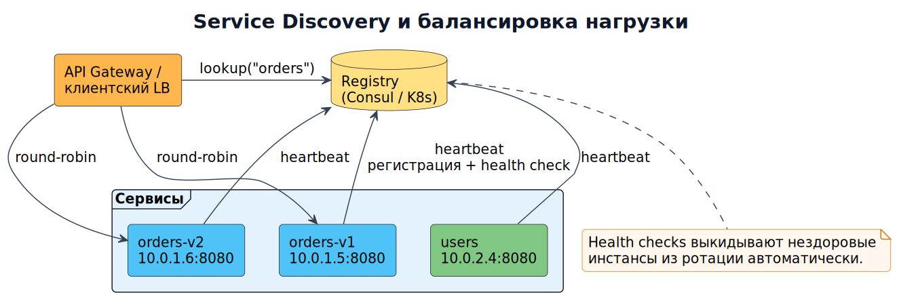

# Модуль 6. Service Discovery и балансировка нагрузки



## 6.1. Проблема

В статическом дата-центре хостинги фиксированы: `payment.prod:8443`. В облаке/K8s инстансы рождаются и умирают каждую минуту (автоскейлинг, rolling update, аварии). Жёстко прописанные адреса = мгновенно устаревающие конфигурации.

**Service discovery** — реестр «имя сервиса → список живых инстансов».

## 6.2. Два режима регистрации

- **Client-side discovery**: консумент сам спрашивает реестр и балансирует (Netflix Eureka + Ribbon; Spring Cloud).
- **Server-side discovery**: балансировщик/shim перед сервисом знает инстансы (Kubernetes Service + kube-proxy; облачные LB).

В Kubernetes вам обычно не нужен отдельный реестр: DNS-имя `order-service.namespace.svc.cluster.local` + Service с label selectors делают discovery и LB «из коробки».

## 6.3. Health checks — сердце механизма

Реестр считает инстанс живым только при зелёных проверках:
- **Liveness** — процесс не завис (иначе restart).
- **Readiness** — готов принимать трафик (миграции БД прогреты, кэш загружен; иначе убрать из балансировки, но не убивать).
- **Startup** — медленный старт legacy-приложений.

Пример readiness в K8s:

```yaml
readinessProbe:
  httpGet: { path: /health/ready, port: 8080 }
  initialDelaySeconds: 5
  periodSeconds: 5
  failureThreshold: 3
```

## 6.4. Алгоритмы балансировки

- Round robin / weighted round robin.
- Least connections / least request (для разнородных запросов).
- Consistent hashing (сессионная аффинность, кэши на нодах).
- P2C (power of two choices): выбрать двух случайных, отдать тому, у кого меньше нагрузок — стандарт Envoy для больших кластеров.

## 6.5. Разбор примера: scale-up под распродажу

1. Метрика RPS на order-service > порог → HPA увеличивает реплики 3 → 12.
2. Новые поды проходят readiness → автоматически добавляются в Endpoints.
3. Клиенты получают свежий список без перезапуска (watch/DNS TTL).
4. При откате инстансы убираются из LB *до* SIGTERM; graceful shutdown дожидается активных запросов (preStop sleep + connection drain). Ошибка новичков — kill без drain = потерянные запросы.

## 6.6. Service Mesh — следующий уровень

Istio/Linkerd выносят discovery, mTLS, retry, observability в sidecar-прокси: бизнес-код ничего не знает о сети. Цена: +1 прокси на под, задержка ~1–3 мс/hop, операционная сложность. Берите mesh, когда сервисов десятки и языков много.

**Дальше → [Модуль 7. Управление данными](07_data_management.md)**

## Проверка понимания

<details>
<summary>Достаточно ли DNS для гарантии доступности сервиса?</summary>

Нет. Нужны readiness, актуальные endpoints, таймауты и наблюдаемость; DNS сам по себе не гарантирует успешный вызов.

</details>

**Практика:** примените тему к [сквозному платежу](../../examples/payment/README.md). Опишите решение, один сбой, способ обнаружения и действие восстановления. Явно отделите допущения от требований.
