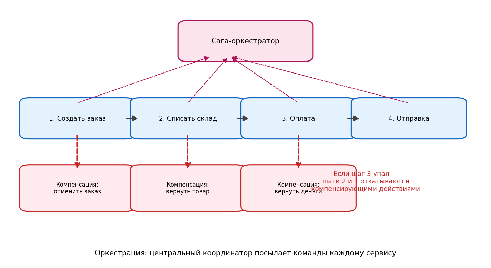

# Модуль 8. Распределённые транзакции: Saga



## 8.1. Почему 2PC не вариант

Two-Phase Commit требует: все участники в одной координирующей сессии, блокировки на время prepare, поддержка XA всеми БД. В микросервисах это связывает доступность всех участников и убивает независимость развёртывания. Используем **Saga** — последовательность локальных транзакций с компенсацией.

## 8.2. Оркестрация vs хореография

**Оркестрация**: центральный сага-координатор (order-service или отдельный workflow-движок) посылает команды; состояние шагов хранится явно.

```python
class PlaceOrderSaga:
    steps = [
        Step(CreateOrder,     compensate=CancelOrder),
        Step(ReserveStock,    compensate=ReleaseStock),
        Step(AuthorizePayment,compensate=VoidPayment),
        Step(CapturePayment,  compensate=Refund),
        Step(MarkShipped),
    ]
```

**Хореография**: сервисы обмениваются событиями без координатора (`OrderPlaced` → склад резервирует и шлёт `StockReserved` → платёж...). Децентрализованно, но при >3 шагах граф зависимостей становится нечитаемым; нет явного состояния саги.

| Критерий | Оркестрация | Хореография |
|---|---|---|
| Прозрачность потока | ✅ один файл/DAG | ❌ по всей системе |
| Связность | координатор знает шаги | сервисы знают только свои события |
| Отладка «где застряло» | легко | тяжело |
| Масштаб малых интеграций | overhead | идеально |

Правило: 2–3 участника → хореография; длинный бизнес-процесс → оркестратор (Temporal/Cadence, AWS Step Functions, Camunda, самописный).

## 8.3. Компенсирующие действия: семантика

Компенсация ≠ откат. После `PaymentCaptured` возврат денег — новая транзакция, остаток товара уже мог измениться другими заказами. Проектируйте компенсации как *бизнес-решения*: «заказ помечен CANCELLED, деньги будут возвращены в течение 3 дней».

Требования к шагам:
- **Идемпотентность** (повтор команды безопасен).
- **Видимость промежуточных состояний** для пользователей и поддержки (`PAYMENT_PENDING`).
- **Защита от «призраков»**: шаг пришёл после начала компенсации → сверяйте версию/статус саги.

## 8.4. Разбор примера: отказ посередине

Сага: Create → Reserve → Authorize → Capture → Ship.
Сбой на Capture (эквайринг недоступен):
1. Оркестратор ловит таймаут, помечает сагу COMPENSATING.
2. VoidPayment(ok) → ReleaseStock(ok) → CancelOrder(ok).
3. Пользователь: «Оплата не прошла, бронь снята». Повтор → новая сага.

Edge case: ReleaseStock упал 5 раз → сага в состоянии MANUAL INTERVENTION, алерт в дежурку; нельзя «забыть» незавершённую сагу. Temporal переживает перезапуски воркеров; самописные оркестраторы обязаны хранить журнал состояний в надёжной БД.

## 8.5. Идемпотентность через ключ операции

Каждая команда несёт `operation_id`; сервис хранит последние N обработанных id и отдаёт закэшированный ответ при повторе. Лечит классическое «платёж прошёл, но клиент получил timeout и повторил оплату».

**Дальше → [Модуль 9. Отказоустойчивость](09_resilience.md)**
