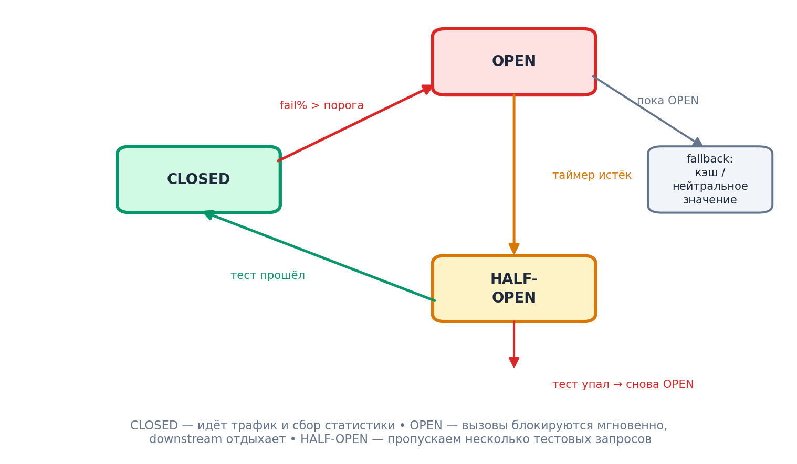

# Модуль 9. Отказоустойчивость: Circuit Breaker, Retry, Timeout, Bulkhead

[← Предыдущий](08_saga.md) · [Программа](../README.md) · [Следующий →](10_observability.md)

> Порядок работы: разберите основную идею, объясните схему словами, выполните задание и самопроверку. Если термины мешают, вернитесь к [основному маршруту](../../START_HERE.md).



## 9.1. Фундамент: сетевые вызовы обязаны падать

Failures — норма, а не исключение. Цель модуля: чужая авария не убивает ваш сервис (**fail fast + degrade gracefully**).

Базовый набор любого вызова downstream:
1. Таймаут (всегда!)
2. Retry с экспоненциальной задержкой и jitter
3. Circuit breaker
4. Fallback / деградация
5. Изоляция ресурсов (bulkhead)

## 9.2. Retry: правила хорошего тона

```python
backoff = min(cap, base * 2**attempt) * random.uniform(0.5, 1.5)
```

- Повторять только **идемпотентные** операции или с operation-id (см. 8.5).
- Не ретраить бизнес-ошибки (400/422), только транспортные (timeout, 502/503).
- **Retry budget**: не более 10–20% дополнительных запросов, иначе ретраи одного сервиса превращаются в шторм для соседа (retry storm).
- Jitter обязателен: синхронные волны повторов после общего сбоя = thundering herd.

## 9.3. Circuit breaker: механика

Три состояния (рис.): Closed → Open при пороге ошибок (например, 50% за 20 скользящих окон) → Half-open: пропускаем пробные запросы → успех — закрыли, провал — снова открыли.

Эффект: вместо 1000 клиентов, ждущих 5-секундный таймаут мёртвого сервиса, все получают мгновенный отказ/fallback; выживший сервис не добивается лавиной.

Библиотеки: resilience4j (Java), sony/gobreaker (Go), pybreaker (Python), Polly (.NET); на уровне инфраструктуры — outlier detection Envoy/Istio.

Пример resilience4j:

```java
CircuitConfig cfg = CircuitConfig.custom()
    .failureRateThreshold(50)
    .waitDurationInOpenState(Duration.ofSeconds(30))
    .slidingWindowSize(20)
    .permittedNumberOfCallsInHalfOpenState(3)
    .build();
```

## 9.4. Fallback — продуманная деградация

| Сервис упал | Плохо | Хорошо |
|---|---|---|
| Рекомендации | ошибка страницы | пустой блок / популярное из кэша |
| Цены (pricing) | checkout лежит | цена из последней читательской модели + баннер |
| Оплата | всё лежит | очередь: принять заказ со статусом PAYMENT_PENDING |
| Поиск | поиск мёртв | LIKE по кэшированным категориям |

## 9.5. Bulkhead (перегородки)

Как в корабле: провал отсека не топит судно. Выделите каждому downstream собственный пул соединений/семафор (maxConcurrent=20). Иначе один медленный сервис займет все 200 потоков HTTP-клиента и положит все остальные вызовы этого сервиса.

## 9.6. Load shedding и backpressure

При перегрузке отбрасывайте часть трафика раньше, чем деградировает всё: лимиты очередей (queue length cap), приоритетные классы (оплата важнее ленты), 429 + Retry-After наружу.

## 9.7. Chaos engineering

Проверяйте гипотезы об устойчивости активно: Simian Army / Gremlin / Litmus — убили под, подняли latency на 300 мс, разорвали AZ. Ожидаемое поведение фиксируется SLO до эксперимента (game day).

**Дальше → [Модуль 10. Наблюдаемость](10_observability.md)**

## Проверка понимания

<details>
<summary>Нужно ли повторять любой 5xx?</summary>

Нет. Согласовываем временные ошибки, безопасность повторов, deadline и retry budget.

</details>

**Практика:** примените тему к [сквозному платежу](../../examples/payment/README.md). Опишите решение, один сбой, способ обнаружения и действие восстановления. Явно отделите допущения от требований.
