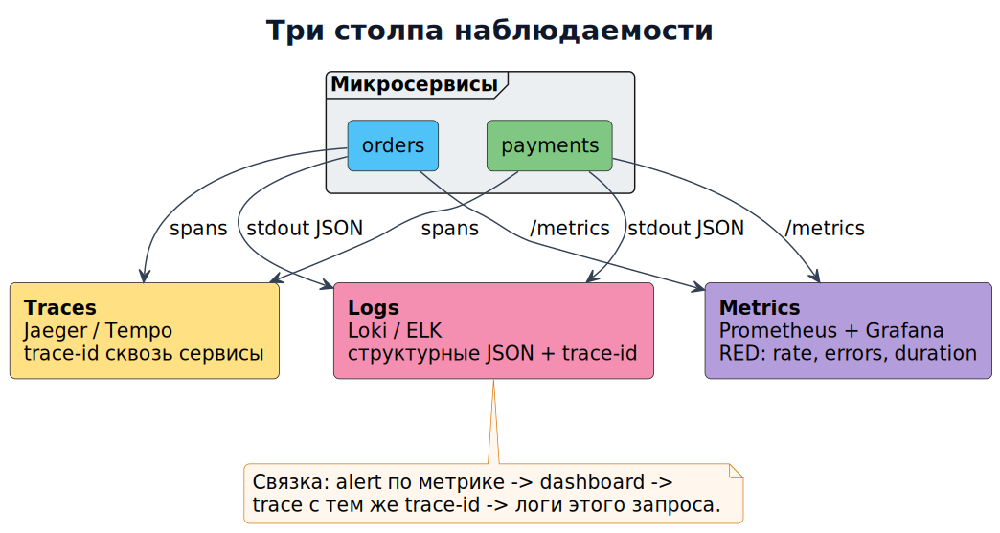

# Модуль 10. Наблюдаемость: логи, метрики, трейсинг



В монолите вы «отлаживаете процесс»; в микросервисах — **систему**: запрос живёт в 8 сервисах, 3 контейнерах и 2 зонах. Наблюдаемость (observable = выводимое состояние по внешним сигналам) — не опция.

## 10.1. Три столпа

### Метрики (Prometheus + Grafana)
Агрегаты по времени: counter, gauge, histogram. Золотые сигналы на каждый сервис: **Latency (p50/p95/p99), Traffic, Errors, Saturation**.

```python
REQUESTS.labels(endpoint, status).inc()
HISTOGRAM.labels(endpoint).observe(elapsed)   # гистограмма длительности
```
Alertmanager-правило: `rate(errors[5m]) / rate(requests[5m]) > 0.05 for 5m`.

### Логи (структурированные!)
- JSON-строки с обязательными полями: `ts, level, svc, trace_id, span_id, user_id(masked), msg`.
- Централизация: Loki (+Grafana), ELK, ClickHouse. Никакого ssh по подам.
- Levels дисциплинированно: ERROR = требует реакции; DEBUG доступен динамически (log level endpoint).

### Трейсинг (OpenTelemetry → Jaeger/Tempo)
`trace_id` генерируется на gateway и летит через все hop'ы в заголовках (`traceparent`, W3C standard). Span = отрезок работы сервиса; parent_span связывает дерево.

Пример сквозного разбора: пользователь жалуются на тормоз checkout. В Jaeger открываем trace: total 4.2 s; root order-service ждёт inventory.Reserve 4.0 s; внутри Reserve видно 3.9 s на `SELECT stock ... FOR UPDATE` → блокировка строк при резком спросе. Без трейсинга поиск занял бы дни перебора логов пяти команд.

## 10.2. OpenTelemetry — текущий стандарт

Единый API/SDK для трёх сигналов, автоинструментация HTTP-клиентов/БД-драйверов, OTLP-экспорт в любой бэкенд. Поднимается sidecar-коллектором в K8s.

## 10.3. SLO и error budget

- SLI: доля успешных запросов; SLO: 99.9% за 30 дней.
- Error budget = 1 − SLO. Кончился → заморозка фич, работа над надёжностью. Не кончился → можно рисковать и деплоить часто. Это язык переговоров между продуктом и инженерией.

## 10.4. Алерты нового стиля

Алертите на **симптомы** (SLO горит), а не на причины (CPU 90% у одного пода — шум). Каждое уведомление — actionable + ссылку на runbook. Grading: page / ticket / dashboard-only.

## 10.5. Чек-лист нового сервиса

- [ ] /health/liveness, /health/readiness
- [ ] Prometheus /metrics: QPS, p99, errors, saturation
- [ ] Структурированные JSON-логи с trace_id
- [ ] OTel-трассировка входящих и исходящих вызовов
- [ ] Dashboard из золотых сигналов + SLO burn-rate алерты

**Дальше → [Модуль 11. Развёртывание](11_deployment.md)**

## Проверка понимания

<details>
<summary>Почему request_id нельзя делать label метрики?</summary>

Уникальные ID создают высокую кардинальность; храним их в логах и traces, метрики агрегируем.

</details>

**Практика:** примените тему к [сквозному платежу](../../examples/payment/README.md). Опишите решение, один сбой, способ обнаружения и действие восстановления. Явно отделите допущения от требований.
