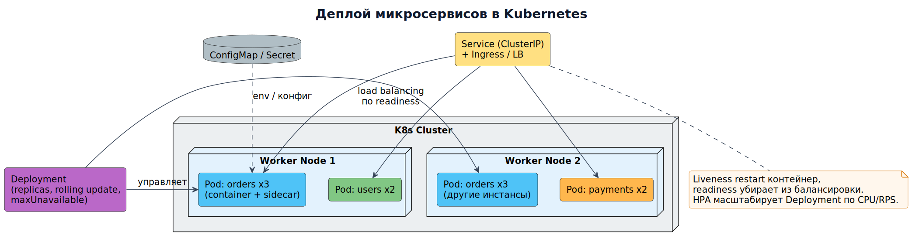

# Модуль 11. Развёртывание: Docker, Kubernetes, CI/CD



## 11.1. Контейнеризация

Каждый микросервис = Docker-образ: приложение + зависимости, неизменяемый артефакт с тегом версии (`payment:1.42.0` или digest). Multi-stage build:

```dockerfile
FROM golang:1.22 AS build
WORKDIR /src
COPY . .
RUN CGO_ENABLED=0 go build -o /app ./cmd/payment

FROM gcr.io/distroless/static
COPY --from=build /app /app
USER nonroot
ENTRYPOINT ["/app"]
```
Размер измеряется после сборки; отсутствие shell уменьшает поверхность атаки. Для воспроизводимости фиксируйте версии зависимостей и digest базового образа. Dockerfile — учебный фрагмент, нужен исходный Go-проект.

## 11.2. Kubernetes: нужные примитивы

| Объект | Роль |
|---|---|
| Deployment | N реплик, rolling update, rollback |
| Service | стабильный виртуальный IP + DNS + LB |
| HPA | автоскейл по CPU/RPS/custom metric |
| ConfigMap/Secret | конфигурация вне образа |
| Ingress/Gateway API | внешний вход (см. модуль 5) |
| Job/CronJob | разовые задачи (миграции) |

```yaml
kind: Deployment
spec:
  replicas: 3
  strategy:
    rollingUpdate: { maxSurge: 1, maxUnavailable: 0 }
  template:
    spec:
      containers:
      - name: payment
        image: registry/payment:1.42.0
        resources:
          requests: { cpu: 250m, memory: 256Mi }
          limits:   { cpu: "1",  memory: 512Mi }
```

requests/limits обязательны — иначе планировщик и HPA слепы.

## 11.3. CI/CD на один сервис

```
git push → CI: линт → тесты → build образа → скан (Trivy) → push в registry
        → CD: staging (автоматически) → smoke + канареечные метрики 15 мин
        → prod (canary 5% → 25% → 100%) или manual gate
```

Стратегии выката:
- **Rolling** — дёшево, но новая версия постепенно «подмешивается».
- **Blue-green** — мгновенный переключатель, двойная ёмкость на время выката.
- **Canary** — процент трафика + автоматический откат по метрикам ошибок (Flagger/Argo Rollouts).
- **Feature flags** — отделить деплой от релиза; выключатели проверяются в проде под нагрузкой.

GitOps (Argo CD/Flux): желаемое состояние в git-репозитории манифестов, кластер синхронизируется сам; откат = git revert.

## 11.4. Миграции БД без даунтайма

Правило Expand-Contract:
1. **Expand**: добавить новую колонку/таблицу (старый код работает).
2. Двойная запись/дабл-райт, бэкфилл данных.
3. Переключить чтение новой версии кода.
4. **Contract**: удалить старое отдельным релизом после стабилизации.

Никогда: миграция «DROP COLUMN» одновременно с деплоем кода, который её читает (окна между репликами = ошибки). Инструменты: Flyway, Liquibase, Alembic, gh-ost.

## 11.5. Окружения и секреты

staging зеркалит прод по топологии (иначе «у меня работало»). Секреты: Vault/External Secrets, никогда в образах; отдельные креды на окружение.

**Дальше → [Модуль 12. Миграция от монолита](12_migration_strangler_fig.md)**

## Проверка понимания

<details>
<summary>Откат контейнера всегда откатывает миграцию?</summary>

Нет. Совместимость схемы и данных проверяется отдельно; удалённые данные могут быть необратимы.

</details>

**Практика:** примените тему к [сквозному платежу](../../examples/payment/README.md). Опишите решение, один сбой, способ обнаружения и действие восстановления. Явно отделите допущения от требований.
