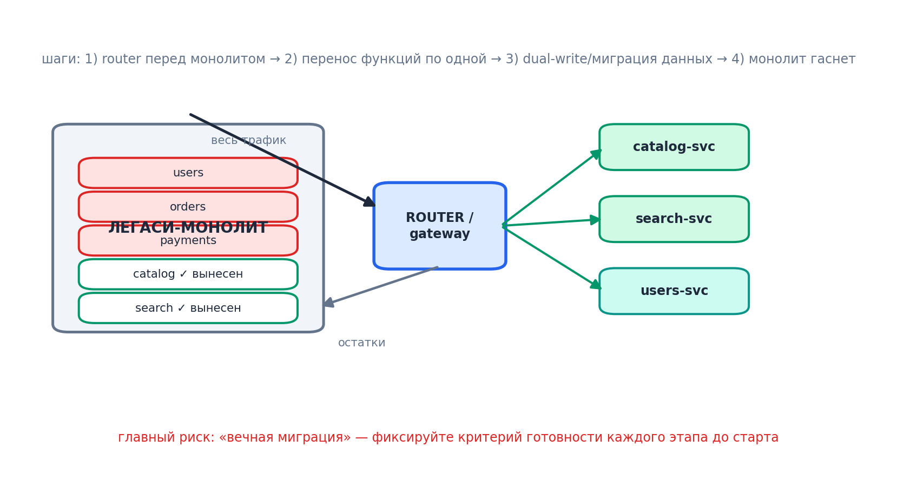

# Модуль 12. Миграция от монолита: Strangler Fig

[← Предыдущий](11_deployment.md) · [Программа](../README.md) · [Следующий →](13_when_not_and_final_project.md)

> Порядок работы: разберите основную идею, объясните схему словами, выполните задание и самопроверку. Если термины мешают, вернитесь к [основному маршруту](../../START_HERE.md).

## 12.1. Почему «большой взрыв» не работает

Переписать всё с нуля = годы, двойная поддержка, устаревшие требования к моменту финиша (Big Rewrite Fallacy — классика по Joel Spolsky). **Strangler Fig** (Мартин Фаулер): новый функционал рождается в сервисах, старый перехватывается маршрутизацией и постепенно «задушивается».

## 12.2. Механика

1. Поставить proxy/gateway перед монолитом. Весь трафик идёт через него.
2. Выбрать **одну** бизнес-возможность (по границам DDD из модуля 2), обычно самую горячую или самую изолированную.
3. Реализовать её как сервис; gateway переключает маршрут `/api/recommendations/**` на новый backend.
4. Канарейка: 5% → 100%; параллельное сравнение ответов (shadow traffic) для рискованных путей.
5. Данные: dual-write или CDC (Debezium) из таблиц монолита; затем перенос ответственности за запись.
6. Обедневший кусок монолита удаляется. Повторять до испарения.

Критерий выбора первой жертвы: высокая ценность × низкая связанность × наличие чёткого API-разреза. Рекомендации/уведомления — типичные кандидаты; «ядро заказов» — последним.

## 12.3. Инфраструктурные предпосылки (платформа раньше сервисов!)

До первого выделенного сервиса должны существовать: CI/CD конвейер, контейнерная платформа, централизованные логи+метрики+трейс, шлюз. Иначе каждая команда изобретает своё болото. Это «платформенная команда» в терминах Team Topologies.

## 12.4. Разбор примера: 18 месяцев миграции маркетплейса

| Месяц | Шаг | Эффект |
|---|---|---|
| 0–2 | Gateway + наблюдаемость поверх монолита | карта трафика, baseline SLO |
| 3–5 | notifications-service (события из шины) | −15% кодовой базы монолита |
| 6–9 | search-service (CDC-реплика в Elastic) | p99 поиска 900→120 мс |
| 10–14 | checkout вынесен с Saga-оркестратором | независимые релизы оплаты |
| 15–18 | users + удаление legacy auth | монолит → каталог-остаток, потом сервис |

Уроки: biggest win — event bus как буфер между старым и новым; biggest pain — разделение БД (см. Expand-Contract, модуль 11); обязательны feature flags на каждом рубеже для мгновенного отката.

## 12.5. Признаки, что вы буксуете

- Новый сервис требует синхронных вызовов обратно в монолит больше, чем отдаёт данных.
- «Временный» dual-write живёт полгода без плана закрытия.
- Команды не могут деплоиться независимо (общие библиотеки-монстры, общая БД).

**Дальше → [Модуль 13. Когда НЕ нужны микросервисы + проект](13_when_not_and_final_project.md)**

## Проверка понимания

Почему нельзя включать новый путь без проверки данных?

Новый сервис может иметь неполную read-модель; нужны сверка, контролируемое переключение и план восстановления.

**Практика:** примените тему к [сквозному платежу](../../examples/payment/README.md). Опишите решение, один сбой, способ обнаружения и действие восстановления. Явно отделите допущения от требований.
