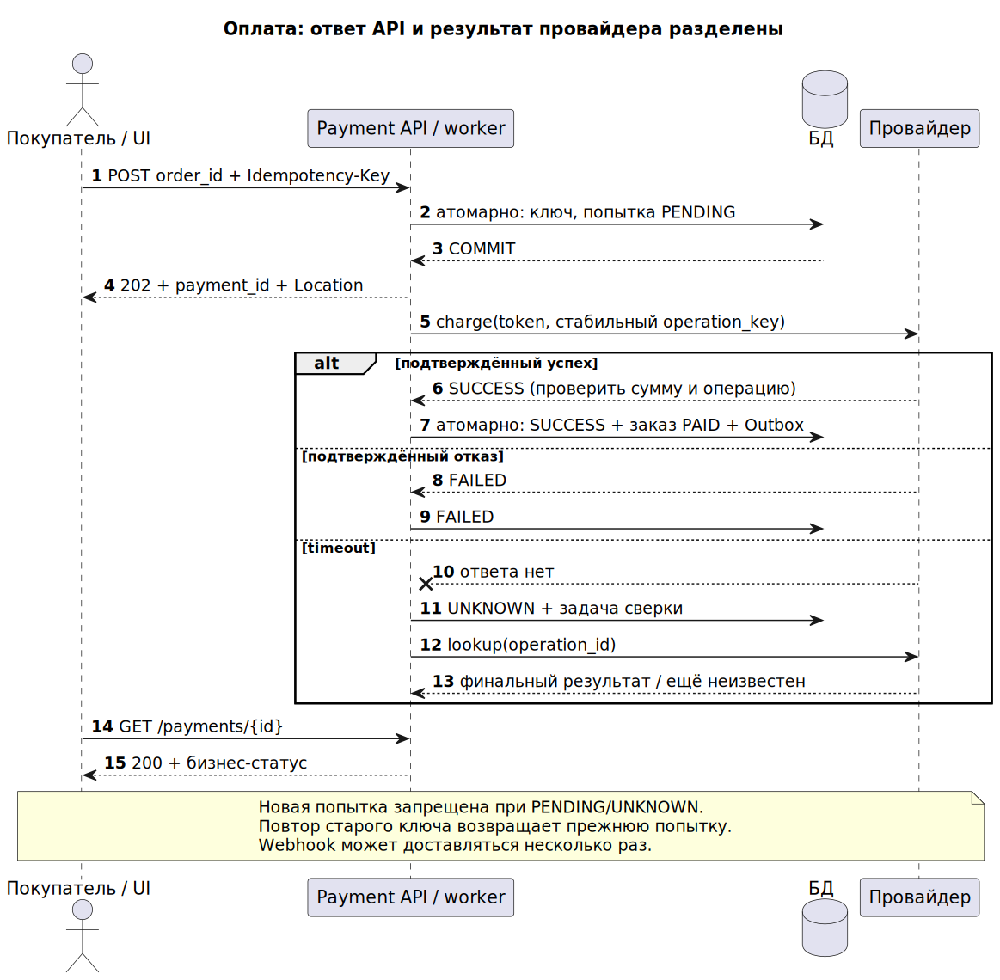
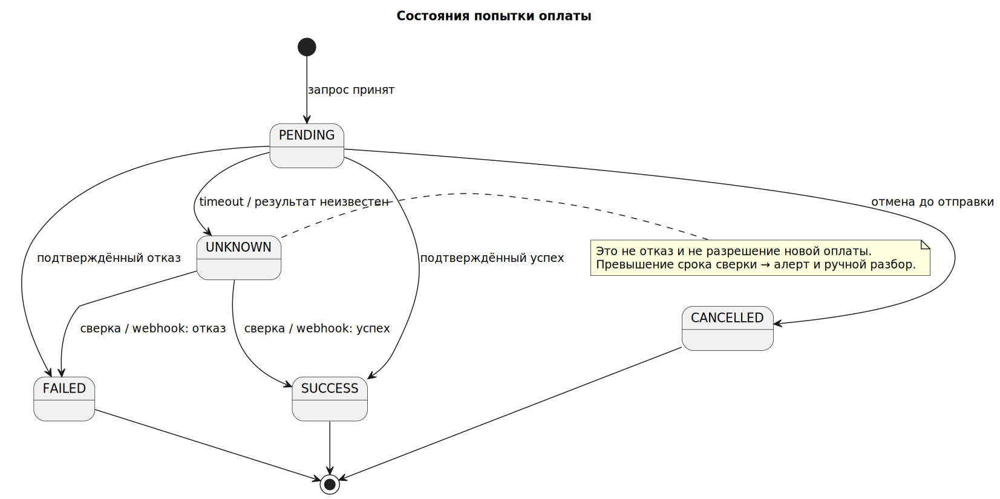

# Сквозной пример: один заказ, один полный платёж

Учебная модель для согласования требований, API, данных и тестов. Это документация и симулятор; банковские операции не выполняются.

## Допущения и границы

- Заказ O123 стоит 150000 копеек (1500 ₽), RUB. Сумму сервер берёт из заказа, а не доверяет браузеру.
- Модель допускает один полный успешный платёж на заказ. Частичные оплаты, рассрочки и возвраты — отдельные расширения, здесь не реализованы.
- payment_id идентифицирует попытку; order_id — заказ; Idempotency-Key — намерение клиента повторить ту же операцию. Это разные идентификаторы.
- Одна активная попытка на заказ. PENDING и UNKNOWN блокируют новую попытку с новым ключом. После FAILED/CANCELLED новый ключ создаёт новую попытку.
- CANCELLED допустим до отправки операции провайдеру. UNKNOWN нельзя автоматически отменять: требуется сверка.
- Учебное хранение ключей — 24 часа; поведение после истечения согласуется отдельно. Симулятор хранит их в памяти без TTL и не имитирует сеть или конкуренцию БД.

## От проблемы к требованиям

| ID | Требование | Проверка |
|---|---|---|
| BR-01 | Снизить повторные успешные списания по одному заказу до 0 в учётном месяце | Сверка уникальных операций провайдера; исходный уровень выяснить |
| UR-01 | Покупатель узнаёт результат оплаты и понимает следующий шаг | Пользовательские сценарии успех/отказ/неопределённость |
| FR-01 | POST создаёт одну попытку; одинаковый ключ и тело возвращают ту же попытку | payment_id одинаков при повторе |
| FR-02 | Новый ключ при активной попытке возвращает конфликт с существующим payment_id | 409 PAYMENT_ACTIVE |
| FR-03 | Только проверенный результат провайдера переводит попытку в SUCCESS/FAILED | Подпись, идентификатор, сумма и допустимый переход |
| FR-04 | Timeout переводит PENDING в UNKNOWN и запускает сверку | Нет новой операции charge |
| NFR-01 | p95 локального принятия POST ≤300 мс при 200 RPS за 15 минут на согласованном стенде; без ожидания провайдера | Нагрузочный тест; ошибки и отказовые запросы считаются отдельно |

Метрики — учебные предложения для обсуждения, не измеренные свойства работающей системы.

## Use Case «Оплатить заказ»

Актор: покупатель. Предусловия: авторизован, владеет неоплаченным заказом, цена подтверждена сервером. Триггер: нажал «Оплатить».

1. Клиент создаёт ключ операции и отправляет order_id + токен платёжного метода.
2. Сервер проверяет права, заказ и активную попытку, сохраняет попытку и ключ атомарно.
3. Возвращает 202, payment_id и Location ресурса. Worker использует стабильный ключ операции у провайдера.
4. При необходимости клиент проходит подтверждение банка; сервер не считает redirect доказательством оплаты.
5. Проверенный webhook или сверка сообщает успех; сервер фиксирует SUCCESS и оплаченный заказ атомарно с исходящим событием.
6. Покупатель видит успех; отправка email — отдельный идемпотентный обработчик события.

Альтернативы: недостаточно средств → FAILED; отмена до отправки → CANCELLED; сетевой timeout → UNKNOWN; повтор → существующая попытка. Поздний успех по UNKNOWN принимается. Неожиданное противоречие после финального результата регистрируется для сверки, а не молча перезаписывает статус.



[SVG для увеличения](images/payment_sequence.svg)

## Состояния попытки

| Состояние | Значение | UI и следующий шаг |
|---|---|---|
| PENDING | Попытка принята, окончательного результата нет | «Обрабатываем», новая оплата заблокирована |
| UNKNOWN | После сбоя результат внешней операции неизвестен | «Уточняем», webhook/опрос/ручная сверка |
| SUCCESS | Успех подтверждён | «Оплачено», повторная оплата запрещена |
| FAILED | Окончательный отказ подтверждён | Показать причину; новая попытка с новым ключом допустима |
| CANCELLED | Отмена подтверждена до отправки провайдеру | Новая попытка допустима |



[SVG для увеличения](images/payment_states.svg)

## Контракт

Полный учебный документ: [openapi.json](openapi.json). POST всегда принимает локальную асинхронную попытку и возвращает 202; текущий ресурс читается GET с 200. Повтор POST с тем же ключом возвращает актуальный ресурс прежней попытки с 202, даже если она уже завершилась — это явно выбранная семантика, не обязательное правило для всех API.

```http
POST /v1/payments HTTP/1.1
Authorization: Bearer <учебный-токен>
Idempotency-Key: 680d814f-c6c3-46ee-a021-8f29837ed360
Content-Type: application/json

{"order_id":"O123","payment_method_token":"pm_demo"}
```

```http
HTTP/1.1 202 Accepted
Location: /v1/payments/P9
Content-Type: application/json

{"payment_id":"P9","order_id":"O123","amount_minor":150000,"currency":"RUB","status":"PENDING"}
```

| HTTP | code | Значение и действие |
|---|---|---|
| 400 | INVALID_REQUEST | Исправить форму/обязательные заголовки |
| 401 | UNAUTHENTICATED | Восстановить сессию |
| 404 | NOT_FOUND | Объект отсутствует или скрыт от пользователя |
| 409 | IDEMPOTENCY_CONFLICT | Тот же ключ с другим телом; исправить клиент, не повторять автоматически |
| 409 | PAYMENT_ACTIVE | Использовать существующий payment_id и читать статус |
| 409 | ORDER_PAID | Заказ уже оплачен, нового списания нет |
| 503 | TEMPORARILY_UNAVAILABLE | Приём запроса не удался; после восстановления повторить тот же ключ |

504 от инфраструктуры может появиться до получения ответа; выясняем состояние с прежним ключом. API чтения не заменяет проверку владельца. PAN/CVV в контракте отсутствуют.

## Данные и обработка событий

[PostgreSQL DDL](schema.sql): ограничения одной активной и одной успешной попытки, сумма >0, уникальность ключа в области клиента и операции. Ограничения дополняют транзакции приложения: смена статуса, оплаченный заказ и запись Outbox — одна транзакция. Не держать DB-транзакцию во время внешнего HTTP-вызова.

Webhook: проверить подпись сырого тела, replay-window и схему → надёжно сохранить inbox(event_id) → 2xx → транзакционно применить бизнес-эффект. Один payment_id может иметь несколько событий: дедупликация по event_id не заменяет проверку переходов.

## Самостоятельная практика

1. До чтения симулятора напишите шесть AC: успех, отказ, двойной клик, timeout, чужой заказ, поздний webhook.
2. Запустите `python3 tools/check_examples.py` из корня репозитория.
3. Изучите [симулятор](simulator.py): он проверяет последовательные правила. Отдельно опишите race между двумя серверами и какие транзакции/индексы нужны.
4. Добавьте возврат: отдельная сущность и REFUND_PENDING, без превращения успешной оплаты в FAILED.

[Оглавление](../../README.md) · [Первоисточники](../../SOURCES.md)
