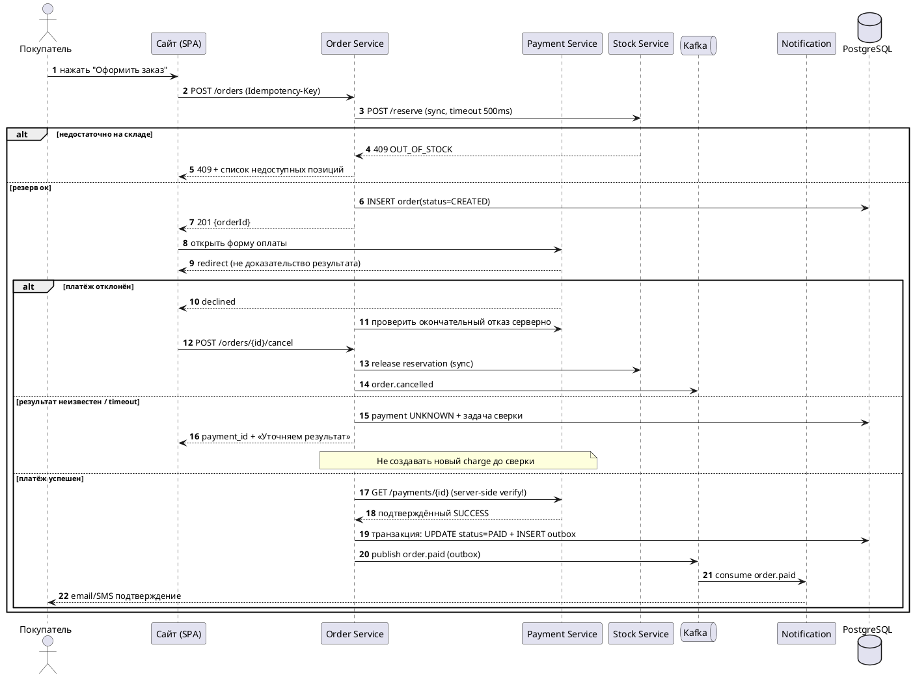

# Решение 3. Sequence-диаграмма оформления заказа

Ключевые моменты разбора:
- Резерв склада **до** оплаты (иначе платят за отсутствующий товар), с TTL резерва.
- Результат оплаты проверяется серверно (`GET /payments`), а не «пришёл redirect → значит ок» (подделываемый callback).
- Notification — async через очередь: медленное письмо не блокирует заказ.
- Idempotency-Key на POST /orders — защита от двойного клика.
