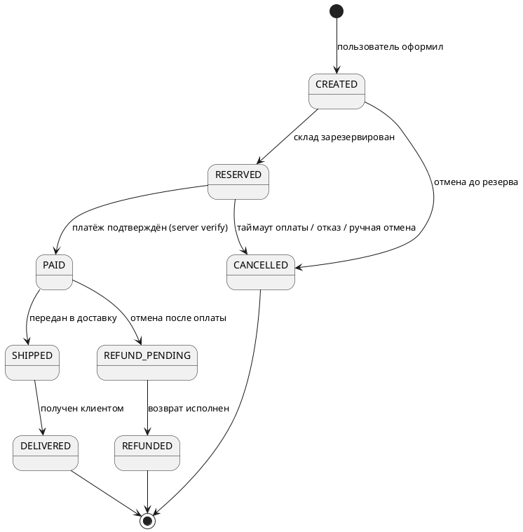

# Решение 4. State machine заказа

Таблица переходов:

| Из | Событие | Guard | Действие | В |
|---|---|---|---|---|
| CREATED | reserve.ok | все позиции в наличии | записать резерв (TTL 15 мин) | RESERVED |
| RESERVED | pay.confirmed | сумма совпадает, подпись OK | outbox: order.paid | PAID |
| RESERVED | timeout/cancel | — | release резерва (компенсация Saga) | CANCELLED |
| PAID | cancel | не передан в доставку | создать refund task (компенсация) | REFUND_PENDING |
| REFUND_PENDING | refund.done | провайдер подтвердил возврат | outbox: order.refunded | REFUNDED |

Небезопасные места:
- **PAID → SHIPPED** требует внешней системы (курьер) — промежуточное состояние нужно, иначе «оплачен, но непонятно где».
- **REFUND_PENDING** — обязательный промежуточный: возврат может не пройти; без него теряем деньги молча.
- Каждый переход идемпотентен (повтор `pay.confirmed` не создаёт второй заказ) и пишется в audit log.
- Запрещённые переходы явные: из DELIVERED нет прямого CANCELLED; спор постфактум — другая сущность (dispute).
