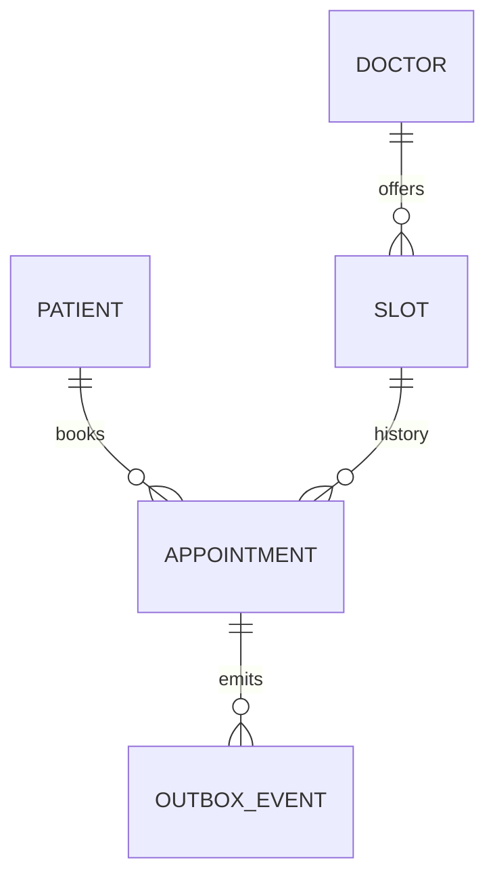

# 3. Данные, состояния и инварианты

[Назад](02_requirements.md) · [Проект](README.md) · [Далее](04_api.md)

## Словарь данных

| Сущность | Ключ и поля | Связь и ограничение |
|---|---|---|
| patient | id, display_name | 1 пациент → 0..N записей; только синтетические данные в практике |
| doctor | id, display_name | 1 врач → 0..N слотов |
| slot | id, doctor_id, starts_at, ends_at, published | ends_at > starts_at; непересекающееся расписание одного врача |
| appointment | id, slot_id, patient_id, status, created_at, version | slot → 0..N исторических записей; одновременно максимум 1 CONFIRMED |
| idempotency_request | patient_id, operation, key, request_hash, appointment_id, expires_at | UNIQUE по пациенту, операции и ключу; хранит ссылку на результат |
| outbox_event | id, aggregate_id, version, type, payload, published_at | событие сохраняется с изменением записи |

Все timestamp в PostgreSQL — `timestamptz`; сравнения по серверному времени. Локальное отображение — Asia/Irkutsk. Хранение UTC не определяет автоматически часовой пояс отчёта.

*Один слот имеет историю отменённых записей. Ограничение «одна активная» выражается отдельно от кардинальности ER.*

## Машина состояний

| Из | Событие | Условие | В | Эффект |
|---|---|---|---|---|
| Нет записи | Создание | Слот опубликован, будущий и свободен | CONFIRMED | Занять слот, создать событие |
| CONFIRMED | Отмена пациентом | Владелец, до приёма ≥2 ч | CANCELLED | Освободить слот, создать событие |
| CONFIRMED | Завершение визита регистратором | now ≥ ends_at, посещение подтверждено | COMPLETED | Зафиксировать исход |
| CONFIRMED | Фиксация неявки регистратором | now ≥ ends_at, неявка подтверждена | NO_SHOW | Зафиксировать исход |

CANCELLED, COMPLETED и NO_SHOW терминальны в версии 1.0. Автоматическая смена на NO_SHOW только по часам не предусмотрена. Исправление ошибочного исхода требует отдельного согласованного процесса.

## Защита от гонки

Проверки «SELECT свободно → INSERT» без транзакционной защиты недостаточно. В PostgreSQL частичный UNIQUE по `slot_id WHERE status='CONFIRMED'` защищает инвариант даже при гонке. Публикация и снятие слота согласуются через блокировку той же строки slot. Проверка времени и состояния выполняется после получения блокировки; обработать unique violation как бизнес-конфликт.

Непересечение интервалов одного врача — другое ограничение: UNIQUE по starts_at не обнаружит интервалы 10:00–10:30 и 10:15–10:45. Для промышленной реализации нужно отдельное транзакционное правило или exclusion constraint.

## Задание

Нарисуйте ER и объясните, почему связь slot → appointment равна 0..N, хотя двойная активная запись запрещена. Найдите, где в вашей модели хранится история отмены.

Для запуска запросов используйте [SQL-лабораторию](../examples/sql/lab/README.md). Её SQLite-схема специально упрощена: она не доказывает корректность конкурентных транзакций PostgreSQL.
