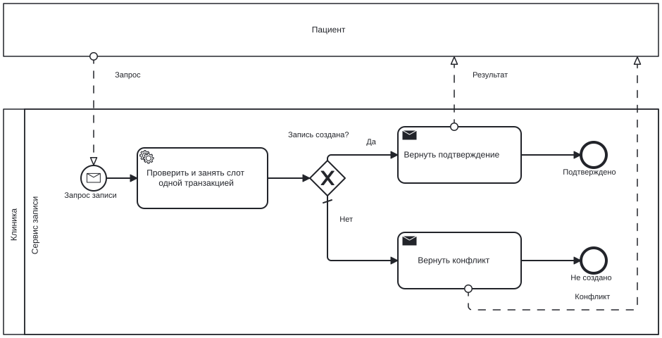
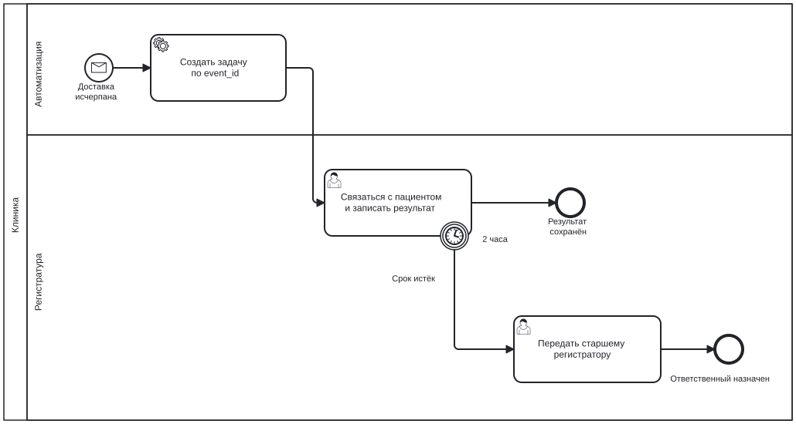

# 5. BPMN: кто отвечает за следующий шаг

[Назад](04_api.md) · [Проект](README.md) · [Далее](06_acceptance.md)

Модели в формате **BPMN 2.0**, с координатами BPMN DI. `isExecutable=false`: это аналитические модели, для запуска в process engine потребуется конфигурация исполнителей и интеграций. Проверка XML и импорт в редактор не доказывают корректность бизнес-процесса.

## Запись на приём

[Редактируемый booking.bpmn](bpmn/booking.bpmn) · [SVG](bpmn/booking.svg)

**Как читать:** внешний участник «Пациент» отправляет сообщение; оно запускает процесс клиники. Сервис атомарно проверяет и занимает слот (FR-02), затем XOR выбирает один из двух исходов. В успешной транзакции сохранено outbox-событие (FR-06); отправка SMS выполняется отдельно и не является условием подтверждения.

Пул пациента показан как black box: его внутренние действия не моделируются. Внешние сообщения нарисованы пунктиром. Сплошные стрелки не пересекают границы пулов. Модель показывает бизнес-исходы; технический rollback и повтор HTTP описаны в контракте и плане испытаний.

## Исключение: уведомление не доставлено

[Редактируемый exception.bpmn](bpmn/exception.bpmn) · [SVG](bpmn/exception.svg)

**Как читать:** после исчерпания попыток доставки приходит событие. Автоматизация создаёт задачу по уникальному event_id, затем регистратор фиксирует результат связи. Прерывающий boundary timer через PT2H прекращает эту задачу и передаёт обработку старшему регистратору. Финальный исход эскалации означает назначенного ответственного, а не гарантированный контакт с пациентом.

**Учебные допущения:** 2 часа — календарное время от начала задачи, не «рабочие часы». Если клиника не работает круглосуточно, потребуется календарь и другая спецификация SLA. Дедупликация входного события выполняется до создания второго экземпляра задачи. Запись пациента при этом остаётся CONFIRMED.

## Легенда и правила

| Элемент | Смысл | Ошибка, которую нужно исключить |
|---|---|---|
| Пул | Независимый участник | Sequence flow между пулами |
| Дорожка | Ответственность внутри участника | Считать смену дорожки новым процессом |
| Круг с конвертом | Message start event | Запускать процесс без определённого сообщения |
| Ромб с X | Выбор одного пути | Несовместимые условия, не покрывающие все исходы |
| Часы на границе задачи | Boundary timer | Считать заметку со сроком настоящим таймером |
| Толстый конечный круг | Завершение данного пути | Обещать бизнес-успех при исходе эскалации |

## Практика

Откройте `.bpmn` в совместимом редакторе. Добавьте отдельный процесс отмены: запрос → проверка владельца и границы времени → отмена либо отказ. Не связывайте пациента с задачей сплошной стрелкой. Сохраните исходник, экспортируйте SVG, объясните каждую ветку словами.

Первоисточник: [OMG BPMN 2.0.2](https://www.omg.org/spec/BPMN/2.0.2/). SVG экспортирован из той же XML-модели, а не нарисован отдельно.
